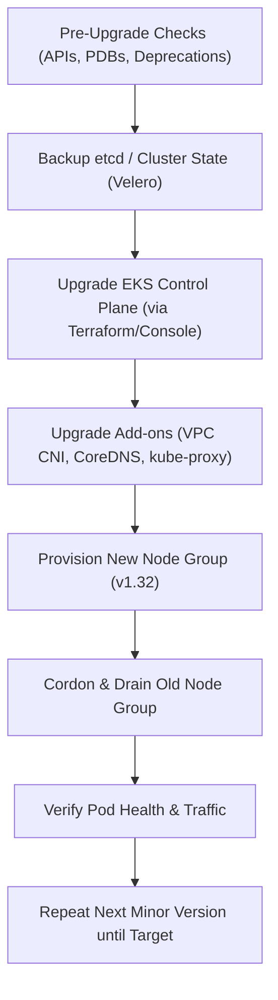
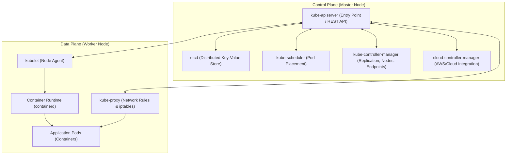
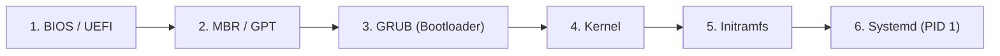
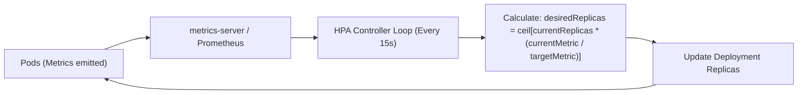

# DevOps Interview Questions (from Discord)

# DevOps Interview Q&A — 1-Oct-2026 (5-Year Experience Level)

<details open>
<summary><h2>🏢 Cognitivzen</h2></summary>

<details open>
<summary><h3>Client Round</h3></summary>

*Date: 29-Sep-2026 12:04 PM*


#### 【 BEHAVIORAL 】

<details>
<summary><strong>● Can you briefly introduce yourself and describe your professional background?</strong></summary>

**Answer:**
Hello, thank you for the opportunity. I have around 5 years of experience in DevOps, Cloud Engineering, and Infrastructure Automation, specializing in AWS, Kubernetes (Amazon EKS), CI/CD pipeline architecture, and Infrastructure as Code (IaC) with Terraform.

In my current and previous roles, my day-to-day work centers around three core pillars:
1. **Container Orchestration & Platform Reliability:** Deploying, autoscaling, and managing 25+ microservices across multi-AZ Amazon EKS clusters. I configure Helm charts, Horizontal Pod Autoscalers (HPA), Ingress controllers (ALB Controller), and PodDisruptionBudgets (PDB) to ensure high availability.
2. **Automated CI/CD Pipelines:** Building Declarative Jenkins pipelines and shared libraries that automate checkout, SonarQube code quality gating, Trivy container security scans, and progressive rollouts to Kubernetes environments (Dev, QA, Staging, Production).
3. **Infrastructure as Code & Cloud Governance:** Provisioning immutable AWS cloud infrastructure—VPCs, subnets, NAT Gateways, EKS managed node groups, RDS PostgreSQL, and S3 buckets—using modular Terraform with remote state management and DynamoDB state locking.
4. **Observability & Incident Response:** Monitoring microservice health using Prometheus, Grafana, and ELK/OpenSearch, analyzing pod logs with Fluentbit, and handling production troubleshooting for CrashLoopBackOff, OOMKilled, and network issues.
</details>


#### 【 GIT / GITHUB 】

<details>
<summary><strong>↳ Can you explain your approach and procedure for resolving merge conflicts when merging a feature or reference branch into develop or master?</strong></summary>

**Answer:**
In our workflow, feature branches are never merged directly into `develop` or `master` without prior local synchronization and conflict resolution. When a merge conflict occurs, we resolve it locally on the feature branch before triggering a Pull Request (PR).

### Standard Step-by-Step Procedure:
1. **Fetch Latest Upstream Changes:**
   Ensure the local repository has the newest commit tree from the remote target branch:
   ```bash
   git checkout develop
   git pull origin develop
   ```
2. **Switch to the Feature Branch:**
   ```bash
   git checkout feature/user-auth
   ```
3. **Perform Merge or Rebase:**
   - **Method A (Git Merge - Standard Team Workflow):**
     Preserves full commit history and timestamps:
     ```bash
     git merge develop
     ```
   - **Method B (Git Rebase - Linear History Preference):**
     Replays feature branch commits on top of latest `develop`:
     ```bash
     git rebase develop
     ```
4. **Identify Conflicted Files:**
   Git marks conflicted files with `both modified`:
   ```bash
   git status
   ```
5. **Resolve Conflicts in Editor/IDE:**
   Open the conflicted files (marked by `<<<<<<< HEAD`, `=======`, `>>>>>>>`). Consult with the feature developer if business logic differs, choose the correct lines, and delete conflict markers.
6. **Mark as Resolved and Commit:**
   ```bash
   git add <resolved-files>
   git commit -m "fix(merge): resolve conflicts between develop and feature/user-auth"
   # Or for rebase: git rebase --continue
   ```
7. **Run Local Tests & Push:**
   Verify unit tests pass locally, then push the resolved branch:
   ```bash
   git push origin feature/user-auth
   ```
   The PR in GitHub/GitLab will now show as clean and mergeable without conflicts.
</details>


#### 【 GIT / GITHUB 】

<details>
<summary><strong>● If a repository has unwanted files that you don't want pushed to your develop or master branch, how would you ignore or exclude them?</strong></summary>

**Answer:**
There are multiple levels of excluding unwanted files depending on whether the files are already tracked or untracked:

### 1. Preventive Approach: `.gitignore` (For Untracked Files)
For files that have not yet been committed (e.g., `.env`, `node_modules/`, `target/*.jar`, IDE configs `.vscode/`, `.idea/`, OS files `.DS_Store`):
- Add file patterns to the root `.gitignore` file:
  ```gitignore
  # Secrets & Environment variables
  .env
  *.pem
  *.key
  
  # Build artifacts & Dependencies
  target/
  node_modules/
  dist/
  *.log
  ```
- Commit and push `.gitignore` to the branch so all team members enforce the same exclusion rules.

### 2. Remediation Approach: Untrack Already Committed Files
If an unwanted file was accidentally committed previously, adding it to `.gitignore` does not stop Git from tracking it. You must remove it from the Git index while keeping the local file:
```bash
# Untrack a single file without deleting it locally
git rm --cached .env

# Untrack an entire directory
git rm -r --cached target/

# Commit the removal and update .gitignore
git commit -m "chore: remove tracked sensitive/build files from git tracking"
git push origin <branch>
```

### 3. Global Exclusion (Local Machine Level)
For developer-specific files that should never touch Git across any repository on their laptop:
```bash
git config --global core.excludesfile ~/.gitignore_global
echo ".DS_Store" >> ~/.gitignore_global
echo "*.swp" >> ~/.gitignore_global
```
</details>


#### 【 GIT / GITHUB 】

<details>
<summary><strong>● Have you worked with the Git cherry-picking concept, for example when a developer asks you to take a specific commit and apply it elsewhere?</strong></summary>

**Answer:**
Yes, `git cherry-pick` is a standard Git operation used when we need to apply the exact changes introduced by a specific commit from one branch onto another branch, without merging the entire branch.

### Common Production Scenarios:
1. **Critical Hotfix Backporting:** A bug fix is developed and merged into the `develop` branch, but production (`main`) needs the patch immediately without bringing in unreleased features currently sitting in `develop`.
2. **Accidental Commit Placement:** A developer mistakenly commits a hotfix to `feature/reporting` instead of `release/1.4`. We cherry-pick that commit onto `release/1.4`.

### Practical Execution Steps:
1. Identify the commit SHA on the source branch:
   ```bash
   git log --oneline -n 5 feature/payments
   # Example output: a7f8c2d fix: resolve null pointer in payment gateway webhook
   ```
2. Switch to the target destination branch and ensure it is updated:
   ```bash
   git checkout release/v1.2.0
   git pull origin release/v1.2.0
   ```
3. Execute cherry-pick:
   ```bash
   git cherry-pick a7f8c2d
   ```
4. **Handling Conflicts (if any):**
   If files modified in the commit have diverged:
   ```bash
   git status
   # Manually edit files to resolve conflicts
   git add <resolved-file>
   git cherry-pick --continue
   ```
   *(If you want to abort the cherry-pick safely: `git cherry-pick --abort`)*
5. Push the new commit to the target branch:
   ```bash
   git push origin release/v1.2.0
   ```
</details>


#### 【 GIT / GITHUB 】

<details>
<summary><strong>● If you have a self-hosted (non-SaaS/enterprise) Git repository containing individual files of 10-15 GB and a total repo size of around 200 GB, how would you migrate that entire repository to GitHub Enterprise?</strong></summary>

**Answer:**
Migrating a 200 GB repository with massive 10–15 GB individual files to GitHub Enterprise requires careful architectural planning because standard Git protocol and GitHub have strict file size limits (GitHub rejects files > 100 MB via standard git push, and GitHub Enterprise Server default max file size limit is typically 2 GB without Git LFS).

### Architectural Solution & Migration Strategy:

#### Step 1: Pre-Migration Analysis & Tool Selection
- Standard Git cannot push 10–15 GB objects directly over HTTPS or SSH due to timeouts and memory buffers.
- Large binary files must be converted to **Git LFS (Large File Storage)**, where the Git tree stores lightweight pointer files (~130 bytes), while binary payloads are stored in an external S3/MinIO/Blob storage backing GitHub Enterprise.
- Tool of choice: **`git-lfs`** combined with **`git-filter-repo`** (the official high-performance replacement for `git-filter-branch` and BFG).

#### Step 2: Configure Large File Storage (Git LFS) on Target
- In GitHub Enterprise Server / Cloud, enable Git LFS on the target organization and repository.
- Ensure the Git LFS backend (e.g., AWS S3 bucket) has sufficient capacity (200+ GB) and network bandwidth.

#### Step 3: Rewrite Historical Git History to Git LFS
On a migration server with fast NVMe disk and high RAM:
```bash
# 1. Mirror clone the self-hosted repository
git clone --mirror https://self-hosted-git.corp/engineering/large-repo.git
cd large-repo.git

# 2. Install and initialize Git LFS
git lfs install

# 3. Migrate historical files larger than 50MB to Git LFS pointers across all branches and tags
git lfs migrate import --everything --above=50MB --include="*.iso,*.bin,*.zip,*.tar,*.pkg,*.tar.gz"

# 4. Verify pointer replacement
git lfs ls-files
```

#### Step 4: Chunked Push to GitHub Enterprise
Pushing 200 GB in one single command over standard network pipes will fail if interrupted. We split the push into LFS objects first, then Git refs:
```bash
# Set new GitHub Enterprise remote
git remote set-url origin https://github.mycompany.com/engineering/migrated-repo.git

# Push LFS binary data first (supports retry and resume)
git lfs push origin --all

# Increase Git HTTP buffer size for large packfiles
git config http.postBuffer 1048576000
git config ssh.postBuffer 1048576000

# Push all branches and tags
git push origin --all
git push origin --tags
```

#### Step 5: Post-Migration Validation
- Clone the repository on a fresh workstation: `git clone https://github.mycompany.com/engineering/migrated-repo.git`.
- Verify commit hashes and run `git lfs pull` to confirm large binaries download accurately.
</details>


#### 【 CI/CD 】

<details>
<summary><strong>● Are you familiar with writing GitHub Actions workflows?</strong></summary>

**Answer:**
Yes, I have hands-on experience designing and writing declarative GitHub Actions workflows stored in `.github/workflows/*.yaml`.

### Typical Production Workflow Architecture:
1. **Triggers (`on`):** Pull requests (`pull_request`), branch pushes (`push: branches: [main, develop]`), manual dispatches (`workflow_dispatch`), and release tags (`push: tags: ['v*']`).
2. **Environment & Matrix Builds:** Defining matrix strategies (`matrix: os: [ubuntu-latest], java-version: [17, 21]`).
3. **CI Pipeline Steps:**
   - Source checkout (`actions/checkout@v4` with `fetch-depth: 0`).
   - Tool setup (`actions/setup-java`, `actions/setup-node`, `actions/setup-python`).
   - Dependency caching (`actions/cache`).
   - Unit testing and coverage reporting.
   - SonarCloud / SonarQube quality gate analysis.
   - Containerization with Docker Buildx and pushing to AWS ECR using `aws-actions/configure-aws-credentials` and `aws-actions/amazon-ecr-login`.
   - Security scanning using Trivy or Snyk GitHub Actions.
   - CD Deployment: GitOps commit updates or Helm deployments.
</details>


#### 【 CI/CD 】

<details>
<summary><strong>↳ Can you explain your Jenkins-based CI/CD pipeline flow in your current project—starting from when a developer commits code to a branch, through to how the pipeline is designed and executed?</strong></summary>

**Answer:**
Our CI/CD pipeline is designed as an automated, multi-stage **Declarative Jenkins Pipeline** leveraging Jenkins Shared Libraries (`vars/standardPipeline.groovy`) to ensure consistency and governance across 25+ microservices.

```mermaid
flowchart LR
    A["Developer Commit"] --> B["GitHub Webhook"]
    B --> C["Jenkins Controller"]
    C --> D["Dynamic K8s Agent"]
    subgraph CI ["CI Validation"]
        D --> E["1. Checkout & Compile"]
        E --> F["2. Unit Tests"]
        F --> G["3. SonarQube Gate"]
        G --> H["4. Docker Build & Trivy"]
        H --> I["5. Push to AWS ECR"]
    end
    subgraph CD ["CD Deployment"]
        I --> J["6. Helm Deploy to Dev/QA"]
        J --> K["7. Smoke & Integration Tests"]
        K --> L["8. Approval Gate"]
        L --> M["9. Rolling Update Production"]
    end
```



### Detailed Pipeline Flow:
1. **Trigger:** Developer pushes code to GitHub. A GitHub Webhook fires an HTTP POST payload to the Jenkins Controller (`/github-webhook/`).
2. **Dynamic Agent Provisioning:** The Jenkins Kubernetes plugin spins up an ephemeral pod agent on AWS EKS containing specialized containers (`maven:3.9-eclipse-temurin-17`, `docker:cli`, `trivy:latest`, `helm:v3`).
3. **Stage 1 - Checkout:** Checks out the commit using git credentials with a shallow clone depth.
4. **Stage 2 - Compile & Unit Test:** Runs `mvn clean test` (or `go test ./...`), publishing JUnit XML reports and JaCoCo code coverage.
5. **Stage 3 - Code Quality Gate (SonarQube):** Analyzes code for code smells, bugs, and security hotspots. Pipeline blocks using `waitForQualityGate()` until SonarQube returns a `PASSED` status.
6. **Stage 4 - Docker Packaging & Trivy Vulnerability Scan:**
   - Builds container image tagged with `${GIT_COMMIT}` and `${BUILD_NUMBER}`.
   - Scans image with Trivy (`trivy image --severity HIGH,CRITICAL --exit-code 1`). If CRITICAL CVEs with existing fixes are found, the build fails.
7. **Stage 5 - Image Push to ECR:** Authenticates via IAM Role (IRSA) or credentials and pushes the verified image to Amazon ECR.
8. **Stage 6 - Deployment (Dev/QA):** Executes `helm upgrade --install <service> ./helm --set image.tag=${GIT_COMMIT} -n qa`.
9. **Stage 7 - Automated Smoke Tests:** Runs automated HTTP endpoint health checks (`curl --fail /health/live`).
10. **Stage 8 - Production Promotion:** Once QA signs off, a manual approval prompt (`input message: 'Approve Production Deploy?'`) releases the image to Production via Helm with zero downtime rolling update.
</details>


#### 【 CI/CD 】

<details>
<summary><strong>↳ Why do you use stored credentials in Jenkins for authenticating to ECR/AWS/Kubernetes rather than another method? Is there a specific reason?</strong></summary>

**Answer:**
In Jenkins environments, teams historically used stored credentials (such as Secret Text for API tokens, Username with Password, or AWS Access Key/Secret Key stored in Jenkins Credentials Store) for several operational reasons:
1. **Legacy Infrastructure Simplicity:** When Jenkins is hosted on standalone on-premises VMs or non-AWS compute, IAM instance profiles or AWS-native identity federation are not natively available out-of-the-box.
2. **Third-Party & Multi-Cloud Services:** Connecting to external SaaS platforms like SonarQube, Jira, Docker Hub, or Slack webhooks requires token-based credentials stored in Jenkins Credentials Store.
3. **Strict Credential Masking:** Jenkins Credentials Provider automatically obfuscates sensitive strings from pipeline console logs (`****`).

However, for AWS services (ECR, EKS, S3), relying on static stored credentials is an anti-pattern due to key rotation overhead and leakage risks. In modern AWS environments, we migrate from stored credentials to **IAM Roles**.
</details>


#### 【 SECURITY 】

<details>
<summary><strong>↳ Why aren't you using IAM roles instead of static credentials, given that roles are more secure and reduce the risk of credential compromise?</strong></summary>

**Answer:**
You are completely right—using **IAM Roles** is the AWS best practice and industry security standard over static access keys. In our production architecture, we specifically transitioned to IAM Roles to eliminate static credentials:

### How We Leverage IAM Roles Instead of Static Keys:

1. **When Jenkins Runs on Amazon EKS (IRSA - IAM Roles for Service Accounts):**
   - We associate an AWS IAM Role with the Kubernetes ServiceAccount used by Jenkins agent pods using OpenID Connect (OIDC).
   - EKS automatically injects temporary AWS credentials (`AWS_WEB_IDENTITY_TOKEN_FILE` and `AWS_ROLE_ARN`) into the container.
   - The Jenkins pipeline runs `aws ecr get-login-password` or Terraform without managing or rotating any long-lived secret keys:
     ```yaml
     apiVersion: v1
     kind: ServiceAccount
     metadata:
       name: jenkins-agent-sa
       annotations:
         eks.amazonaws.com/role-arn: arn:aws:iam::123456789012:role/JenkinsAgentECRRole
     ```

2. **When Jenkins Runs on EC2 Instances (IAM Instance Profile):**
   - We attach an IAM Instance Profile directly to the Jenkins controller / worker EC2 instance.
   - The AWS SDK / CLI automatically queries the EC2 Instance Metadata Service (IMDSv2) for temporary, auto-rotating session credentials every 6 hours.

### Security Benefits of IAM Roles:
- **Zero Static Credentials:** No `AWS_ACCESS_KEY_ID` or `AWS_SECRET_ACCESS_KEY` to store, rotate, or risk leaking into logs.
- **Short-Lived Tokens:** Session tokens expire automatically within 1 to 6 hours.
- **Least Privilege Access:** Granular IAM policies restrict the role to only `ecr:GetAuthorizationToken`, `ecr:BatchCheckLayerAvailability`, `ecr:PutImage`, etc.
</details>


#### 【 CI/CD 】

<details>
<summary><strong>● After checking out the backend code, what language is your backend written in, and once compiled, how is the end product packaged and shipped—e.g., as a Docker image, WAR file, or JAR file?</strong></summary>

**Answer:**
Our microservices backend is primarily written in **Java (Spring Boot 3.x with Java 17)**, alongside several high-throughput data ingestion services written in **Go (Golang)**.

### Packaging & Shipping Flow:
1. **Compilation & Artifact Creation:**
   - In Spring Boot, we package the application as an executable, self-contained **Fat JAR (Java Archive)** file using Maven:
     ```bash
     mvn clean package -DskipTests
     # Generates: target/order-service-1.0.0.jar
     ```
   *(Note: Older monolithic legacy applications were packaged as WAR files deployed into external Tomcat servers, but cloud-native microservices use self-contained JARs with embedded Tomcat/Netty server).*
2. **Container Packaging (Docker Image):**
   - The standalone JAR file is copied into a multi-stage Dockerfile based on `eclipse-temurin:17-jre-alpine` or `distroless/java17`.
3. **End Shipping Artifact:**
   - The final packaged product shipped across environments is a **Docker Container Image** registered in Amazon ECR. We do not distribute raw JAR or WAR files directly to servers.
</details>


#### 【 DOCKER 】

<details>
<summary><strong>↳ For the backend, can you walk through how you prepare your Dockerfile, build/execute it, and push the resulting image to ECR?</strong></summary>

**Answer:**
We follow a multi-stage Dockerfile architecture to ensure the resulting container image is minimal, secure, and production-ready:

### 1. Production Multi-Stage Dockerfile (`Dockerfile`)
```dockerfile
# Stage 1: Build stage with JDK and Maven
FROM maven:3.9-eclipse-temurin-17-alpine AS builder
WORKDIR /build

# Cache dependencies layer
COPY pom.xml .
RUN mvn dependency:go-offline -B

# Compile and package application
COPY src ./src
RUN mvn clean package -DskipTests -B

# Stage 2: Runtime stage with minimal JRE
FROM eclipse-temurin:17-jre-alpine
WORKDIR /app

# Create non-root system user for security
RUN addgroup -S appgroup && adduser -S appuser -G appgroup

# Copy only the compiled JAR from builder stage
COPY --from=builder --chown=appuser:appgroup /build/target/*.jar app.jar

# Expose microservice HTTP port
EXPOSE 8080

# Switch to non-root user
USER appuser

# Optimized JVM memory flags for containers
ENTRYPOINT ["java", "-XX:+UseContainerSupport", "-XX:MaxRAMPercentage=75.0", "-jar", "app.jar"]
```

### 2. Build, Tag, and Push Steps to AWS ECR:
```bash
# Set variables
AWS_REGION="us-east-1"
ACCOUNT_ID="123456789012"
ECR_REPO="${ACCOUNT_ID}.dkr.ecr.${AWS_REGION}.amazonaws.com/order-service"
IMAGE_TAG="v1.0.1-${GIT_COMMIT:0:7}"

# 1. Authenticate Docker with Amazon ECR
aws ecr get-login-password --region "${AWS_REGION}" | \
  docker login --username AWS --password-stdin "${ACCOUNT_ID}.dkr.ecr.${AWS_REGION}.amazonaws.com"

# 2. Build the Docker image
docker build -t "${ECR_REPO}:${IMAGE_TAG}" -t "${ECR_REPO}:latest" .

# 3. Push both the commit-specific tag and latest tag
docker push "${ECR_REPO}:${IMAGE_TAG}"
docker push "${ECR_REPO}:latest"
```
</details>


#### 【 DOCKER 】

<details>
<summary><strong>↳ So to confirm, once the WAR file is generated, you package it into your Dockerfile, build it, and push the image to ECR—is that correct?</strong></summary>

**Answer:**
Yes, conceptually that is accurate. 

If dealing with a legacy application that compiles into a **WAR (Web Application Archive)** file:
1. Maven generates the `.war` package (`target/legacy-app.war`).
2. The Dockerfile uses a Tomcat base image (e.g., `FROM tomcat:10-jdk17-corretto`).
3. The WAR file is copied into Tomcat's webapps directory (`COPY target/legacy-app.war /usr/local/tomcat/webapps/ROOT.war`).
4. Docker builds the image, tags it with the Git commit SHA, and pushes it to Amazon ECR.

For modern Spring Boot microservices, we package as an executable **JAR** with embedded servlet container rather than a WAR, but the containerization and ECR promotion lifecycle remains identical.
</details>


#### 【 CI/CD 】

<details>
<summary><strong>↳ Since commit SHAs vary with each commit, how do you promote a specific Docker image build through environments up to production?</strong></summary>

**Answer:**
We follow the **"Build Once, Deploy Anywhere"** continuous delivery principle. We never rebuild the Docker image for each environment, because rebuilding introduces differences in dependencies or packages.

### How Image Promotion Works:
1. **Immutable Image Tagging:**
   In the CI stage, the image is built once from the feature/main branch and tagged with the immutable Git commit SHA:
   `ecr-repo/order-service:sha-a8f9c1d`.
2. **Dev & QA Deployment:**
   The pipeline deploys `sha-a8f9c1d` to Dev. Automated integration and smoke tests run. QA performs verification.
3. **Environment Configuration Decoupling:**
   Environment differences (database host, URLs, feature flags) are NOT baked into the image. They are injected at runtime via Kubernetes ConfigMaps and AWS Secrets Manager.
4. **GitOps / Configuration Promotion to Production:**
   To promote `sha-a8f9c1d` to Production:
   - **Method A (GitOps / ArgoCD / Flux - Best Practice):** The release pipeline creates a Pull Request in the Kubernetes manifest/Helm values repository, updating `values-prod.yaml`:
     ```yaml
     image:
       repository: 123456789012.dkr.ecr.us-east-1.amazonaws.com/order-service
       tag: "sha-a8f9c1d" # Promoted from QA
     ```
   - **Method B (ECR Additional Semantic Tagging):**
     We add a release tag (e.g., `v1.4.0` or `release-prod`) to the existing ECR image digest without rebuilding:
     ```bash
     MANIFEST=$(aws ecr batch-get-image --repository-name order-service --image-ids imageTag=sha-a8f9c1d --output text --query 'images[].imageManifest')
     aws ecr put-image --repository-name order-service --image-tag v1.4.0 --image-manifest "$MANIFEST"
     ```
5. Production Helm release pulls `sha-a8f9c1d`, guaranteeing that the exact same tested binary runs in production.
</details>


#### 【 CI/CD 】

<details>
<summary><strong>↳ Given that ECR ends up with many images tagged by commit SHA, what process do you follow to identify and promote a specific build/image from QA to production?</strong></summary>

**Answer:**
To trace and promote the exact QA-approved image among hundreds of SHA-tagged images in ECR:

1. **Release Candidate Metadata Tracking:**
   When a build passes QA, our Jenkins pipeline records metadata into our release management system (Jira Release / GitHub Release) linking:
   - Release Version: `v2.4.0`
   - Git Commit SHA: `a8f9c1d2e3`
   - ECR Image Digest: `sha256:7c9b3a...`
   - QA Sign-off ticket ID: `PROJ-1428`
2. **ECR Lifecycle Policies for Hygiene:**
   To prevent image clutter from hundreds of untagged or temporary dev commit images, we enforce an **ECR Lifecycle Policy**:
   - Keep only the last 30 commit-tagged images.
   - Retain all release-tagged (`v*`) images indefinitely.
   - Expire untagged images older than 7 days.
3. **Promotion Trigger via Pipeline:**
   The Production deployment pipeline takes a single parameter: `IMAGE_TAG` (defaulting to the approved QA commit SHA or release tag). It verifies that the tag exists in ECR, runs pre-flight checks, and initiates the zero-downtime rolling update on Production EKS.
</details>


#### 【 SECURITY 】

<details>
<summary><strong>● Do you perform container image scanning as part of your CI/CD pipeline, during or after the build process?</strong></summary>

**Answer:**
Yes, container security scanning is an automated, mandatory Quality Gate in our CI/CD pipeline implemented in a **defense-in-depth** manner:

### 1. In-Pipeline Shift-Left Scanning (During Build):
Immediately after `docker build` completes and before pushing to ECR, the Jenkins dynamic agent runs **Trivy**:
```bash
trivy image \
  --severity HIGH,CRITICAL \
  --ignore-unfixed \
  --exit-code 1 \
  --format table \
  order-service:${IMAGE_TAG}
```
- `--ignore-unfixed`: Ignores vulnerabilities that have no official upstream patch, avoiding false-positive pipeline breaks.
- `--exit-code 1`: Fails the Jenkins pipeline immediately if any actionable `CRITICAL` vulnerability is detected.

### 2. Registry-Level Scanning (After Push):
- In Amazon ECR, we enable **Enhanced Scanning** powered by **AWS Inspector**.
- Every image pushed is automatically scanned for OS package vulnerabilities (CVEs) and application dependencies. Continuous scanning re-evaluates images whenever newly announced CVEs are published.
</details>


#### 【 SECURITY 】

<details>
<summary><strong>↳ If critical vulnerabilities are found during container scanning, how would you go about fixing them?</strong></summary>

**Answer:**
When Trivy or AWS Inspector flags a `CRITICAL` CVE, we follow a systematic remediation workflow:

1. **Determine the Vulnerability Source:**
   Analyze Trivy's scan report to identify whether the CVE originates from:
   - **A. Base OS Layer:** e.g., outdated OpenSSL, curl, or glibc in the Linux distribution.
   - **B. Application Dependencies:** e.g., vulnerable third-party library in `pom.xml` (Log4j, Spring Framework).

2. **Remediating Base OS Vulnerabilities:**
   - **Upgrade Base Image:** Update `FROM eclipse-temurin:17-jre-alpine` to the latest patch release (e.g., alpine 3.20+).
   - **Package Upgrade in Dockerfile:** Add `RUN apk update && apk upgrade --no-cache` or `apt-get update && apt-get upgrade -y` to pull the latest security patches.
   - **Adopt Distroless Images:** Switch to `gcr.io/distroless/java17-debian12`, which removes shells, package managers, and standard utilities, eliminating 95% of common OS CVE attack vectors.

3. **Remediating Application Dependency Vulnerabilities:**
   - Inspect Maven dependency tree: `mvn dependency:tree -Dincludes=<vulnerable-package>`.
   - Update the library version in `pom.xml` to the patched release.
   - If a direct update is not yet available, use Maven dependency management overrides or exclusion tags.

4. **Verify and Retest:**
   Re-run Trivy locally: `trivy image <new-tag>`. Once exit code is 0, commit the fix and allow the pipeline to proceed.
</details>


#### 【 DOCKER 】

<details>
<summary><strong>● If a microservice's Docker image size is over 8-10 GB, causing slow deployments, and you're asked to reduce it to around 300-500 MB, what steps would you take to optimize and reduce the image size?</strong></summary>

**Answer:**
An 8–10 GB image for a microservice typically occurs due to common anti-patterns: including full build tools (Maven, JDK, Go compilers), unnecessary OS utilities, uncleaned package caches, or accidentally copying entire local directories (like `node_modules` or `.git`) into the container.

### Step-by-Step Optimization Strategy (8 GB → ~300 MB):

1. **Implement Multi-Stage Builds (Biggest Impact):**
   Separate the build environment from the runtime environment. Compilers, SDKs, and build tools stay in stage 1; only the final compiled binary/JAR is copied to stage 2:
   ```dockerfile
   # Stage 1: 1.5 GB build container
   FROM maven:3.9-eclipse-temurin-17 AS builder
   COPY . .
   RUN mvn clean package -DskipTests
   
   # Stage 2: 250 MB minimal runtime container
   FROM eclipse-temurin:17-jre-alpine
   COPY --from=builder /target/*.jar /app/app.jar
   ENTRYPOINT ["java", "-jar", "/app/app.jar"]
   ```

2. **Choose a Minimal Base Image:**
   - Replace heavy full OS images (e.g., `ubuntu:latest` ~100MB + full JDK ~800MB) with `alpine` (~5MB) or `debian-slim` (~80MB).
   - For Go microservices, build a static binary and use `FROM scratch` (0 MB) or `FROM gcr.io/distroless/static` (~2 MB).
   - For Java microservices, use `eclipse-temurin:17-jre-alpine` (~180 MB) instead of `eclipse-temurin:17-jdk` (~600 MB).

3. **Enforce a Strict `.dockerignore`:**
   Prevent local bloat from being sent to the Docker daemon during `COPY . .`:
   ```gitignore
   .git
   node_modules
   target/
   *.log
   .idea
   *.tar
   ```

4. **Clean Package Manager Caches in the Same Layer:**
   When installing packages, clean temporary caches within the same `RUN` command to prevent bloated intermediate layers:
   ```dockerfile
   # For Debian/Ubuntu:
   RUN apt-get update && apt-get install -y --no-install-recommends curl \
       && rm -rf /var/lib/apt/lists/*
   
   # For Alpine:
   RUN apk add --no-cache curl
   ```

5. **Analyze Image Layers with Dive:**
   Run `dive <image_name>` to inspect layer-by-layer size breakdowns, identify wasted duplicate files, and locate hidden large binaries.
</details>


#### 【 KUBERNETES 】

<details>
<summary><strong>● What container orchestration tool are you using—is it a managed Kubernetes cluster (like EKS) or a self-managed cluster?</strong></summary>

**Answer:**
We use **Amazon EKS (Elastic Kubernetes Service)**, which is AWS's managed Kubernetes service.

### Why We Selected Managed EKS over Self-Managed:
1. **Managed Control Plane:** AWS manages the Kubernetes master nodes (API server, etcd, controller manager, scheduler) across 3 Availability Zones, providing a 99.95% SLA with automated backups, scaling, and patch management.
2. **Managed Node Groups:** Worker nodes run on AWS-managed node groups with automated rolling updates, AMI security patching, and graceful node draining.
3. **AWS Ecosystem Integration:** Native integration with AWS IAM via IRSA (IAM Roles for Service Accounts), AWS VPC CNI for native pod IP allocation within our VPC CIDR, and AWS Application Load Balancer Controller for Layer 7 Ingress routing.
</details>


#### 【 KUBERNETES 】

<details>
<summary><strong>↳ If your production EKS cluster is on version 1.3.1 and you need to upgrade it to version 1.3.6 without causing application downtime, how would you approach this upgrade?</strong></summary>

**Answer:**
*(Note: In Kubernetes semantic versioning, minor versions are represented as `v1.31`, `v1.32`, etc. Kubernetes does not support jumping multiple minor versions at once—e.g., 1.31 directly to 1.36. Upgrades must proceed sequentially one minor version at a time: 1.31 → 1.32 → 1.33 → 1.34 → 1.35 → 1.36).*

### Production Zero-Downtime Upgrade Strategy:



### Step-by-Step Procedure:
1. **Pre-Upgrade Validation:**
   - Scan cluster for deprecated API versions using `kube-no-trouble` (`kubent`) or Pluto.
   - Verify all microservices have **PodDisruptionBudgets (PDB)** configured (e.g., `minAvailable: 1` or `maxUnavailable: 25%`) to guarantee pods remain available during node draining.
   - Ensure microservices have proper readiness probes and multiple replicas (`replicaCount >= 2`) distributed across zones using `topologySpreadConstraints`.
2. **Cluster Backup:**
   Execute full cluster backup using **Velero** (`velero backup create pre-upgrade-backup`).
3. **Upgrade EKS Control Plane:**
   Update the cluster version in Terraform (`cluster_version = "1.32"`) and run `terraform apply`. EKS upgrades the multi-AZ control plane nodes with zero downtime while worker nodes continue servicing traffic.
4. **Upgrade Core Kubernetes Add-ons:**
   Immediately upgrade core add-ons to match the new minor version:
   - AWS VPC CNI
   - CoreDNS
   - Kube-Proxy
   - AWS Load Balancer Controller
5. **Worker Node Group Upgrade (Blue/Green Node Group Approach):**
   To avoid risks of in-place node failures:
   - Provision a new Managed Node Group running the new EKS AMI version.
   - Once new nodes are healthy and Ready:
     ```bash
     # Cordon old nodes to prevent new pod scheduling
     kubectl cordon -l alpha.eksctl.io/nodegroup-name=old-nodegroup
     
     # Drain old nodes safely respecting PDBs
     kubectl drain -l alpha.eksctl.io/nodegroup-name=old-nodegroup --ignore-daemonsets --delete-emptydir-data
     ```
   - Microservice pods gracefully terminate and reschedule onto the new node group without dropping user requests.
   - Decommission and delete the old node group.
6. Repeat the cycle for subsequent versions until target version is reached.
</details>


#### 【 KUBERNETES 】

<details>
<summary><strong>↳ If AL2 node group AMIs become deprecated and you need to migrate to AL3 via Terraform—where changing the AMI type would normally delete and recreate the entire node group—how would you perform this migration with zero downtime to the application, given that similar AMI deprecations may recur in the future (e.g., AL3 to AL4)?</strong></summary>

**Answer:**
If you directly modify `ami_type = "AL2_x86_64"` to `AL2023_x86_64` on an existing Terraform `aws_eks_node_group` resource, Terraform will destroy the existing node group and create the new one, resulting in complete application downtime.

### Production Solution: Blue/Green Node Group Pattern via Terraform

To achieve 100% zero downtime and establish a reusable pattern for all future AMI migrations:

1. **Step 1: Declare the New (Green) Node Group in Terraform:**
   In `eks_node_groups.tf`, define a new node group resource alongside the existing one:
   ```hcl
   # Old node group (keep active)
   resource "aws_eks_node_group" "ng_al2" {
     node_group_name = "ng-workers-al2"
     ami_type        = "AL2_x86_64"
     # ...
   }
   
   # New node group (Green)
   resource "aws_eks_node_group" "ng_al2023" {
     node_group_name = "ng-workers-al2023"
     ami_type        = "AL2023_x86_64"
     # ...
   }
   ```
2. **Step 2: Apply Terraform:**
   Run `terraform apply`. Terraform provisions the new AL2023 node group. Both node groups now run concurrently in the cluster.
3. **Step 3: Cordon and Drain Old Nodes:**
   ```bash
   # Cordon old AL2 nodes
   kubectl cordon <node-names-al2>
   
   # Drain old AL2 nodes gracefully respecting PDBs
   kubectl drain <node-names-al2> --ignore-daemonsets --delete-emptydir-data --grace-period=60
   ```
   Kubernetes moves all pods to the new AL2023 nodes with zero dropped traffic.
4. **Step 4: Remove Old Node Group from Terraform:**
   Remove `aws_eks_node_group.ng_al2` from code and re-apply:
   ```bash
   terraform apply
   ```
   Terraform cleanly terminates the drained AL2 nodes without affecting running workloads.
</details>


#### 【 TERRAFORM / IAC 】

<details>
<summary><strong>↳ To confirm, your approach is to create a new node group, route traffic to it, and then delete the old node group—is that correct?</strong></summary>

**Answer:**
Yes, exactly. That is the **Blue/Green Node Group Migration pattern**. 

By provisioning the new node group first, Kubernetes naturally schedules application pods onto the ready, healthy nodes during the drain process. Once traffic is confirmed running smoothly on the new AMI, the old node group is safely decommissioned and destroyed via Terraform, ensuring zero downtime and zero risk of orphaned pods.
</details>


#### 【 TERRAFORM / IAC 】

<details>
<summary><strong>● If someone bypasses the Jenkins pipeline and makes changes directly via the CLI (causing infrastructure drift), how do you detect and flag that drift, and what safety measures do you have in your Jenkins/Terraform pipeline to prevent such drift from destroying resources?</strong></summary>

**Answer:**
Out-of-band manual changes made directly in the cloud console or AWS CLI introduce **Infrastructure Drift**. If left unchecked, the next automated Terraform run might inadvertently overwrite or destroy critical resources.

### 1. Drift Detection Strategy:
- **Automated Scheduled Drift Detection Job:**
  We run a nightly Jenkins cron pipeline that runs `terraform plan -detailed-exitcode`:
  ```bash
  terraform plan -detailed-exitcode -no-color
  PLAN_EXIT=$?
  if [ $PLAN_EXIT -eq 2 ]; then
    echo "ALERT: Infrastructure drift detected between AWS and Terraform state!"
    # Trigger Slack notification / Jira ticket
  fi
  ```
  *(Exit code 0 = No changes, Exit code 1 = Error, Exit code 2 = Drift / Changes present).*
- **AWS Config Rules:** Config rules trigger alerts whenever security groups, routes, or IAM policies deviate from approved baselines.

### 2. Safety Measures in Jenkins/Terraform Pipelines:
1. **Mandatory Two-Stage Approval (`plan` → Review → `apply`):**
   Jenkins runs `terraform plan -out=tfplan.binary`. The pipeline pauses with an approval gate displaying the exact execution plan. Developers and leads inspect the additions, modifications, and deletions before manual approval triggers `terraform apply tfplan.binary`.
2. **`prevent_destroy` Lifecycle Rules:**
   In our Terraform resource definitions for critical stateful infrastructure (RDS, S3 buckets, EKS clusters), we define:
   ```hcl
   lifecycle {
     prevent_destroy = true
   }
   ```
   If any drift or misconfiguration causes Terraform to attempt a resource destroy, Terraform immediately aborts with an error before touching the resource.
3. **IAM Boundary Restrictions (Preventing CLI Access):**
   Individual engineers are not granted broad admin access in production. Cloud permissions are restricted to read-only roles for developers; only the Jenkins deployment service role possesses write/provisioning IAM policies.
</details>


#### 【 SECURITY 】

<details>
<summary><strong>● In a team of, say, 3 members, how do you differentiate and grant granular access levels so that not everyone has full production pipeline access, and what authentication/authorization mechanism do you use within Jenkins for this?</strong></summary>

**Answer:**
To enforce the principle of least privilege and regulatory compliance across engineering teams, we implement **Role-Based Access Control (RBAC)** in Jenkins using the **Role-based Authorization Strategy (Role Strategy Plugin)**:

### 1. Authentication Integration:
- We do not manage local Jenkins users. Jenkins is integrated with our corporate identity provider via **SAML 2.0 / Okta** or **GitHub OAuth / LDAP**.
- Users belong to centralized AD/Okta security groups (e.g., `devops-team`, `developers-backend`, `qa-team`).

### 2. Authorization Setup via Role-Based Strategy:
We configure three distinct tiers of roles:
1. **Global Roles:**
   - `Admin`: Full permissions (Lead DevOps Engineer).
   - `Read-Only`: Overall `Read`, Job `Discover/Read` across folders.
2. **Item (Job) Roles (Project-Level Granularity):**
   - `Developer-Dev-QA-Deploy`: Allows `Job/Build`, `Job/Cancel`, `Job/Read` matching pattern `^(dev|qa)-.*`.
   - `QA-Tester`: Allows executing automated test suites in QA environments.
   - `Prod-Deployer`: Restricted solely to senior DevOps leads matching `^prod-.*`.
3. **Credential Access Segregation:**
   Production AWS secrets, SSH keys, and ECR credentials are bound specifically to production folders; non-privileged developers cannot view, edit, or inject them into arbitrary pipeline scripts.
</details>


#### 【 MONITORING 】

<details>
<summary><strong>● How are your application logs monitored, and what interface do you expose to developers so they can access and manage application logs?</strong></summary>

**Answer:**
We implement a centralized, cloud-native log aggregation pipeline using the **EFK / OpenSearch stack (Fluentbit → OpenSearch / Elasticsearch → Kibana / OpenSearch Dashboards)**:

### Log Shipping Architecture:
1. All microservices write structured JSON logs directly to standard output (`stdout` / `stderr`).
2. A lightweight **Fluentbit DaemonSet** runs on every EKS worker node, tails `/var/log/containers/*.log`, enriches log records with Kubernetes metadata (pod name, namespace, container name, deployment), and ships them to Amazon OpenSearch Service.

### Interface Exposed to Developers:
We provide developers with access to **OpenSearch Dashboards (Kibana)**:
- Developers filter logs by namespace (`kubernetes.namespace_name: "qa"`), service name (`kubernetes.pod_name: "order-service-*"`), trace IDs, or error levels (`level: "ERROR"`).
- Developers build personalized saved queries, error spike visualizations, and real-time log stream dashboards without needing direct server access.
</details>


#### 【 MONITORING 】

<details>
<summary><strong>↳ For an application deployed on EKS with backend, frontend, and middleware logs, what logging mechanism or interface do you expose to developers to check logs across development, QA, and production environments?</strong></summary>

**Answer:**
We use a unified OpenSearch Dashboards / Kibana interface where logs from backend, frontend, and middleware (Kafka, Redis) are segmented cleanly through index patterns and metadata tags:

1. **Unified Index Strategy:**
   - Index naming convention: `app-logs-<environment>-YYYY.MM.DD` (e.g., `app-logs-dev-2026.10.01`, `app-logs-qa-2026.10.01`, `app-logs-prod-2026.10.01`).
2. **Access Segmentation:**
   - In Kibana, index patterns allow developers to toggle between Dev, QA, and Production.
   - Role-Based Access Control in OpenSearch ensures developers have read-only access to Production log indexes with sensitive PII fields (credit card, auth tokens) masked via Fluentbit filter plugins.
3. **Distributed Tracing Alignment:**
   - Frontend, backend, and middleware logs contain a correlation ID (`X-Correlation-ID` or `traceparent`). When a developer searches a specific transaction ID in Kibana, they see the end-to-end journey across frontend API gateways, Java backend microservices, and Kafka event topics in one single timeline.
</details>


#### 【 MONITORING 】

<details>
<summary><strong>↳ What if developers need to check live/real-time logs of the system—how do they access that?</strong></summary>

**Answer:**
For real-time log monitoring:

1. **In Kibana / OpenSearch Dashboards:**
   - OpenSearch Dashboards features an **Auto-Refresh** mechanism (configurable to 5s, 10s, 30s) and a **Live Tail** mode in the Discover tab that streams incoming log records in near real-time.
2. **Direct Kubernetes Read-Only Access (For Dev/QA):**
   - For Dev and QA namespaces, developers have read-only `kubectl` permissions via AWS IAM/RBAC. They can stream live logs directly using standard tools:
     ```bash
     # Live stream container logs
     kubectl logs -f deployment/order-service -n dev
     
     # Or using Stern (multi-pod streaming tool)
     stern "order-service" -n dev
     ```
3. **K9s / Lens Desktop UI:**
   - Developers using Lens or K9s can view auto-refreshing live log panes with search and filter capabilities.
</details>


#### 【 MONITORING 】

<details>
<summary><strong>↳ If something goes wrong in production at midnight, how do developers get read access to production logs without needing to reach out to the DevOps team directly at that hour?</strong></summary>

**Answer:**
To support 24/7 on-call engineering without bottle-necking on DevOps engineers at odd hours:

1. **Self-Service OpenSearch / Kibana Access:**
   - Production logs are accessible 24/7 via the corporate Single Sign-On (Okta / Google Workspace).
   - Any on-call software engineer logs into OpenSearch Dashboards with their corporate credentials and has permanent read-only access to production index logs (`app-logs-prod-*`).
2. **Automated Incident Alerting Links:**
   - When Prometheus Alertmanager or Datadog detects an elevated error rate (5xx errors > 2%), it posts a high-priority PagerDuty / Slack alert.
   - The alert payload contains a direct pre-filtered link to Kibana for that exact timeframe and service (`https://kibana.internal/goto/order-service-error-window`), allowing developers to immediately view the relevant stack traces with one click.
3. **Amazon CloudWatch Logs Access:**
   - As an alternative fallback, developers with read-only AWS IAM roles can log in and view CloudWatch Logs Insights (`aws logs tail /aws/eks/prod-cluster/application --follow`).
</details>

</details>
</details>


<details open>
<summary><h2>🏢 Nisum</h2></summary>

<details open>
<summary><h3>Level 2</h3></summary>

*Date: 30-Sep-2026 7:49 PM*


#### 【 KUBERNETES 】

<details>
<summary><strong>● In your day-to-day work, how do you use containerized applications with Docker and Kubernetes — how many applications do you manage, and what kinds of issues do you typically troubleshoot?</strong></summary>

**Answer:**
In our production environment on Amazon EKS, our team manages **25+ microservices** (primarily Spring Boot Java and Go services) packaged as Docker containers.

### Day-to-Day Responsibilities:
1. **Packaging & Helm Deployment:** Writing multi-stage Dockerfiles, managing modular Helm charts, and updating Kubernetes manifests (Deployments, Services, ConfigMaps, Secrets, Ingress, PDBs).
2. **Scaling & Resource Allocation:** Configuring Horizontal Pod Autoscaler (HPA) policies based on CPU/memory utilization and Kafka consumer lag, alongside Karpenter / Cluster Autoscaler for node management.
3. **Common Troubleshooting Scenarios:**
   - **`CrashLoopBackOff`:** Pod starts and immediately terminates due to missing environment variables, DB connection timeouts, or unhandled null pointers. We diagnose via `kubectl logs <pod> --previous` and `kubectl describe pod <pod>`.
   - **`OOMKilled` (Exit Code 137):** Pod exceeds container memory limits. We analyze Grafana memory graphs, tune JVM `-XX:MaxRAMPercentage=75%`, and increase container memory limits in Helm values.
   - **`ImagePullBackOff`:** Incorrect image tag, missing ECR IAM pull permissions, or repository typo.
   - **Service Discovery & Ingress Failures:** Diagnosing 502/504 Bad Gateway errors on ALBs due to unready pods failing readiness probes, or misconfigured CoreDNS.
</details>


#### 【 KUBERNETES 】

<details>
<summary><strong>↳ What is the difference between ImagePullBackOff and CrashLoopBackOff in Kubernetes?</strong></summary>

**Answer:**
Both are common pod failure states in Kubernetes, but they occur at completely different phases of the pod lifecycle:

| Feature / Metric | `ImagePullBackOff` / `ErrImagePull` | `CrashLoopBackOff` |
| :--- | :--- | :--- |
| **Phase in Lifecycle** | **Pre-Start Phase** (Container creation) | **Runtime Phase** (After container has started) |
| **Root Cause** | Kubelet cannot fetch the container image from the container registry. | The application process started, failed, exited, and Kubernetes is retrying with exponential backoff. |
| **Common Reasons** | 1. Typo in image name or tag.<br>2. Image does not exist in registry.<br>3. Missing image pull secret or expired registry credentials.<br>4. Network failure between worker node and registry. | 1. Application code crashed (runtime exception).<br>2. Missing required environment variable or configuration file.<br>3. Failed database or Redis connection.<br>4. Container exceeded memory limit (`OOMKilled` - Exit code 137). |
| **Diagnostic Command** | `kubectl describe pod <pod_name>` (look at Events section at the bottom) | `kubectl logs <pod_name> --previous`<br>`kubectl describe pod <pod_name>` |
| **Exit Code** | N/A (Container never executed) | Non-zero exit code (e.g., 1, 137, 139, 255) |
</details>


#### 【 CI/CD 】

<details>
<summary><strong>● What CI/CD pipelines and tools do you have hands-on experience with?</strong></summary>

**Answer:**
My primary CI/CD automation tool is **Jenkins**, where I design and maintain Declarative Pipelines and Shared Libraries. In addition, I have hands-on working experience with modern cloud-native CI/CD tooling:

1. **Jenkins (Primary):** Controller/agent architecture, dynamic Kubernetes agents, Declarative Jenkinsfiles, Shared Libraries (`vars/`), and pipeline-as-code.
2. **GitHub Actions:** Multi-stage workflow automation (`.github/workflows/*.yaml`), reusable actions, matrix builds, and GitHub-hosted / self-hosted runners.
3. **GitLab CI/CD:** `.gitlab-ci.yml` pipeline definitions, runner configuration, and artifact passing between stages.
4. **Argo CD (GitOps):** Declarative GitOps continuous delivery for Kubernetes, tracking Git repository state and synchronizing Helm/Kustomize manifests into EKS clusters with automated self-healing.
</details>


#### 【 CI/CD 】

<details>
<summary><strong>↳ What is the difference between declarative and scripted pipelines in Jenkins?</strong></summary>

**Answer:**
Jenkins supports two pipeline syntaxes:

| Feature | Declarative Pipeline (Modern Standard) | Scripted Pipeline (Legacy / Advanced Groovy) |
| :--- | :--- | :--- |
| **Syntax Style** | Strict, opinionated, structured DSL starting with `pipeline { ... }`. | Free-form Groovy script starting with `node { ... }`. |
| **Learning Curve** | Simple, clean, readable, and easy to maintain across teams. | Steeper learning curve; requires full Apache Groovy knowledge. |
| **Error Checking** | Built-in structural syntax validation at the very start before execution begins. | Errors are detected at runtime when that specific Groovy line executes. |
| **Restart from Stage** | Supported out-of-the-box (`restart from stage`). | Not supported natively without custom scripting. |
| **Post-Action Blocks** | Native `post { success { ... } failure { ... } always { ... } }` blocks. | Requires standard Groovy `try-catch-finally` blocks. |
| **Complex Logic** | For complex logic, you encapsulate inside a `script { ... }` block or use a Shared Library. | Full programmatic Groovy flexibility throughout (loops, if-else, classes). |

**Production Recommendation:** We standardize on **Declarative Pipelines** across all microservices for readability and governance, delegating reusable Groovy logic to Jenkins Shared Libraries.
</details>


#### 【 CI/CD 】

<details>
<summary><strong>↳ How do you securely pass credentials in a Jenkins pipeline?</strong></summary>

**Answer:**
Credentials must never be hardcoded in Jenkinsfiles or source code repositories. We secure credentials using standard Jenkins best practices:

### 1. `withCredentials` Wrapper (Declarative & Scripted):
Use Jenkins Credentials Store and the `withCredentials` binding:
```groovy
stage('Deploy to S3') {
    steps {
        withCredentials([usernamePassword(credentialsId: 'nexus-creds', usernameVariable: 'NEXUS_USER', passwordVariable: 'NEXUS_PASS')]) {
            sh 'mvn deploy -Dusername=$NEXUS_USER -Dpassword=$NEXUS_PASS'
        }
        // Environment variables are immediately un-set outside this block
    }
}
```

### 2. Pipeline `environment` Block Binding:
```groovy
environment {
    SONAR_TOKEN = credentials('sonarqube-api-token')
    AWS_SECRET  = credentials('aws-deploy-key')
}
```
*Jenkins automatically masks these values with `****` in the console output.*

### 3. Modern Cloud-Native Standard (Zero Static Credentials):
Whenever possible, we avoid static stored credentials altogether by using **AWS IAM Roles for Service Accounts (IRSA)** for Kubernetes-based Jenkins agents, or HashiCorp Vault integration via the Vault Jenkins plugin.
</details>


#### 【 SECURITY 】

<details>
<summary><strong>● Do you have any experience with certificate management tools such as Venafi or CertiK?</strong></summary>

**Answer:**
While enterprise tools like **Venafi** are specialized machine identity and enterprise TLS certificate lifecycle management platforms, my primary hands-on certificate automation experience is centered around cloud-native and Kubernetes standards:

1. **AWS Certificate Manager (ACM):** Provisioning, validating via Route 53 DNS records, and auto-renewing public and private SSL/TLS certificates attached to Application Load Balancers (ALB) and CloudFront distributions.
2. **Kubernetes `cert-manager`:** Deploying `cert-manager` inside Amazon EKS with Let's Encrypt or corporate internal Private Certificate Authorities (PKI) via ACME / Vault issuers. It automates issuance, renewal, and secret injection for Kubernetes Ingress resources before expiration.
3. **Venafi Understanding:** I understand that Venafi provides enterprise-wide centralized visibility, policy enforcement, and automated rotation for TLS/SSL certificates and SSH keys across multi-cloud and on-premise environments, and can integrate with `cert-manager` through the Venafi issuer plugin.
</details>


#### 【 MONITORING 】

<details>
<summary><strong>● What observability tools do you have experience with?</strong></summary>

**Answer:**
In my 5 years of DevOps experience, I have hands-on experience across the three pillars of observability (Metrics, Logs, and Traces):

1. **Metrics & Health Dashboards:**
   - **Prometheus:** Scraping metrics from Kubernetes nodes, microservices (Spring Boot Actuator `/actuator/prometheus`), and infrastructure exporters (Node Exporter, kube-state-metrics).
   - **Grafana:** Designing executive and operational dashboards (CPU/Memory headroom, HTTP request rates, p95/p99 latency, pod restart counts).
   - **AWS CloudWatch:** Native AWS metrics, alarms, and composite alarms for RDS, ALB, and EKS.
2. **Log Aggregation & Searching:**
   - **ELK / OpenSearch (Elasticsearch, Logstash/Fluentbit, Kibana):** Centralized log analysis, index lifecycle management (ILM), and query filters.
3. **Distributed Tracing & APM:**
   - **OpenTelemetry / Jaeger / AWS X-Ray:** End-to-end distributed tracing across microservices to isolate API latency bottlenecks.
   - Working knowledge of enterprise APM tools like **Dynatrace** and **Datadog**.
</details>


#### 【 MONITORING 】

<details>
<summary><strong>↳ Do you have any experience with Application Performance Monitoring (APM) or log ingestion tools?</strong></summary>

**Answer:**
Yes:
1. **APM Experience:** We integrate Java and Go microservices with APM agents (e.g., OpenTelemetry Java Agent, Datadog Agent, or Dynatrace OneAgent). The agent instruments JVM bytecode to monitor transaction execution time, database query latency (slow SQL queries), garbage collection (GC) pauses, and thread pool deadlocks.
2. **Log Ingestion Pipeline:**
   - **Fluentbit (DaemonSet on Kubernetes):** Consumes container stdout/stderr logs from `/var/log/pods/`, applies regex/json parsers, enriches logs with Kubernetes metadata, and batches records to OpenSearch.
   - **Logstash:** Used for parsing unstructured legacy application logs via grok filters before indexing.
</details>


#### 【 MONITORING 】

<details>
<summary><strong>↳ Do you have any experience with log aggregation tools such as Splunk, ELK, or OpenSearch?</strong></summary>

**Answer:**
Yes, my deepest hands-on experience is with the **ELK / OpenSearch stack**, alongside familiarity with **Splunk**:

1. **ELK / OpenSearch:**
   - Designed index patterns, Index Lifecycle Policies (Hot-Warm-Cold architecture) to migrate indices to S3 cold storage after 30 days to optimize storage costs.
   - Authored KQL (Kibana Query Language) and Lucene queries to filter error traces and build dashboard alerts.
2. **Splunk:**
   - Familiar with Splunk Universal Forwarders shipping logs to Splunk Indexers.
   - Comfortable using SPL (Search Processing Language) commands (`index=production sourcetype=nginx_access status>=500 | stats count by uri`) to investigate outages.
</details>


#### 【 MONITORING 】

<details>
<summary><strong>↳ Are you comfortable creating alerts, setting up alerting rules, and building dashboards using these monitoring tools?</strong></summary>

**Answer:**
Yes, absolutely. Building production alerting and visibility is an essential part of my daily responsibilities:

1. **Prometheus Alerting Rules (Alertmanager):**
   Writing Prometheus rule manifests (`PrometheusRule`) to detect anomalies:
   ```yaml
   apiVersion: monitoring.coreos.com/v1
   kind: PrometheusRule
   metadata:
     name: microservice-alerts
     namespace: monitoring
   spec:
     groups:
       - name: pod-health
         rules:
           - alert: PodCrashLooping
             expr: rate(kube_pod_container_status_restarts_total[5m]) * 60 > 2
             for: 5m
             labels:
               severity: critical
             annotations:
               summary: "Pod {{ $labels.pod }} is restarting frequently in {{ $labels.namespace }}"
   ```
2. **Grafana Dashboards:**
   Creating dashboards with variable templating (dropdown for `$namespace`, `$service`), visual panels for golden signals (Latency, Traffic, Errors, Saturation), and threshold alerts routed to Slack and PagerDuty.
</details>


#### 【 AWS / CLOUD 】

<details>
<summary><strong>● Do you have any experience with content delivery networks (CDNs) such as Akamai or Amazon CloudFront?</strong></summary>

**Answer:**
Yes, I primarily work with **Amazon CloudFront** as our cloud CDN, and have architectural familiarity with **Akamai**:

### Production Implementation with Amazon CloudFront:
1. **Edge Caching & Performance:** Fronting our S3 static frontend assets (React/Angular SPAs) and API Gateway / ALB endpoints with CloudFront edge locations, reducing global user latency from ~300ms to < 30ms.
2. **SSL/TLS & Custom Domains:** Terminating HTTPS using custom domains with free AWS Certificate Manager (ACM) certificates in `us-east-1`.
3. **Origin Access Control (OAC):** Securing S3 buckets so that files cannot be accessed publicly, only through authorized CloudFront signed requests.
4. **Security Integration (AWS WAF):** Attaching AWS WAF (Web Application Firewall) to CloudFront distributions to block SQL injection (SQLi), Cross-Site Scripting (XSS), and rate-limit aggressive bot IPs.
5. **Akamai Comparison:** Akamai provides similar enterprise edge capabilities, advanced DDoS scrubbing (Prolexic), and EdgeWorkers, which are architecturally equivalent to CloudFront + CloudFront Functions / Lambda@Edge.
</details>


#### 【 LINUX 】

<details>
<summary><strong>● On a scale, how would you rate your skills in bash shell scripting and Python?</strong></summary>

**Answer:**
- **Bash Shell Scripting: 8.5 / 10**
  - High proficiency in production automation: authoring idempotent scripts with error handling (`set -euo pipefail`), regex parsing (`sed`, `awk`, `grep`), process management, cron scheduling, CI/CD pipeline automation, and system administration.
- **Python: 7 / 10**
  - Strong working proficiency for DevOps tasks: writing automation scripts with `boto3` (AWS SDK), interacting with REST APIs (`requests`), parsing JSON/YAML, writing custom Kubernetes scripts, and maintaining Lambda functions. (I focus on Python for operational tooling and automation rather than full-stack software development).
</details>


#### 【 AI/ML 】

<details>
<summary><strong>● Do you use generative AI (GenAI) tools such as GitHub Copilot in your workflow?</strong></summary>

**Answer:**
Yes, I actively leverage Generative AI tools including **GitHub Copilot**, **ChatGPT**, and **Claude/Gemini** coding assistants in my day-to-day DevOps engineering workflow.
</details>


#### 【 AI/ML 】

<details>
<summary><strong>↳ How do you use these GenAI tools, and how are they integrated into your workflow?</strong></summary>

**Answer:**
GenAI tools significantly boost operational velocity when integrated into IDEs (VS Code) and terminal workflows:

1. **Boilerplate & Syntax Generation:**
   - Generating complex Kubernetes manifests, Helm template helpers, and modular Terraform configurations (`resource "aws_route_table_association"` blocks).
   - Drafting complex Regular Expressions (regex) for log parsers and `awk`/`sed` one-liners.
2. **Pipeline Scripting:**
   - Writing repetitive Declarative Jenkinsfile stages or GitHub Actions workflow steps.
3. **Troubleshooting & Log Analysis:**
   - Pasting complex multi-line stack traces or cryptic Linux kernel / Kubernetes errors for rapid root-cause hypothesis generation.
4. **Validation & Code Review:**
   - Identifying missing error-handling flags in shell scripts or missing resource requests/limits in Kubernetes YAML before committing.
</details>


#### 【 AI/ML 】

<details>
<summary><strong>↳ Do you use MCP (Model Context Protocol) servers to connect and integrate directly with your tools?</strong></summary>

**Answer:**
Yes, I am familiar with and utilize **MCP (Model Context Protocol)** servers. 

### What MCP Is & How We Use It:
MCP is an open protocol created by Anthropic that allows AI agents and assistants (like Claude Desktop or IDE AI assistants) to securely connect directly to external tools, databases, and APIs without manual copy-pasting.

### DevOps Use Cases for MCP:
1. **GitHub MCP Server:** Enables the AI assistant to read pull requests, search repository code, and create issues directly from the chat interface.
2. **Kubernetes / Cloud MCP Server:** Allows querying cluster status (`kubectl get pods`, checking deployment rollout status) directly through natural language prompts.
3. **PostgreSQL / Database MCP Server:** Enables inspection of database schema definitions and query validation without switching tools.
</details>


#### 【 GENERAL 】

<details>
<summary><strong>● Do you have any experience with middleware tools such as Kafka or TIBCO?</strong></summary>

**Answer:**
Yes, I have hands-on DevOps operational experience with **Apache Kafka** (and AWS Managed Streaming for Apache Kafka - MSK):

### Kafka Operational Responsibilities:
1. **Kubernetes Integration:** Deploying Kafka consumer/producer microservices on EKS, configuring connection pools, and setting up SASL/SCRAM or mTLS authentication.
2. **Lag Monitoring & Autoscaling:** Monitoring Kafka consumer group lag using Prometheus and Strimzi Kafka Exporter (`kafka_consumergroup_lag`). We configure **KEDA (Kubernetes Event-driven Autoscaling)** to dynamically scale worker pods based on real-time topic message backlog.
3. **TIBCO Awareness:** I understand TIBCO (EMS/BusinessWorks) is an enterprise messaging and integration bus widely used in banking and telecom architectures; our modern cloud projects utilize Kafka or AWS SQS/SNS for decoupled asynchronous messaging.
</details>


#### 【 AWS / CLOUD 】

<details>
<summary><strong>● Which databases are you comfortable with or familiar with, such as MySQL?</strong></summary>

**Answer:**
From an infrastructure and DevOps perspective, I work with both relational (RDBMS) and NoSQL databases:

1. **Relational Databases (PostgreSQL & MySQL):**
   - Managing managed **Amazon RDS** and **Amazon Aurora** clusters (Multi-AZ deployments, read replicas, automated snapshots, maintenance windows).
   - Executing schema migrations in CI/CD pipelines using Flyway or Liquibase.
   - Performing basic DBA tasks: user creation, database provisioning, connection pool tuning, and investigating slow query logs.
2. **NoSQL & In-Memory Databases:**
   - **Amazon ElastiCache (Redis):** Managing Redis replication groups for session caching and rate-limiting.
   - **Amazon DynamoDB:** Serverless NoSQL tables for fast key-value lookups and Terraform state locking.
</details>


#### 【 LINUX 】

<details>
<summary><strong>● Do you know what a regular expression (regex) is and how it's used?</strong></summary>

**Answer:**
Yes, a **Regular Expression (Regex)** is a sequence of characters that forms a search pattern used for pattern matching, data validation, and text extraction within strings.

### Practical DevOps Use Cases:
1. **Log Parsing & Filtering:** Using regex in `grep -E`, `awk`, and `sed` to filter specific error codes (e.g., HTTP `5[0-9]{2}` for 5xx errors).
2. **Log Ingestion Engines:** Configuring regex patterns in Fluentbit, Logstash, or CloudWatch metric filters to parse timestamp, log level, IP address, and request duration.
3. **CI/CD Validation:** Validating Git branch naming conventions (`^(feature|bugfix|hotfix)\/[A-Z]+-[0-9]+`) and semantic version tags (`^v[0-9]+\.[0-9]+\.[0-9]+$`).
</details>


#### 【 LINUX 】

<details>
<summary><strong>↳ If you needed to extract email addresses from a log file containing 1,000 customer events, how would you write a regex pattern to match and extract those email addresses (e.g., using grep or a script)?</strong></summary>

**Answer:**
Here are practical, tested ways to extract email addresses:

### Method 1: Using `grep` with Extended Regex (`-E` or `-P`)
```bash
# -E: Extended regex, -o: Output only matched parts, -i: Case-insensitive
grep -E -o -i '[a-zA-Z0-9._%+-]+@[a-zA-Z0-9.-]+\.[a-zA-Z]{2,}' customer_events.log | sort -u
```
- `[a-zA-Z0-9._%+-]+`: Matches username characters before `@`.
- `@`: Matches the literal at sign.
- `[a-zA-Z0-9.-]+`: Matches domain name (e.g., `gmail`, `mycompany`).
- `\.[a-zA-Z]{2,}`: Matches top-level domain (e.g., `.com`, `.org`, `.io`).
- `sort -u`: Deduplicates and sorts the extracted email addresses.

### Method 2: Using Python Script (For Complex Logs or JSON)
```python
import re

email_pattern = r'[a-zA-Z0-9._%+-]+@[a-zA-Z0-9.-]+\.[a-zA-Z]{2,}'

with open('customer_events.log', 'r') as f:
    text = f.read()

emails = sorted(set(re.findall(email_pattern, text)))
print(f"Extracted {len(emails)} unique emails:")
for email in emails:
    print(email)
```
</details>


#### 【 MONITORING 】

<details>
<summary><strong>● What monitoring tools have you used? Have you used AppDynamics?</strong></summary>

**Answer:**
My primary monitoring stack consists of **Prometheus, Grafana, AWS CloudWatch, and OpenSearch / ELK**, along with exposure to enterprise APM solutions.

Regarding **AppDynamics**:
- While my day-to-day production workloads run on Prometheus/Grafana and Datadog, I have working knowledge of AppDynamics.
- I understand AppDynamics operates via application bytecode agents (Java, .NET, Node.js) to map application topology (flow maps), monitor business transactions, track end-user response time, and trigger automated diagnostic snapshots when transaction baselines exceed normal deviations.
</details>


#### 【 MONITORING 】

<details>
<summary><strong>↳ Have you used Dynatrace as a monitoring tool?</strong></summary>

**Answer:**
Yes, I am familiar with **Dynatrace**:
- **OneAgent Deployment:** Dynatrace simplifies monitoring by installing a single daemon (`OneAgent`) per Kubernetes node or VM, which automatically auto-discovers all running microservice processes, network connections, and containers without requiring individual code instrumentation.
- **Davis AI Root-Cause Engine:** Automatically correlates metrics, logs, and traces to detect anomalies and identify the precise root cause (e.g., slow backend database query) before an alert is dispatched.
</details>


#### 【 MONITORING 】

<details>
<summary><strong>↳ Can you write a query to list out all errors that occurred in the last 10 minutes?</strong></summary>

**Answer:**
Depending on the monitoring tool used:

### 1. In OpenSearch / Elasticsearch (KQL - Kibana Query Language):
```kql
level: "ERROR" OR level: "CRITICAL" OR status >= 500
```
- In the top-right time picker, select **"Last 10 minutes"** (`now-10m` to `now`).

### 2. In Elasticsearch Query DSL (REST API Query):
```json
GET /app-logs-*/_search
{
  "query": {
    "bool": {
      "must": [
        { "match": { "log.level": "ERROR" } }
      ],
      "filter": [
        {
          "range": {
            "@timestamp": {
              "gte": "now-10m"
            }
          }
        }
      ]
    }
  },
  "sort": [ { "@timestamp": { "order": "desc" } } ]
}
```

### 3. In Prometheus (PromQL):
```promql
# Rate of 5xx HTTP server errors over the last 10 minutes
sum(rate(http_requests_total{status=~"5.."}[10m])) by (service, status)
```
</details>


#### 【 MONITORING 】

<details>
<summary><strong>↳ How do you currently use ELK when searching through logs?</strong></summary>

**Answer:**
In our day-to-day workflow, we use Kibana / OpenSearch Dashboards Discover tab:
1. **Select Relevant Index Pattern:** We choose `app-logs-*` or environment-specific pattern `app-logs-prod-*`.
2. **Set Time Window:** Narrow time range to the exact incident window (e.g., `Last 30 minutes` or specific absolute timestamp).
3. **Filter by Structured Fields:** Rather than searching full text, we filter by indexed fields for speed:
   - `kubernetes.namespace_name: "prod"`
   - `kubernetes.container_name: "payment-service"`
   - `log_level: "ERROR"`
4. **Correlate with Trace ID:** Once a failed request is found, we copy its `trace_id` or `correlation_id` and search across all services to see the complete distributed request trail.
</details>


#### 【 MONITORING 】

<details>
<summary><strong>↳ Do you not use a specific search query to define and count errors in ELK?</strong></summary>

**Answer:**
Yes, absolutely! Counting and aggregating errors is done using search queries and aggregations:

### 1. In Kibana Discover Search Bar (Lucene / KQL):
```kql
kubernetes.container_name: "order-service" AND (level: "ERROR" OR level: "FATAL" OR http.response.status_code: [500 TO 599])
```
*Kibana automatically displays a histogram bar chart at the top showing the total count of matched error events distributed over time.*

### 2. In Elasticsearch REST API (Terms Aggregation):
To count errors grouped by microservice:
```json
POST /app-logs-prod-*/_search?size=0
{
  "query": {
    "bool": {
      "filter": [
        { "range": { "@timestamp": { "gte": "now-1h" } } },
        { "term": { "level.keyword": "ERROR" } }
      ]
    }
  },
  "aggs": {
    "errors_per_service": {
      "terms": {
        "field": "kubernetes.container_name.keyword",
        "size": 10
      }
    }
  }
}
```
*This returns the exact error count aggregated per microservice.*
</details>

</details>
</details>


<details open>
<summary><h2>🏢 Cognissolutions</h2></summary>

<details open>
<summary><h3>Level 1</h3></summary>

*Date: 30-Sep-2026 10:18 PM*


#### 【 BEHAVIORAL 】

<details>
<summary><strong>● Are you currently working, or have you already completed your notice period?</strong></summary>

**Answer:**
I am currently employed and serving my notice period, with an official availability to join within 15 to 30 days (or immediate joining depending on project transition buyout options).
</details>


#### 【 BEHAVIORAL 】

<details>
<summary><strong>● Where do you currently live in Bangalore?</strong></summary>

**Answer:**
I currently reside in Bangalore, located centrally with convenient access to major tech corridors (Outer Ring Road, Whitefield, and Electronic City).
</details>


#### 【 BEHAVIORAL 】

<details>
<summary><strong>↳ Would you have any issue commuting to the office location for work?</strong></summary>

**Answer:**
No, I have no issues commuting to the office. I am fully open to working in a hybrid or on-site model as per organizational and project requirements.
</details>


#### 【 BEHAVIORAL 】

<details>
<summary><strong>● Can you please introduce yourself and describe your professional background?</strong></summary>

**Answer:**
Thank you. I have around 5 years of professional IT experience as a DevOps and Cloud Engineer. My core competencies lie in Amazon Web Services (AWS), container orchestration with Kubernetes (EKS), automated CI/CD pipeline development with Jenkins and GitHub Actions, and Infrastructure as Code using Terraform.

In my day-to-day work:
- I manage 25+ microservices hosted on multi-AZ Amazon EKS clusters, authoring Helm charts, configuring HPA scaling, and implementing PodDisruptionBudgets.
- I build automated Declarative Jenkins pipelines enforcing SonarQube code quality gates, Trivy container security scans, and progressive deployments.
- I provision and manage immutable cloud infrastructure (VPCs, EKS clusters, RDS databases, S3, IAM) using modular Terraform with remote state management.
- I configure observability with Prometheus, Grafana, and Fluentbit/OpenSearch for proactive system monitoring and troubleshooting.
</details>


#### 【 KUBERNETES 】

<details>
<summary><strong>● How would you describe your Kubernetes skills and experience?</strong></summary>

**Answer:**
I would rate my Kubernetes skills at **8.5 / 10**. Kubernetes has been my primary container orchestration platform for over 4 years. 

### My Practical Kubernetes Experience Covers:
1. **Cluster Operations & Upgrades:** Provisioning managed Amazon EKS clusters with Terraform and executing zero-downtime cluster version upgrades (e.g., from v1.31 up to v1.37) using blue/green node group rollouts.
2. **Workload Management:** Packaging, versioning, and deploying Deployments, StatefulSets, DaemonSets, ConfigMaps, and Secrets using Helm v3.
3. **Traffic Routing & Ingress:** Configuring AWS Load Balancer Controller to dynamically provision ALBs/NLBs, managing SSL termination with ACM, and implementing path/host-based routing.
4. **Auto-Scaling & Resilience:** Tuning Horizontal Pod Autoscalers (HPA) using CPU/memory metrics, integrating KEDA for Kafka lag-based scaling, and Karpenter / Cluster Autoscaler for node auto-provisioning.
5. **Observability & Troubleshooting:** Rapidly diagnosing pod failures (`CrashLoopBackOff`, `ImagePullBackOff`, `OOMKilled`) using `kubectl describe`, previous container logs, and ephemeral debug containers.
</details>


#### 【 KUBERNETES 】

<details>
<summary><strong>↳ Have you ever set up an entire Kubernetes cluster from scratch, rather than just using existing manifests?</strong></summary>

**Answer:**
Yes, I have set up Kubernetes clusters from scratch using both self-managed and cloud-managed methods:

1. **Using `kubeadm` (Bare-Metal / EC2 Multi-Node Setup):**
   - Bootstrapped Ubuntu VMs: disabled swap (`swapoff -a`), enabled Linux kernel modules (`overlay`, `br_netfilter`), configured `sysctl` for bridged traffic (`net.bridge.bridge-nf-call-iptables = 1`).
   - Installed `containerd` container runtime, `kubelet`, `kubeadm`, and `kubectl`.
   - Initialized the control plane with `kubeadm init --pod-network-cidr=192.168.0.0/16`.
   - Installed the Container Network Interface (CNI) plugin (Calico / Flannel).
   - Joined worker nodes to the control plane using `kubeadm join <control-plane-endpoint> --token <token> --discovery-token-ca-cert-hash <hash>`.

2. **Automated Production EKS from Scratch via Terraform:**
   - Authored Terraform modules creating the underlying VPC (public and private subnets across 3 AZs, NAT Gateways), IAM roles for EKS, security groups, the EKS Control Plane (`aws_eks_cluster`), and Managed Node Groups (`aws_eks_node_group`) with automated add-ons (VPC CNI, CoreDNS, kube-proxy).
</details>


#### 【 KUBERNETES 】

<details>
<summary><strong>● Can you explain the Kubernetes architecture, specifically the control plane and data plane (worker node) components?</strong></summary>

**Answer:**
Kubernetes follows a master-worker distributed architecture split into the **Control Plane** (Cluster Management) and **Data Plane / Worker Nodes** (Workload Execution):



### 1. Control Plane Components (The Brain):
- **`kube-apiserver`:** The central REST API gateway and entry point for all administrative commands (`kubectl`), internal components, and worker nodes. Validates and configures data for api objects.
- **`etcd`:** Consistent, highly-available distributed key-value store holding the complete state, configuration, and metadata of the cluster.
- **`kube-scheduler`:** Watches for newly created pods with no assigned node and selects the optimal worker node based on resource requests, taints/tolerations, affinity, and availability.
- **`kube-controller-manager`:** Runs core control loops in a continuous loop to reconcile actual state with desired state (Node Lifecycle Controller, ReplicaSet Controller, EndpointSlice Controller).
- **`cloud-controller-manager`:** Interfaces with underlying cloud provider APIs to provision cloud load balancers, VPC routes, and EBS persistent volumes.

### 2. Data Plane / Worker Node Components (The Muscle):
- **`kubelet`:** The primary node agent that registers the node with the API server, ensures containers described in PodSpecs are running and healthy via the container runtime, and reports node status.
- **`kube-proxy`:** Maintains network rules on nodes (`iptables` / IPVS) allowing network communication to pods from network sessions inside or outside the cluster (implements Kubernetes `Service` abstraction).
- **Container Runtime (`containerd` / CRI-O):** Software responsible for pulling container images, creating namespaces/cgroups, and running the containerized processes.
</details>


#### 【 KUBERNETES 】

<details>
<summary><strong>● Can you explain the lifecycle of a Kubernetes pod and its different states?</strong></summary>

**Answer:**
A Kubernetes Pod passes through distinct phases from creation to termination:

### 1. Pod Phases (Status):
1. **`Pending`:** The Pod manifest was accepted by the API server and written to `etcd`, but one or more containers have not been created yet. The pod might be waiting for the scheduler to select a node, or waiting for container images to download.
2. **`Running`:** The Pod has been bound to a node, all containers have been created, and at least one container is currently running or in the process of starting/restarting.
3. **`Succeeded`:** All containers in the Pod have terminated successfully (exit code 0) and will not be restarted (common for batch `Job` or `CronJob` workloads).
4. **`Failed`:** All containers in the Pod have terminated, and at least one container terminated in failure (non-zero exit code).
5. **`Unknown`:** The state of the Pod cannot be obtained, usually due to communication loss between the control plane and the node's `kubelet`.

### 2. Container States within a Pod:
Inside a pod, each container transitions through:
- **`Waiting`:** Container is waiting for initialization (e.g., `ContainerCreating`, pulling image, or `CrashLoopBackOff`).
- **`Running`:** Container process is executing without issues.
- **`Terminated`:** Container finished executing (either succeeded or failed with exit code).

### 3. Graceful Termination Flow:
When a pod is deleted (`kubectl delete pod`):
- Pod status changes to `Terminating`.
- Kubelet removes pod IP from Service endpoints so no new traffic routes to it.
- Kubelet sends `SIGTERM` to the container process.
- Kubernetes waits for `terminationGracePeriodSeconds` (default 30s) allowing in-flight requests to complete.
- If process does not exit, Kubelet sends `SIGKILL` to force termination.
</details>


#### 【 LINUX 】

<details>
<summary><strong>● How would you rate your Linux skills, and what kind of Linux administration or day-to-day tasks do you typically perform?</strong></summary>

**Answer:**
I rate my Linux skills at **8.5 / 10**. Linux is the foundation for all our servers, container environments, and CI/CD agents.

### Day-to-Day Linux Administration Tasks:
1. **Process & Performance Diagnostics:** Monitoring CPU, memory, and IO bottlenecks using `top`, `htop`, `ps aux`, `vmstat`, `iostat`, and `uptime`.
2. **Disk & Storage Management:** Investigating filesystem space with `df -h`, tracking directory consumption with `du -sh *`, mounting EBS volumes, managing swap, and rotating logs.
3. **Networking & Connectivity:** Diagnosing network reachability and open ports with `ss -tulpn`, `netstat`, `curl -Iv`, `telnet`, `nc`, `dig`, and `traceroute`.
4. **Service Administration (Systemd):** Managing daemons with `systemctl start|stop|restart|status` and analyzing system journals with `journalctl -u <service> -f --since "10 min ago"`.
5. **Permissions & Security:** Managing user accounts, sudoers privileges (`visudo`), file ownership (`chown`), permission modes (`chmod 755 / 600`), and SSH key management (`authorized_keys`).
6. **Shell Automation:** Writing automated Bash scripts for scheduled tasks, backup routines, and cleanup cron jobs.
</details>


#### 【 LINUX 】

<details>
<summary><strong>● Can you explain the Linux boot process and the sequence of steps involved when a system starts up?</strong></summary>

**Answer:**
The standard Linux boot process consists of 6 sequential stages:



1. **BIOS / UEFI (Hardware Initialization):**
   - Performs **POST (Power-On Self-Test)** to verify CPU, RAM, and attached storage hardware.
   - Searches for and loads the bootable device (SSD, HDD, USB, Network PXE).
2. **MBR / GPT (Partition Table):**
   - Reads the Master Boot Record (MBR - sector 0) or GUID Partition Table (GPT) to locate the primary bootloader.
3. **GRUB 2 (Grand Unified Bootloader):**
   - Displays the boot menu (if multiple kernels or OSes exist).
   - Loads the selected Linux kernel binary (`vmlinuz`) and initial RAM filesystem (`initramfs` / `initrd`) into memory.
4. **Kernel Initialization:**
   - The Linux kernel decompresses itself in RAM.
   - Initializes hardware drivers, memory management, and processor subsystems.
5. **Initramfs (Temporary Root Filesystem):**
   - Serves as a temporary root filesystem containing essential device drivers (RAID, LVM, NVMe, filesystem drivers like ext4/xfs) needed to mount the real physical root partition (`/`).
6. **Systemd (Init Process - PID 1):**
   - Once the real root filesystem is mounted, the kernel executes `/sbin/init` (symlinked to `systemd`).
   - Systemd (Process ID 1) activates target units (e.g., `multi-user.target` or `graphical.target`), mounting `/etc/fstab`, starting background network services, SSH, and launching login prompts.
</details>


#### 【 LINUX 】

<details>
<summary><strong>↳ What is systemd in Linux, and what role does it play in the system initialization process?</strong></summary>

**Answer:**
**systemd** is the modern system and service manager for Linux distributions (Ubuntu, RHEL, CentOS, Debian), running as the first userspace process with **PID 1**.

### Key Roles and Responsibilities:
1. **System Initialization:** Controls the startup sequence by executing targets in parallel, using dependency resolution and socket-based activation for faster boot times compared to legacy SysVinit scripts.
2. **Service Supervision & Health Monitoring:** Manages background daemons (`.service` units). Can automatically restart crashed services (`Restart=always`, `RestartSec=5s`).
3. **Resource Control via Cgroups:** Groups processes into control groups (cgroups), allowing CPU, memory, and task limits per service.
4. **Unified Logging (systemd-journald):** Collects and indexes kernel messages and stdout/stderr of all services into binary journals queryable via `journalctl`.
5. **Other Unit Management:** Manages mount points (`.mount`), timers replacing cron (`.timer`), sockets (`.socket`), and targets replacing runlevels (`.target`).
</details>


#### 【 LINUX 】

<details>
<summary><strong>● What is the difference between a foreground process and a background process in Linux?</strong></summary>

**Answer:**

| Feature | Foreground Process | Background Process |
| :--- | :--- | :--- |
| **Terminal Control** | Occupies the terminal; takes direct input from `stdin` and writes output to `stdout`. | Runs asynchronously in the background; does NOT block the terminal prompt. |
| **Shell Prompt** | The user cannot run any new commands in the shell until this process finishes. | Shell prompt returns immediately for executing other commands. |
| **Execution Method** | Standard execution: `python app.py` | Appending `&`: `python app.py &` |
| **Suspending / Moving** | Press `Ctrl + Z` (suspends process), then type `bg` to move to background. | Bring to foreground using `fg %1`. |
| **Terminal Exit Effect** | Terminating the terminal sends a `SIGHUP` (hangup) signal, killing the process. | Also killed on `SIGHUP` unless protected by `nohup` or `disown`. |
</details>


#### 【 LINUX 】

<details>
<summary><strong>↳ What is a detached process in Linux?</strong></summary>

**Answer:**
A **detached process** is a process that has been decoupled from its controlling terminal session. It does not depend on an open shell window and continues running uninterrupted even if the user logs out, closes the SSH connection, or exits the terminal.
</details>


#### 【 LINUX 】

<details>
<summary><strong>↳ Can you clarify what it specifically means for a process to be 'detached' in Linux?</strong></summary>

**Answer:**
Technically, when a process runs in a terminal, it belongs to the terminal's **Process Group** and **Session**. If the user terminates the session or drops SSH, the kernel sends a `SIGHUP` (Signal Hang Up) to all processes in that session, causing them to terminate.

A process becomes **detached** when:
1. **Immunity to SIGHUP:** It ignores or disconnects from the `SIGHUP` signal.
2. **Terminal Disassociation:** Its standard input/output streams (`stdin`, `stdout`, `stderr`) are redirected away from the terminal (e.g., to `/dev/null` or log files).
3. **Session Re-parenting:** The process calls `setsid()` to become the leader of a new process group and session. If its parent shell exits, the detached process is adopted by `systemd` (PID 1) as its new parent.

### Common Ways to Run Detached Processes:
- **`nohup command > app.log 2>&1 &`:** Ignores hangup signal.
- **`disown -h %1`:** Removes a running background job from the shell's active job table.
- **Terminal Multiplexers (`tmux` / `screen`):** Keeps sessions running in a detached virtual terminal.
- **systemd Services:** The production standard—daemons are managed by systemd completely independent of user sessions.
</details>


#### 【 KUBERNETES 】

<details>
<summary><strong>● Why do you think Kubernetes was designed to allow running multiple containers inside a single pod? What is the advantage of this design?</strong></summary>

**Answer:**
Kubernetes introduced the **Pod** (rather than a raw single container) as the atomic scheduling unit to model tightly-coupled helper relationships between cooperating processes.

### Core Architectural Reasons:
In real-world distributed systems, applications often need secondary helper services that:
1. Must be co-located on the exact same physical host (worker node).
2. Must share the exact same network lifecycle and localhost address space.
3. Must share storage volumes with zero network overhead.

Without pods, container orchestrators would have had to schedule two separate containers independently, risking placement on different nodes across different Availability Zones, breaking local IPC and shared file access.
</details>


#### 【 KUBERNETES 】

<details>
<summary><strong>↳ What specific advantage does running multiple containers within a single pod provide?</strong></summary>

**Answer:**
Containers within the same pod share two critical Linux kernel namespaces:

1. **Shared Network Namespace (Shared `localhost` & IP):**
   - All containers in the pod share the exact same Pod IP address and network ports.
   - Containers communicate with each other with ultra-low latency via `localhost` (e.g., application calls a local proxy on `http://127.0.0.1:9090`).
   - Port conflicts must be avoided between containers in the same pod.
2. **Shared IPC (Inter-Process Communication):**
   - Containers can use POSIX shared memory or system V semaphores for high-speed inter-process communication.
3. **Shared Volumes (Local Storage):**
   - Multiple containers can mount the exact same `emptyDir` or persistent volume. For example, a log-shipping container can immediately tail log files written to disk by the application container.
4. **Co-Scheduled Lifecycle:**
   - Kubernetes guarantees that all containers in a pod are scheduled onto the same worker node, scaled together, and terminated together.
</details>


#### 【 KUBERNETES 】

<details>
<summary><strong>↳ Since you could also run multiple processes across separate containers, why does Kubernetes still provide the mechanism of grouping multiple containers within a single pod?</strong></summary>

**Answer:**
Running multiple processes inside a *single container* violates container best practices (single responsibility, separate logs, difficult signal handling, lack of granular restart policies). On the other hand, running processes as *completely separate pods* prevents localhost networking and shared local volumes.

The multi-container pod provides the best of both worlds, enabling **Container Design Patterns**:

### Popular Multi-Container Patterns:
1. **Sidecar Pattern (Most Common):**
   - Extends or enhances the main application without modifying application source code.
   - *Example:* A Fluentbit sidecar tails log files from a shared `/var/log` volume and ships them to OpenSearch; or an Envoy / Istio proxy handles mTLS and traffic routing.
2. **Ambassador Pattern:**
   - Acts as an intelligent local proxy representing external services.
   - *Example:* Application connects to `localhost:6379`, and the ambassador sidecar handles routing to an external sharded Redis cluster with automatic failover.
3. **Adapter Pattern:**
   - Standardizes and normalizes output from the main container.
   - *Example:* Transforms legacy application metric formats into Prometheus-compatible `/metrics` format.
4. **Init Containers:**
   - Runs to completion before the main container starts (e.g., checking database readiness, running schema migrations, or downloading configuration files).
</details>


#### 【 KUBERNETES 】

<details>
<summary><strong>● What is a namespace in the context of a Kubernetes cluster?</strong></summary>

**Answer:**
A **Namespace** in Kubernetes is a logical partition or virtual cluster within a single physical Kubernetes cluster. It provides a scope for names (resource names must be unique within a namespace, but can be duplicated across different namespaces).
</details>


#### 【 KUBERNETES 】

<details>
<summary><strong>↳ What is the advantage of using namespaces in Kubernetes?</strong></summary>

**Answer:**
Namespaces provide critical isolation, multi-tenancy, and governance advantages:

1. **Environment Segmentation:**
   Isolates environments within the same cluster (e.g., `dev`, `qa`, `staging`, `production`), allowing identical deployment names (`order-service`) across environments.
2. **Resource Quotas & Limits:**
   Admins can enforce `ResourceQuota` and `LimitRange` per namespace, preventing one rogue team or testing workload from consuming all cluster CPU, memory, or pod limits.
3. **Role-Based Access Control (RBAC):**
   Security policies can grant developers full access to `dev` and `qa` namespaces while restricting `prod` namespace access to lead engineers and automated CI/CD service accounts.
4. **Network Policies:**
   Kubernetes `NetworkPolicy` can restrict cross-namespace traffic (e.g., blocking pods in `dev` from connecting to databases in `prod`).
5. **DNS Scoping:**
   Pods resolve services within the same namespace using simple service names (`http://payment-service`), and cross-namespace services using FQDN (`http://payment-service.prod.svc.cluster.local`).
</details>


#### 【 KUBERNETES 】

<details>
<summary><strong>● Can you explain the concept of Horizontal Pod Autoscaling (HPA) in Kubernetes?</strong></summary>

**Answer:**
**Horizontal Pod Autoscaler (HPA)** is a native Kubernetes control loop that automatically scales the number of Pod replicas in a Deployment or StatefulSet up or down based on observed resource utilization.



### Mathematical Scaling Formula:
$$\text{desiredReplicas} = \left\lceil \text{currentReplicas} \times \left( \frac{\text{currentMetricValue}}{\text{targetMetricValue}} \right) \right\rceil$$

### Key Production Aspects of HPA:
1. **Prerequisite:** Pods MUST define `resources.requests` (e.g., `cpu: 250m`, `memory: 512Mi`), because HPA calculates percentage utilization relative to requested resources.
2. **Metrics Server:** Requires `metrics-server` installed in the cluster for CPU/Memory metrics.
3. **Custom Metrics (KEDA):** For event-driven microservices, HPA can scale based on custom metrics (e.g., Kafka consumer queue lag, HTTP requests per second) via KEDA or Prometheus Adapter.
4. **Stabilization Window & Cooldown:** HPA includes cooldown periods (default 5 minutes for scale down) to prevent rapid pod churning / flapping during transient metric spikes.
</details>


#### 【 CI/CD 】

<details>
<summary><strong>● Have you worked with Argo CD in addition to Jenkins?</strong></summary>

**Answer:**
Yes, I have hands-on experience with **Argo CD** for declarative **GitOps** continuous delivery in Kubernetes:

### How We Leverage Argo CD with Jenkins:
We follow a hybrid architecture:
- **Jenkins for Continuous Integration (CI):** Handles source checkout, testing, SonarQube quality gate checks, Docker packaging, Trivy vulnerability scanning, and pushing container images to Amazon ECR.
- **GitOps Manifest Repository:** Once CI succeeds, Jenkins updates the image tag in a separate Git repository holding our Helm values/manifests.
- **Argo CD for Continuous Deployment (CD):** Argo CD runs inside our EKS cluster, detects the new commit in the Git manifest repo, and reconciles the cluster state:
  - Continuously monitors for drift between Git and live Kubernetes resources.
  - Automatically synchronizes or supports manual approval sync gates.
  - Enables instant one-click rollbacks by reverting the Git commit.
</details>


#### 【 TERRAFORM / IAC 】

<details>
<summary><strong>● Have you worked hands-on with Terraform?</strong></summary>

**Answer:**
Yes, Terraform is my primary Infrastructure as Code (IaC) tool for provisioning and maintaining cloud infrastructure on AWS.

### Hands-on Terraform Architecture & Capabilities:
1. **Modular Infrastructure:** Designing reusable modules for VPCs (subnets, NAT gateways, route tables), EKS clusters and managed node groups, RDS PostgreSQL multi-AZ databases, IAM roles (IRSA), and S3 buckets.
2. **Remote State & State Locking:** Storing state files in encrypted Amazon S3 buckets with versioning enabled, and utilizing Amazon DynamoDB tables for distributed state locking (`LockID`) to prevent concurrent race conditions.
3. **Environments & Workspaces:** Managing multi-environment configurations (Dev, QA, Staging, Prod) using `*.tfvars` files (`dev.tfvars`, `prod.tfvars`) or Terraform workspaces.
4. **CI/CD Integration:** Automating `terraform fmt -check`, `tflint`, `terraform validate`, `terraform plan`, and gated `terraform apply` within Jenkins pipelines.
</details>


#### 【 MONITORING 】

<details>
<summary><strong>● Have you worked with Prometheus and Grafana as well?</strong></summary>

**Answer:**
Yes, **Prometheus and Grafana** form our core observability stack for monitoring Kubernetes clusters and microservices:

1. **Prometheus Architecture:**
   - Deployed via the Prometheus-Operator (`kube-prometheus-stack` Helm chart).
   - Utilizes `ServiceMonitor` and `PodMonitor` Custom Resources to automatically discover and scrape application endpoints (e.g., Spring Boot Actuator `/actuator/prometheus`).
   - Stores time-series metric data with retention policies and scrapes cluster node health via Node Exporter and kube-state-metrics.
2. **Prometheus Alertmanager:**
   - Evaluates alerting rules (`PrometheusRule`) and routes notifications with deduplication and grouping to Slack and PagerDuty.
3. **Grafana Dashboards:**
   - Designed operational dashboards monitoring cluster node CPU/memory saturation, network I/O, application response latency (p50, p95, p99), and HTTP error rates (4xx/5xx).
</details>


#### 【 NETWORKING 】

<details>
<summary><strong>● How would you describe your networking skills? Do you have a basic understanding of protocols like DNS, DHCP, TCP, and UDP?</strong></summary>

**Answer:**
I have a solid understanding of cloud and systems networking fundamentals (rated **8 / 10**), essential for configuring VPCs, container networking (CNI), and load balancers:

1. **TCP (Transmission Control Protocol):** Connection-oriented protocol providing reliable, ordered, error-checked packet delivery using a three-way handshake (`SYN`, `SYN-ACK`, `ACK`). Used for HTTP/HTTPS, SSH, database connections, and REST APIs.
2. **UDP (User Datagram Protocol):** Connectionless, lightweight protocol with zero handshake overhead, prioritizing speed over reliability (packets can be dropped or arrive out of order). Used for DNS queries, video streaming, and real-time VoIP.
3. **DNS (Domain Name System):** Resolves human-readable domain names (`api.sidorea.shop`) into machine IP addresses (`1.2.3.4`).
4. **DHCP (Dynamic Host Configuration Protocol):** Automatically assigns dynamic IP addresses, default gateways, and subnet masks to network devices joining a network. (In AWS VPCs, Amazon provides a built-in managed DHCP options set).
</details>


#### 【 NETWORKING 】

<details>
<summary><strong>↳ Can you explain what a DNS server is and how you work with DNS in your projects?</strong></summary>

**Answer:**
A **DNS (Domain Name System) Server** acts as the internet's phonebook, translating human-friendly domain names (e.g., `api.example.com`) into computer-routable IP addresses (e.g., `54.210.12.34`).

### How We Work with DNS in Our DevOps Projects:

1. **External Public DNS (AWS Route 53):**
   - Managing public hosted zones for our corporate domains.
   - Creating `A` Alias records pointing custom domain names directly to Application Load Balancers (ALB) or CloudFront distributions with zero latency penalty.
   - Creating `CNAME` records for AWS Certificate Manager (ACM) DNS-based automated SSL certificate validation.
   - Configuring routing policies: Latency-based routing, Weighted routing (for canary deployments), and Failover routing with Route 53 health checks.

2. **Internal Kubernetes DNS (CoreDNS):**
   - Amazon EKS runs **CoreDNS** pods as a cluster-internal DNS server.
   - Provides internal service discovery within the cluster:
     - Standard service query: `<service-name>.<namespace>.svc.cluster.local` (resolves to the ClusterIP of the service).
     - Headless service query: resolves directly to the individual Pod IPs for stateful workloads.
   - We tune CoreDNS autoscaling and configure `NodeLocal DNSCache` on busy clusters to prevent DNS query throttling and reduce latency.
</details>

</details>
</details>
