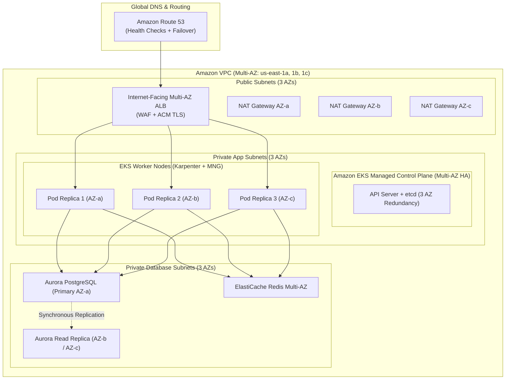

# DevOps Interview Questions (from Discord)

# DevOps Interview Q&A — 17-Sep-2026 (5-Year Experience Level)

<details open>
<summary><h2>🏢 Coforge</h2></summary>

<details open>
<summary><h3>Assessment</h3></summary>

*Date: 17-09-2026 03:37 PM*

#### 【 DOCKER 】

<details>
<summary><strong>● Can you explain how you would use an Nginx server as a reverse proxy for containerized services running in Docker?</strong></summary>

**Answer:**
Using Nginx as a reverse proxy in Docker allows you to expose a single secure entry point (ports 80 and 443) on the host while routing incoming traffic to multiple backend containerized microservices isolated within an internal Docker network.

---

### 1. Architectural Concept & Flow
```
                      +-----------------------------------------------------+
                      |                    Docker Host                      |
                      |                                                     |
                      |  +--------------------+     Internal Docker Network |
                      |  |   Nginx Container  |         (app-network)       |
Client Request ------>|  |  (Reverse Proxy)   |                             |
(Port 80 / 443)       |  |  Port 80:80, 443   |----+                        |
                      |  +--------------------+    |                        |
                      |                            |--> http://frontend:3000|
                      |                            |                        |
                      |                            +--> http://backend:5000 |
                      +-----------------------------------------------------+
```

- **Reverse Proxy Function:** Nginx intercepts public requests, inspects the request URI or domain name, terminates TLS/SSL, and forwards the request (`proxy_pass`) to the appropriate container.
- **Embedded DNS Resolution:** Docker runs an embedded DNS server at `127.0.0.11`. When containers share a custom bridge network, Nginx can route traffic directly using container service names (e.g., `http://frontend:3000` or `http://backend:5000`) without hardcoding private IP addresses.
- **Network Isolation:** Backend application containers do not expose any ports to the host machine (`ports:` is omitted in Compose); they only expose ports inside the internal Docker network.

---

### 2. Nginx Configuration (`nginx.conf`)
```nginx
events {
    worker_connections 1024;
}

http {
    # Upstream definition for backend services
    upstream frontend_service {
        server frontend:3000;
    }

    upstream backend_api_service {
        server backend:5000;
    }

    server {
        listen 80;
        server_name api.example.com app.example.com;

        # Redirect HTTP to HTTPS
        return 301 https://$host$request_uri;
    }

    server {
        listen 443 ssl http2;
        server_name api.example.com app.example.com;

        ssl_certificate     /etc/nginx/certs/fullchain.pem;
        ssl_certificate_key /etc/nginx/certs/privkey.pem;
        ssl_protocols       TLSv1.2 TLSv1.3;

        # Route 1: Route API requests to backend container
        location /api/ {
            proxy_pass http://backend_api_service/;
            proxy_http_version 1.1;

            # Essential Proxy Headers
            proxy_set_header Host $host;
            proxy_set_header X-Real-IP $remote_addr;
            proxy_set_header X-Forwarded-For $proxy_add_x_forwarded_for;
            proxy_set_header X-Forwarded-Proto $scheme;

            # Timeouts
            proxy_connect_timeout 60s;
            proxy_send_timeout    60s;
            proxy_read_timeout    60s;
        }

        # Route 2: Route all other web traffic to frontend container
        location / {
            proxy_pass http://frontend_service;
            proxy_http_version 1.1;

            proxy_set_header Host $host;
            proxy_set_header X-Real-IP $remote_addr;
            proxy_set_header X-Forwarded-For $proxy_add_x_forwarded_for;
            proxy_set_header X-Forwarded-Proto $scheme;
        }
    }
}
```

---

### 3. Docker Compose Orchestration (`docker-compose.yml`)
```yaml
version: '3.8'

services:
  nginx:
    image: nginx:alpine
    container_name: nginx-reverse-proxy
    restart: always
    ports:
      - "80:80"
      - "443:443"
    volumes:
      - ./nginx.conf:/etc/nginx/nginx.conf:ro
      - ./certs:/etc/nginx/certs:ro
    depends_on:
      - frontend
      - backend
    networks:
      - app-network

  frontend:
    image: mycompany/frontend:v1.2.0
    container_name: frontend-service
    restart: unless-stopped
    expose:
      - "3000"
    networks:
      - app-network

  backend:
    image: mycompany/backend-api:v1.2.0
    container_name: backend-service
    restart: unless-stopped
    expose:
      - "5000"
    environment:
      - NODE_ENV=production
    networks:
      - app-network

networks:
  app-network:
    driver: bridge
```

---

### 4. Key Advantages in Production
1. **Security & Surface Minimization:** Only Nginx binds to host network interfaces. Backends are completely shielded from direct internet attacks.
2. **Centralized SSL/TLS Management:** Certificates are maintained and renewed in one place (Nginx) rather than inside individual application containers.
3. **Load Balancing:** Adding multiple backend replicas inside the `upstream` block enables load balancing algorithms (`round-robin`, `least_conn`, or `ip_hash`).
4. **Buffering & Rate Limiting:** Nginx buffers slow client connections and enforces DDoS rate limiting (`limit_req_zone`), protecting upstream app threads.
</details>

#### 【 KUBERNETES 】

<details>
<summary><strong>● Can you explain how you deployed microservices on Amazon EKS using Helm, and what challenges you encountered during that process?</strong></summary>

**Answer:**
In our production setup on Amazon EKS, we package and deploy our 15+ containerized microservices using **Helm v3**, following a standardized chart structure integrated into our CI/CD pipelines.

---

### 1. Helm Chart Architecture & Deployment Workflow
We maintain an umbrella/library chart pattern with reusable templates:
```
microservice-chart/
├── Chart.yaml              # Chart metadata & semver version
├── values.yaml             # Default baseline configuration
├── values-dev.yaml         # Dev overrides (1 replica, low resources)
├── values-staging.yaml     # Staging overrides (2 replicas, realistic configs)
├── values-prod.yaml        # Prod overrides (HPA min 3 max 10, PDB, strict limits)
└── templates/
    ├── _helpers.tpl        # Reusable label and naming templates
    ├── deployment.yaml     # Microservice Deployment
    ├── service.yaml        # ClusterIP Service
    ├── ingress.yaml        # Ingress resource (AWS ALB Controller)
    ├── hpa.yaml            # HorizontalPodAutoscaler
    ├── pdb.yaml            # PodDisruptionBudget
    ├── serviceaccount.yaml # ServiceAccount mapped to IAM Role (IRSA)
    └── secretprovider.yaml # ExternalSecret / SecretProviderClass
```

#### Automated Deployment Command in Pipeline:
```bash
helm upgrade --install payment-service ./charts/microservice-chart \
  --namespace production \
  --create-namespace \
  --values ./charts/microservice-chart/values-prod.yaml \
  --set image.repository=${ECR_REGISTRY}/payment-service \
  --set image.tag=${GIT_COMMIT_SHORT}-${BUILD_NUMBER} \
  --atomic \
  --timeout 5m \
  --cleanup-on-fail
```

---

### 2. Real-World Challenges Encountered & How We Solved Them

| # | Challenge Encountered | Root Cause | Production Solution |
| :--- | :--- | :--- | :--- |
| **1** | **ConfigMap updates not triggering pod rolling updates** | Modifying a ConfigMap values entry updates the ConfigMap in EKS, but does not alter the Deployment's `spec.template`, so Kubernetes does not trigger a rolling restart. | Added a SHA256 checksum annotation in `deployment.yaml` pod template:<br>`annotations:`<br>`  checksum/config: {{ include (print $.Template.BasePath "/configmap.yaml") . \| sha256sum }}`<br>Any config change automatically changes the pod spec hash and triggers a rolling update. |
| **2** | **Plaintext sensitive credentials in Git repositories** | Storing database passwords and API tokens in `values.yaml` violates security compliance. | Implemented **External Secrets Operator (ESO)** with AWS Secrets Manager. Helm manifests define an `ExternalSecret` resource that references AWS Secrets Manager via IAM Roles for Service Accounts (IRSA). No raw secrets are stored in Helm. |
| **3** | **Pipelines hanging on broken releases without recovery** | If a pod entered `CrashLoopBackOff` or failed readiness probes, Helm would hang until CI timeout, leaving the release in a failed/pending state in EKS. | Configured `--atomic`, `--timeout 5m`, and `--cleanup-on-fail` in the Helm CLI. If pods fail health checks within 5 minutes, Helm automatically purges failed pods and rolls back to the previous stable release revision. |
| **4** | **Kubernetes API Deprecations during EKS Upgrades** | Upgrading EKS from 1.25 to 1.28 broke charts relying on deprecated APIs (`autoscaling/v2beta2`, `policy/v1beta1`). | Built automated pre-upgrade linting in CI using `pluto` and `kubent` to detect obsolete API versions, and used Helm conditional blocks in templates: `{{ if .Capabilities.APIVersions.Has "policy/v1" }}`. |
| **5** | **Resource Drift caused by manual `kubectl` interventions** | Developers manually hotfixing deployments via `kubectl edit` caused drift that broke subsequent Helm releases. | Switched from direct Helm CLI execution in Jenkins to **GitOps using Argo CD**. Argo CD uses the Helm charts in Git as the single source of truth, continuously detecting drift and self-healing cluster state. |
</details>

#### 【 BEHAVIORAL 】

<details>
<summary><strong>● Can you explain the project you worked on and describe your specific role and responsibilities in it?</strong></summary>

**Answer:**
"In my current role, I work as a **DevOps & Cloud Platform Engineer** supporting a **Microservices-based Healthcare SaaS Platform** deployed on **Amazon Web Services (AWS)** and orchestrated using **Amazon EKS**.

---

### 1. Project Overview & Architecture
- **Scale:** 15+ containerized microservices (Patient Records, Appointment Booking, Billing, Notifications, Auth/SSO) serving approximately 40,000 daily active users with a 99.95% availability SLA.
- **Compute:** Amazon EKS running Kubernetes across 3 Availability Zones (AZs) in private subnets, with worker nodes managed via Karpenter and Managed Node Groups.
- **Networking:** AWS Application Load Balancers managed via the AWS Load Balancer Controller, Route 53 for latency routing, and AWS Certificate Manager (ACM) for automated TLS termination.
- **Database & Storage:** Amazon Aurora PostgreSQL (Multi-AZ with read replicas), Amazon ElastiCache Redis for distributed session caching, and Amazon S3 for encrypted medical document storage.

---

### 2. My Specific Roles & Responsibilities
1. **CI/CD Pipeline Automation & Shared Libraries:**
   - Designed and maintained multi-branch **Jenkins Declarative Pipelines** powered by centralized **Jenkins Shared Libraries** (`vars/standardPipeline.groovy`).
   - Standardized the build, unit testing, SonarQube static code analysis, and Trivy container vulnerability scanning across all 15 microservice repositories.
   - Reduced average build-to-deploy cycle time from 25 minutes down to under 6 minutes by caching Maven `.m2` dependencies and Docker layer caches on EBS storage.

2. **Kubernetes Platform Management:**
   - Authored and maintained modular **Helm charts** for all microservices, implementing multi-environment parameterization (`values-dev.yaml`, `values-prod.yaml`).
   - Configured **Horizontal Pod Autoscalers (HPA)** based on CPU/memory and custom Prometheus metrics, combined with **PodDisruptionBudgets (PDBs)** to guarantee zero-downtime rolling upgrades.
   - Led zero-downtime EKS cluster upgrades (e.g., from v1.26 to v1.28), verifying API compatibility with `kubent` and `pluto`.

3. **Infrastructure as Code (IaC):**
   - Provisioned and managed AWS infrastructure using modular **Terraform** configurations with remote state locking (S3 backend + DynamoDB lock table).
   - Enforced least-privilege IAM security by implementing **IAM Roles for Service Accounts (IRSA)**, eliminating hardcoded AWS credentials inside container pods.

4. **Security & Compliance:**
   - Enforced 'Shift-Left' security by integrating **Trivy** scanning with `--exit-code 1` for High/Critical CVEs before pushing images to Amazon ECR.
   - Synchronized secrets securely from **AWS Secrets Manager** into native Kubernetes Secrets using the External Secrets Operator (ESO).

5. **Observability & Day-to-Day Operations:**
   - Configured cluster monitoring using **kube-prometheus-stack** (Prometheus & Grafana) with custom alert rules routed to Slack and PagerDuty.
   - Aggregated container logs using **Fluent Bit** shipping to Amazon CloudWatch.
   - Triaged Tier-2/Tier-3 Jira tickets covering build breaks, deployment rollbacks, Git branching/merge issues, and pod scheduling errors."
</details>

</details>
</details>

<details open>
<summary><h2>🏢 Cognitivzen</h2></summary>

<details open>
<summary><h3>Client Round</h3></summary>

*Date: 17-09-2026 05:52 PM*

#### 【 KUBERNETES 】

<details>
<summary><strong>↳ What do you mean when you say worker nodes are deployed across 'regions'?</strong></summary>

**Answer:**
When candidates or engineers mention that worker nodes are deployed across "regions", it is often a **terminological mix-up** between **Availability Zones (AZs)** and **AWS Regions**:

1. **What is Actually Meant in Standard Cluster Deployments:**
   - In 99% of single-cluster production setups, worker nodes are deployed across **multiple Availability Zones (AZs)** (such as `us-east-1a`, `us-east-1b`, and `us-east-1c`), all within a **single AWS Region** (e.g., `us-east-1` N. Virginia).
   - This ensures **High Availability (HA)** and fault tolerance against isolated data center hardware failures, power outages, or localized network disruptions, while keeping network latency under 1 millisecond.

2. **Why True Multi-Region Node Deployment is Misunderstood:**
   - A single Kubernetes cluster control plane and its worker nodes are **not** meant to stretch across distinct geographic regions (e.g., worker nodes in `us-east-1` and `us-west-2` under one single EKS control plane).
   - True multi-region architectures involve **two completely separate, independent EKS clusters** (one in each region), coordinated at the DNS or global ingress level.
</details>

<details>
<summary><strong>↳ Is it possible to deploy EKS worker nodes across multiple AWS regions?</strong></summary>

**Answer:**
In standard AWS EKS architecture, **no, it is not natively supported and is considered a severe anti-pattern**.

---

### 1. Why a Single EKS Cluster Cannot Span Multiple Regions
- **VPC Regional Boundary:** An Amazon VPC is strictly bound to a single AWS Region. An Amazon EKS cluster control plane resides inside a specific regional VPC. Worker nodes must belong to subnets within that same VPC.
- **Latency & etcd Sensitivity:** Kubernetes worker nodes must maintain persistent, low-latency communication with the control plane (API server). Cross-region latency (typically 40ms–80ms+ across the US, or 150ms+ cross-continent) breaks Kubelet heartbeats:
  - If a worker node's heartbeat delays exceed `node-monitor-grace-period` (default 40s), the control plane marks the node as `NotReady` and triggers disruptive pod evictions.
- **Cross-Region Egress Costs:** Pod-to-pod east-west traffic between microservices across regions incurs heavy AWS data transfer charges and induces severe application latency.
- **Single Point of Failure:** If Region A hosting the EKS control plane suffers an outage, worker nodes in Region B lose their master plane, preventing scheduling, scaling, and health recovery.

---

### 2. How Multi-Region Resilience is Implemented in Production
Instead of stretching a single cluster, we deploy an **Independent Multi-Cluster Architecture**:

```
                                +---------------------------+
                                |      Amazon Route 53      |
                                | (Latency / Failover DNS)  |
                                +---------------------------+
                                              |
                     +------------------------+------------------------+
                     |                                                 |
         [ Region 1: us-east-1 ]                           [ Region 2: us-west-2 ]
  +-------------------------------------+           +-------------------------------------+
  | VPC (us-east-1)                     |           | VPC (us-west-2)                     |
  |  +-------------------------------+  |           |  +-------------------------------+  |
  |  | Internet-Facing ALB           |  |           |  | Internet-Facing ALB           |  |
  |  +-------------------------------+  |           |  +-------------------------------+  |
  |                 |                   |           |                 |                   |
  |  +-------------------------------+  |           |  +-------------------------------+  |
  |  | EKS Cluster #1 (Primary)      |  |           |  | EKS Cluster #2 (Secondary/DR) |  |
  |  | Worker Nodes in 3 AZs         |  |           |  | Worker Nodes in 3 AZs         |  |
  |  +-------------------------------+  |           |  +-------------------------------+  |
  +-------------------------------------+           +-------------------------------------+
                     |                                                 |
                     +------> Aurora Global Database (Replication) <---+
```

1. **Independent EKS Clusters:** Deploy Cluster #1 in `us-east-1` and Cluster #2 in `us-west-2`.
2. **Global Ingress Traffic Management:** Use **Amazon Route 53** with Latency-based Routing or Geolocation Routing (with DNS Health Checks for automatic failover), or **AWS Global Accelerator**.
3. **Continuous GitOps Delivery:** Use **Argo CD** to deploy identical Helm chart revisions to both regional clusters simultaneously.
4. **Cross-Region Data Replication:** Use **Amazon Aurora Global Database** (storage-level physical replication with latency < 1 second) and **Amazon DynamoDB Global Tables**.
</details>

#### 【 CLOUD 】

<details>
<summary><strong>↳ Within the VPC, would you be setting up subnets?</strong></summary>

**Answer:**
Yes, absolutely. Setting up segregated subnets across multiple Availability Zones is a mandatory AWS Well-Architected best practice for high availability, security isolation, and compliance.

---

### Subnet Architecture Strategy
For a production AWS VPC hosting Kubernetes (EKS), we configure a **3-Tier Subnet Architecture** spanning a minimum of **3 Availability Zones** (e.g., `us-east-1a`, `us-east-1b`, `us-east-1c`):

1. **Public Subnets (3 subnets - 1 per AZ):**
   - Direct route to the **Internet Gateway (IGW)** (`0.0.0.0/0 -> igw-xxxx`).
   - Hosts internet-facing load balancers and NAT Gateways.
   - Tagged for EKS Public Ingress: `kubernetes.io/role/elb = 1`.

2. **Private Application Subnets (3 subnets - 1 per AZ):**
   - Outbound internet access routes exclusively through a **NAT Gateway** located in the corresponding public subnet (`0.0.0.0/0 -> nat-xxxx`). No direct inbound route from the internet.
   - Hosts EKS worker nodes and application microservices.
   - Tagged for EKS Internal Ingress: `kubernetes.io/role/internal-elb = 1`.

3. **Private Database/Data Subnets (3 subnets - 1 per AZ):**
   - Fully isolated: **No route to Internet Gateway and no route to NAT Gateways**.
   - Contains only local VPC routes (`10.0.0.0/16 -> local`), preventing any possibility of data exfiltration or direct internet exposure.
   - Hosts Amazon Aurora / RDS DB instances and ElastiCache clusters.
</details>

<details>
<summary><strong>↳ What components would you deploy in the private subnet versus the public subnet?</strong></summary>

**Answer:**
We enforce strict **Defense-in-Depth** network isolation. No application container or database should ever have a public IP address.

---

### Comparison: Public vs. Private Subnet Placement

| Category | Public Subnet | Private Application Subnet | Private Database Subnet |
| :--- | :--- | :--- | :--- |
| **Internet Accessibility** | Direct Inbound & Outbound via Internet Gateway (IGW) | Outbound only via NAT Gateway; Zero direct public inbound | Completely isolated; No inbound or outbound internet |
| **Compute Resources** | Bastion Hosts / Jump Boxes (if SSM is not used) | • Amazon EKS Worker Nodes<br>• Karpenter / Auto Scaling EC2s<br>• Jenkins Build Agents | None |
| **Load Balancers & Ingress**| • Internet-Facing AWS Application Load Balancers (ALB)<br>• Public Network Load Balancers (NLB) | • Internal Load Balancers (for east-west microservice traffic) | None |
| **Gateways & Egress** | • AWS NAT Gateways (1 per AZ)<br>• Public VPN Gateways | Default route points to Public Subnet NAT Gateway | Local VPC route only |
| **Databases & Caches** | **Strictly None** | None | • Amazon Aurora / RDS<br>• ElastiCache Redis<br>• OpenSearch / DocumentDB |
| **Endpoints** | None | AWS VPC Interface Endpoints (PrivateLink for S3, ECR, SSM, KMS, Secrets Manager) | S3 Gateway Endpoint |

---

### Key Rationale:
- **Blast Radius Reduction:** Even if an application vulnerability (e.g., Log4j or remote code execution) is exploited inside a pod in the private subnet, the attacker cannot establish a direct inbound shell or access the internet directly without traversing monitored NAT and egress inspection rules.
- **Database Protection:** Placing databases in isolated private database subnets ensures that even internal application subnets cannot reach the database unless explicitly permitted by Security Group rules on port 5432.
</details>

#### 【 SYSTEM DESIGN 】

<details>
<summary><strong>● If you were asked to deploy a highly available cluster for a new customer, what components and possibilities would you consider? Please share your screen and write down the components you would use to create a high-availability cluster.</strong></summary>

**Answer:**
To deploy an enterprise-grade, highly available (HA) Kubernetes cluster on AWS for a new customer, we build redundancy and auto-recovery across **every layer of the stack**: Global Traffic, Network, Control Plane, Compute, Workloads, Data, and Observability.

---

### High-Availability Architecture Blueprint



---

### Core Components Checklist for High Availability

#### 1. Network & VPC Redundancy
- **3 Availability Zones:** Deploy across 3 separate AZs (`us-east-1a`, `us-east-1b`, `us-east-1c`).
- **Redundant NAT Gateways:** Deploy **1 NAT Gateway per AZ** (3 total) in the public subnets. If one AZ suffers a network failure, the remaining AZs continue functioning independently without egress interruption.
- **AWS VPC Endpoints (PrivateLink):** Configure gateway/interface endpoints for S3, ECR, Secrets Manager, and CloudWatch to ensure critical dependencies never traverse the public internet.

#### 2. Kubernetes Control Plane HA
- Use **Amazon EKS Managed Control Plane**:
  - AWS automatically manages multiple API server instances and a distributed **etcd quorum across 3 separate AZs**.
  - Provides a financially backed **99.95% uptime SLA**.
  - Automated control plane backups and zero-downtime control plane patching.

#### 3. Worker Node (Compute) HA
- **Karpenter Autoscaler + Managed Node Groups:**
  - Distribute worker nodes evenly across all 3 AZs.
  - **Diverse Instance Types:** Configure Karpenter to provision across multiple EC2 families (e.g., `m6i.xlarge`, `m5.xlarge`, `c6i.xlarge`, `m6a.xlarge`) to avoid AWS Spot/On-Demand capacity stock-outs.
  - **Capacity Mix:** Run 70% Spot instances for stateless microservices and 100% On-Demand for stateful/critical cluster daemons.

#### 4. Kubernetes Workload-Level HA
- **Minimum 3 Replicas:** Every microservice deployment must have at least 3 replicas (`replicas: 3`).
- **Topology Spread Constraints:** Enforce even distribution across AZs so no single AZ failure kills the service:
  ```yaml
  topologySpreadConstraints:
  - maxSkew: 1
    topologyKey: topology.kubernetes.io/zone
    whenUnsatisfiable: DoNotSchedule
    labelSelector:
      matchLabels:
        app: payment-service
  ```
- **PodDisruptionBudgets (PDB):** Enforce `minAvailable: 2` or `maxUnavailable: 1` to prevent node draining or cluster maintenance from taking down all service replicas.
- **Horizontal Pod Autoscaler (HPA):** Scale dynamically between 3 and 15 pods based on CPU, memory, and custom Prometheus request rates.
- **Health Probes:** Define properly tuned `livenessProbe`, `readinessProbe`, and `startupProbe` to automate self-healing.

#### 5. Ingress & Traffic Management
- **AWS Load Balancer Controller:** Automatically provisions an Application Load Balancer spanning all 3 public subnets.
- **Cross-Zone Load Balancing:** Enabled on the ALB to distribute requests evenly across all healthy target pods regardless of AZ placement.
- **SSL/TLS & Edge Security:** Integrated with AWS Certificate Manager (ACM) for auto-renewing SSL certs, and AWS WAF for Layer 7 DDoS and bot protection.

#### 6. Database & Storage HA
- **Amazon Aurora PostgreSQL Multi-AZ:** Automated storage-level replication across 3 AZs with automated failover in under 30 seconds.
- **Amazon ElastiCache Redis:** Multi-AZ cluster with automatic failover enabled.
- **Persistent Volumes:** Use the AWS EBS CSI Driver with topology-aware storage classes (`volumeBindingMode: WaitForFirstConsumer`) or Amazon EFS for multi-AZ shared read-write storage (RWX).

#### 7. Disaster Recovery & Observability
- **Velero:** Automated scheduled backups of Kubernetes cluster state and persistent volume snapshots stored in an encrypted Amazon S3 bucket in a secondary region.
- **Observability Stack:** Prometheus Operator (kube-prometheus-stack) with Alertmanager firing multi-channel alerts (Slack/PagerDuty) and Fluent Bit streaming logs to CloudWatch.
</details>

#### 【 BEHAVIORAL 】

<details>
<summary><strong>● Can you give a brief description of yourself, including your day-to-day work and how it relates to DevOps/SRE roles?</strong></summary>

**Answer:**
"I am a **DevOps & Cloud Platform Engineer** with approximately **5 years of hands-on experience** architecting, automating, and maintaining cloud infrastructure on AWS, container orchestration platforms on Kubernetes (EKS), and end-to-end CI/CD pipelines.

---

### How My Work Relates to DevOps & SRE:
My responsibilities sit right at the intersection of **DevOps (Delivery & Enablement)** and **SRE (Reliability & Observability)**:

1. **The DevOps Side (Platform Enablement & CI/CD):**
   - **Infrastructure as Code:** I write reusable, modular Terraform code to provision multi-AZ VPCs, EKS clusters, and RDS databases.
   - **CI/CD Pipelines:** I build and maintain declarative Jenkins pipelines using Jenkins Shared Libraries and Helm charts, empowering 6 feature engineering squads to build, test, scan, and deploy their code autonomously.
   - **Shift-Left Security:** I integrate automated SonarQube quality gates and Trivy container vulnerability scanning into the pipelines, catching defects and CVEs before code reaches staging.

2. **The SRE Side (Reliability, Availability & Incident Triage):**
   - **SLO & SLA Governance:** Our platform commits to a **99.95% uptime SLA**. I ensure workloads meet this target by configuring PodDisruptionBudgets (PDB), TopologySpreadConstraints across 3 AZs, and Horizontal Pod Autoscalers (HPA).
   - **Monitoring & Alerting:** I maintain our Prometheus, Alertmanager, and Grafana stacks, creating golden signal dashboards (Latency, Traffic, Errors, Saturation) and setting alert thresholds that notify on-call engineers before user impact occurs.
   - **Incident Response & MTTR Reduction:** When high-severity production incidents arise (e.g., pod `CrashLoopBackOff`, OOMKilled events, database connection pool exhaustion), I lead the root-cause analysis (RCA), execute rollbacks, and implement corrective prevention measures.

---

### My Typical Day-to-Day Routine:
- **Morning (Triage & Health Checks):** Check PagerDuty and Slack alert channels for any overnight anomalies. Run daily health audits on our EKS clusters (`kubectl get nodes`, check for pending pods, review Grafana memory/CPU saturation). Review Jira backlog for urgent build/deployment blocker tickets.
- **Midday (Team Sync & Enablement):** Attend the daily engineering stand-up to coordinate environment needs, resolve developer Git/pipeline issues, and assist squads with IAM or ingress configurations.
- **Afternoon (Sprint Engineering & Automation):** Dedicate uninterrupted time to sprint automation projects — such as optimizing Docker build caching, writing Terraform modules for new microservices, testing Kubernetes version upgrades, or refining Karpenter autoscaling policies."
</details>

</details>
</details>

<details open>
<summary><h2>🏢 LTM</h2></summary>

<details open>
<summary><h3>Level 1</h3></summary>

*Date: 17-09-2026 10:34 PM*

#### 【 CI/CD 】

<details>
<summary><strong>● Have you worked with any GitOps tools?</strong></summary>

**Answer:**
Yes, I have extensive production experience with **Argo CD** as our primary GitOps continuous delivery tool for Kubernetes (and have also evaluated Flux CD).

---

### How We Use Argo CD in Our GitOps Workflow:
1. **Git as the Single Source of Truth:** All application manifests, Helm charts, and environment-specific configurations (`values-dev.yaml`, `values-prod.yaml`) are strictly version-controlled in a dedicated Git repository.
2. **Pull-Based Reconciliation:** Argo CD runs as a Kubernetes controller inside our EKS cluster. It continuously compares the desired state declared in the Git repository against the live cluster state.
3. **Automated Drift Detection & Self-Healing:**
   - If someone makes an unauthorized manual change via `kubectl edit` or `kubectl delete`, Argo CD detects the drift immediately.
   - With `selfHeal: true` enabled, Argo CD automatically overwrites the drift, restoring the cluster to match Git.
4. **Declarative Application Manifest:**
   ```yaml
   apiVersion: argoproj.io/v1alpha1
   kind: Application
   metadata:
     name: payment-service-prod
     namespace: argocd
   spec:
     project: default
     source:
       repoURL: 'https://github.com/mycompany/gitops-manifests.git'
       targetRevision: main
       path: charts/payment-service
       helm:
         valueFiles:
           - values-prod.yaml
     destination:
       server: 'https://kubernetes.default.svc'
       namespace: production
     syncPolicy:
       automated:
         prune: true
         selfHeal: true
       syncOptions:
         - CreateNamespace=true
   ```
5. **Zero-Friction Rollbacks:** If a production release encounters issues, we simply execute `git revert <commit-id>` in GitHub. Argo CD immediately detects the commit and rolls the cluster back to the previous stable state in seconds.
</details>

#### 【 KUBERNETES 】

<details>
<summary><strong>● Can you elaborate on the specific things you have worked on with Kubernetes?</strong></summary>

**Answer:**
Over the past **3+ years**, I have worked across the entire Kubernetes lifecycle on **Amazon EKS**, spanning architecture, deployment, security, autoscaling, and operations:

---

### Key Areas of Kubernetes Expertise:
1. **Workload Management & Templating:**
   - Authored and maintained standardized **Helm charts** for 15+ containerized microservices.
   - Deployed and managed diverse Kubernetes workload primitives: **Deployments** (stateless APIs), **StatefulSets** (databases and caching), **DaemonSets** (node agents), and **CronJobs** (scheduled data cleanups).
2. **Ingress & Networking:**
   - Configured the **AWS Load Balancer Controller** to automatically provision and manage Application Load Balancers (ALBs) based on Ingress resource path/host rules.
   - Deployed the **AWS VPC CNI** plugin, enabling prefix delegation (`ENABLE_PREFIX_DELEGATION=true`) to scale pod density per EC2 node without running out of IP addresses.
3. **Autoscaling & Capacity Optimization:**
   - Implemented **Horizontal Pod Autoscaling (HPA)** based on CPU/memory and custom Prometheus metrics.
   - Replaced legacy Cluster Autoscaler with **Karpenter**, configuring NodePools and EC2NodeClasses to provision right-sized Spot and On-Demand EC2 instances in under 45 seconds, reducing compute costs by 55%.
4. **Security & Identity Governance:**
   - Implemented **IAM Roles for Service Accounts (IRSA)** to bind Kubernetes service accounts to AWS IAM roles with least-privilege policies.
   - Integrated **External Secrets Operator (ESO)** with AWS Secrets Manager to inject secrets dynamically into pods.
   - Configured Kubernetes **RBAC** (Roles, RoleBindings, ClusterRoles) to enforce granular developer access.
5. **Observability & Health Checks:**
   - Deployed and tuned `livenessProbe`, `readinessProbe`, and `startupProbe` across all microservices.
   - Implemented **PodDisruptionBudgets (PDB)** and **TopologySpreadConstraints** to maintain 99.95% availability during cluster maintenance.
   - Deployed **kube-prometheus-stack** for metrics and **Fluent Bit** for log aggregation into CloudWatch.
</details>

<details>
<summary><strong>↳ Which version of Kubernetes have you used in your work?</strong></summary>

**Answer:**
In our production environment on **Amazon EKS**, we are currently running **Kubernetes version 1.28**, and we are actively validating **version 1.29 / 1.30** in our sandbox and staging environments.

---

### Our Production Upgrade Process & Checklist:
1. **API Deprecation Auditing:** Before upgrading any cluster, we run `kubent` (Kube No Trouble) and `pluto` across all live namespaces and Helm chart repos to detect deprecated API versions (e.g., migrating `autoscaling/v2beta2` to `autoscaling/v2`).
2. **Cluster Add-On Upgrades First:** We verify and upgrade all critical cluster add-ons to versions compatible with the target Kubernetes release:
   - AWS VPC CNI (v1.16+)
   - CoreDNS (v1.10+)
   - Kube-Proxy
   - AWS EBS CSI Driver
3. **Control Plane Upgrade:** We trigger the EKS Control Plane upgrade via Terraform. AWS manages this with zero downtime across its 3-AZ master nodes.
4. **Worker Node Rolling Upgrade:** We roll our worker nodes gracefully using Karpenter node expiration / rolling AMI updates:
   - Pods are evicted respecting **PodDisruptionBudgets (PDB)**.
   - Karpenter provisions new nodes running the target AMI version, ensuring continuous application availability.
</details>

<details>
<summary><strong>↳ Apart from application deployment, have you worked on infrastructure setup in Kubernetes?</strong></summary>

**Answer:**
Yes, extensively. Beyond deploying application pods, I have architected and configured the core **platform infrastructure controllers and add-ons** required for an enterprise-ready EKS cluster:

---

### Core Kubernetes Infrastructure Components Configured:
1. **AWS Load Balancer Controller:**
   - Provisioned controller pods via Helm with dedicated IRSA IAM roles.
   - Enables native creation of internet-facing and internal ALBs/NLBs directly from Kubernetes Ingress and Service manifests.
2. **AWS EBS & EFS CSI Drivers:**
   - Installed the `aws-ebs-csi-driver` and `aws-efs-csi-driver` as managed EKS add-ons with IRSA.
   - Configured custom StorageClasses with `volumeBindingMode: WaitForFirstConsumer`, `allowVolumeExpansion: true`, and `gp3` storage with optimized IOPS.
3. **Karpenter Node Autoscaler:**
   - Deployed Karpenter controllers, configured NodePool CRDs with instance families (`m6i`, `c6i`), architecture (`amd64`), and disruption budgets for automated node consolidation.
4. **External Secrets Operator (ESO):**
   - Configured cluster-wide `ClusterSecretStore` backed by AWS Secrets Manager, allowing pods to consume rotated secrets securely.
5. **Cert-Manager:**
   - Deployed `cert-manager` for automated SSL/TLS certificate lifecycle management using Let's Encrypt / AWS Private CA via Route 53 DNS01 challenges.
6. **Cluster Observability Stack:**
   - Deployed `kube-prometheus-stack` (Prometheus, Alertmanager, Grafana) via Helm.
   - Configured Prometheus ServiceMonitors and PodMonitors to scrape application metrics.
   - Deployed **Fluent Bit** as a DaemonSet to tail `/var/log/containers/*.log`, enrich logs with Kubernetes metadata, and ship them to Amazon CloudWatch.
</details>

<details>
<summary><strong>● Can you explain the difference between a StatefulSet and a DaemonSet in Kubernetes?</strong></summary>

**Answer:**
Both are Kubernetes workload controllers, but they serve fundamentally different architectural purposes:

---

### Detailed Comparison: StatefulSet vs. DaemonSet

| Feature / Dimension | StatefulSet | DaemonSet |
| :--- | :--- | :--- |
| **Core Purpose** | Manages workloads requiring **unique, stable network identities** and **persistent, dedicated storage**. | Ensures that **all (or designated) worker nodes** run exactly **one copy of a pod**. |
| **Typical Use Cases** | Databases (PostgreSQL, MySQL, MongoDB), Distributed message brokers (Apache Kafka, RabbitMQ), Coordination services (ZooKeeper). | Node-level background daemons: log collectors (Fluent Bit, Fluentd), monitoring agents (Prometheus `node-exporter`, Datadog), CNI plugins (AWS VPC CNI, `kube-proxy`). |
| **Pod Naming Convention** | **Deterministic, predictable ordinals:**<br>`my-db-0`, `my-db-1`, `my-db-2` | **Random hash suffix:**<br>`fluentbit-x8z9q`, `fluentbit-m4k2p` |
| **Network Identity** | **Stable DNS hostname** via a Headless Service:<br>`$(pod-name).$(service-name).$(namespace).svc.cluster.local`<br>Remains constant across pod restarts and rescheduling. | Standard dynamic pod IP; no sticky per-pod DNS identity. |
| **Storage Binding** | Uses **`volumeClaimTemplates`**: each pod replica gets its own dedicated, persistent PVC that remains attached to that specific ordinal index even if the pod is rescheduled on another node. | Typically uses **`hostPath`** volumes (e.g., mounting `/var/log` or `/var/run/docker.sock` from the host) or runs stateless. |
| **Scaling & Rollout** | **Strictly ordered:** Scales up sequentially (`0 -> 1 -> 2`) and scales down in reverse order (`2 -> 1 -> 0`). | **Node-driven:** Automatically scales up when a new node joins the cluster, and terminates when a node is decommissioned. |
| **Pod Placement** | Scheduled onto nodes based on general cluster resource capacity and affinity rules. | Bypasses standard replica count; runs on every node matching node selectors/tolerations (including tainted control plane nodes if tolerated). |
</details>

<details>
<summary><strong>● What is the difference between a LoadBalancer service and an Ingress in Kubernetes?</strong></summary>

**Answer:**
The primary difference lies in the **networking layer (OSI model)** at which they operate, their **routing capabilities**, and their **cloud cost efficiency**:

---

### Detailed Comparison: Service (type: LoadBalancer) vs. Ingress

| Feature | Service (`type: LoadBalancer`) | Ingress |
| :--- | :--- | :--- |
| **OSI Layer** | **Layer 4 (Transport Layer)** — TCP / UDP | **Layer 7 (Application Layer)** — HTTP / HTTPS / gRPC |
| **Cloud Infrastructure Created** | Provisions a **dedicated Cloud Load Balancer** (e.g., AWS Network Load Balancer or Classic Load Balancer) for **every single service**. | Provisions a **single shared Cloud Load Balancer** (e.g., AWS Application Load Balancer) that routes to **multiple services**. |
| **Routing Capabilities** | Only basic port-to-port forwarding (e.g., External Port 80/443 -> Pod TargetPort). Cannot inspect URLs or host headers. | **Advanced L7 routing:**<br>• Host-based: `api.domain.com` vs `web.domain.com`<br>• Path-based: `/api/v1/orders` vs `/api/v1/users` |
| **TLS / SSL Termination** | Basic SSL termination at the load balancer or raw TCP pass-through. | Centralized TLS termination with **SNI**, automated certificate management (`cert-manager`), and HTTP-to-HTTPS redirection. |
| **Cost Efficiency** | **High Cost:** 20 microservices require 20 separate AWS NLBs/ELBs (~$20-$25/month each = $400-$500/month). | **Cost-Effective:** A single AWS ALB routes traffic to dozens of backend services, slashing infrastructure costs. |
| **Prerequisites** | Native cloud provider integration or MetalLB on bare metal. | Requires an **Ingress Controller** installed in the cluster (e.g., AWS Load Balancer Controller, Ingress-Nginx, Traefik). |

---

### Architectural Summary:
- **Use `Service (type: LoadBalancer)`** when you need raw TCP/UDP streaming, non-HTTP protocols (e.g., database connections, MQTT, gaming servers), or ultra-low latency Layer 4 routing via AWS NLB.
- **Use `Ingress`** for standard web applications, APIs, and microservices requiring path/host routing, SSL termination, and cost consolidation.
</details>

<details>
<summary><strong>↳ Do you have experience setting up Kubernetes in an on-premises environment?</strong></summary>

**Answer:**
Yes. While my primary production experience is with **Amazon EKS**, I have hands-on experience provisioning and maintaining self-managed on-premises Kubernetes clusters using **`kubeadm`** and lightweight distributions like **k3s / Rancher**:

---

### How We Provision an On-Premises Cluster with `kubeadm`:
1. **Host Preparation:**
   - Provision Linux VMs (Ubuntu 22.04 / RHEL 9) for Control Plane and Worker nodes.
   - Disable swap (`swapoff -a` and comment out `/swapfile` in `/etc/fstab`).
   - Enable kernel modules (`overlay`, `br_netfilter`) and set sysctl networking parameters (`net.bridge.bridge-nf-call-iptables = 1`, `net.ipv4.ip_forward = 1`).
   - Install **`containerd`** as the container runtime and configure the `systemd` cgroup driver (`SystemdCgroup = true`).
2. **Control Plane Initialization:**
   ```bash
   sudo kubeadm init \
     --control-plane-endpoint "k8s-api.company.local:6443" \
     --pod-network-cidr=192.168.0.0/16 \
     --upload-certs
   ```
   Configure `~/.kube/config` for cluster administration.
3. **Pod Network Plugin (CNI):**
   - Installed **Calico** using Tigera operator to establish pod-to-pod networking and enforce Kubernetes NetworkPolicies across bare-metal nodes.
4. **Joining Worker Nodes:**
   - Execute `kubeadm join k8s-api.company.local:6443 --token <token> --discovery-token-ca-cert-hash sha256:<hash>` on each worker VM.
5. **Bare-Metal Load Balancing (MetalLB):**
   - Since on-prem environments lack AWS ELB APIs, we deploy **MetalLB** in Layer 2 mode (or BGP mode with network switches) to provide real routable LAN IP addresses for `type: LoadBalancer` services.
6. **Ingress & Persistent Storage:**
   - Deployed **Ingress-Nginx Controller** bound to a MetalLB virtual IP.
   - Configured persistent storage using **NFS Subdir External Provisioner** connected to a centralized enterprise TrueNAS/NetApp storage array, or deployed **Rook-Ceph / Longhorn** for distributed block storage.
</details>

<details>
<summary><strong>● Have you worked on configuring a service mesh in Kubernetes?</strong></summary>

**Answer:**
Yes, I have worked with **Istio** (and am familiar with Linkerd and AWS App Mesh) to implement advanced microservice traffic management, zero-trust security, and observability.

---

### 1. Architecture: Control Plane & Data Plane
- **Control Plane (`istiod`):** Translates high-level routing rules and security policies into Envoy configurations and pushes them to data plane proxies; acts as a Certificate Authority (CA) to issue dynamic SPIFFE certificates.
- **Data Plane (Envoy Sidecars):** Injected alongside application containers (`sidecar.istio.io/inject: "true"` or namespace labeling `istio-injection=enabled`). All inbound and outbound traffic is intercepted by Envoy.

---

### 2. Core Capabilities Implemented in Production:
1. **Mutual TLS (mTLS) & Zero-Trust Security:**
   - Enforced strict mutual TLS encryption between microservices using `PeerAuthentication` without altering any application code:
     ```yaml
     apiVersion: security.istio.io/v1beta1
     kind: PeerAuthentication
     metadata:
       name: default
       namespace: production
     spec:
       mtls:
         mode: STRICT
     ```
   - Prevents eavesdropping and enforces mutual cryptographic identity between pods.

2. **Canary Deployments & Traffic Splitting:**
   - Used `VirtualService` and `DestinationRule` to split traffic between versions (e.g., 90% traffic to `v1` and 10% to `v2`), or route based on custom HTTP request headers (e.g., `x-user-type: beta`):
     ```yaml
     apiVersion: networking.istio.io/v1alpha3
     kind: VirtualService
     metadata:
       name: payment-service
     spec:
       hosts:
         - payment-service
       http:
       - route:
         - destination:
             host: payment-service
             subset: v1
           weight: 90
         - destination:
             host: payment-service
             subset: v2
           weight: 10
     ```

3. **Fault Tolerance & Circuit Breaking:**
   - Configured connection pool limits and outlier detection (circuit breakers) in `DestinationRule`. If a pod instance throws three consecutive 5xx errors, Envoy ejects it from the healthy pool for 30 seconds.

4. **Distributed Tracing & Observability:**
   - Envoy automatically injects B3/W3C tracing headers (`x-request-id`, `x-b3-traceid`), enabling end-to-end distributed transaction tracing in **Jaeger**.
   - Used **Kiali** to visualize real-time microservice communication topologies, request rates, and error anomalies.
</details>

#### 【 IAC 】

<details>
<summary><strong>● In Terraform, why do we need a state file?</strong></summary>

**Answer:**
The Terraform state file (`terraform.tfstate`) is the core engine of Terraform's declarative model. It acts as the **single source of truth** recording the mapping between your written Terraform configuration code and the physical infrastructure deployed in your cloud provider.

---

### Why the State File is Essential:

1. **Mapping Configuration to Real-World Resources:**
   - In your `.tf` file, you write a logical declaration such as `resource "azurerm_resource_group" "rg" { name = "app-rg" }`.
   - The state file maps that logical label to the cloud provider's physical identifier (e.g., `/subscriptions/xxx/resourceGroups/app-rg`).
   - Without the state file, Terraform has no way of knowing whether `app-rg` in Azure was created by this Terraform workspace or by someone else.

2. **Dependency Tracking & Graph Resolution:**
   - Terraform builds a Directed Acyclic Graph (DAG) to determine the exact order in which resources must be created, modified, or destroyed.
   - The state file stores resource metadata and dependency pointers (e.g., an EC2 instance depends on a Subnet, which depends on a VPC). When resources are deleted or changed, the state file ensures they are destroyed in reverse dependency order.

3. **Concurrency & State Locking:**
   - In team environments, storing state remotely (e.g., Azure Blob Storage with blob lease locking, or AWS S3 with a DynamoDB lock table) enables **State Locking**.
   - When one engineer runs `terraform apply`, Terraform acquires a lock. If another engineer or CI pipeline tries to apply simultaneously, Terraform blocks execution, preventing race conditions and state file corruption.

4. **Performance & API Call Optimization:**
   - In large enterprise infrastructures managing thousands of resources, querying every individual cloud API for every single resource on every run would trigger cloud API rate limits (throttling) and take hours.
   - The state file caches resource attributes locally, allowing Terraform to calculate plans quickly.

5. **Tracking Metadata:**
   - Certain resource configurations exist only in Terraform's knowledge (such as `prevent_destroy`, timeouts, and resource drift history) and cannot be stored directly inside the cloud provider.
</details>

<details>
<summary><strong>↳ Suppose a team member manually created a resource in the Azure portal, and that resource entry is not present in the Terraform state file. If you later receive a request to create the same resource using Terraform, what would happen when you try to create it, and how would you handle this situation?</strong></summary>

**Answer:**

---

### Part 1: What Happens If You Try to Create It Directly?
Because Terraform relies entirely on its state file to determine what exists:
1. **Terraform Plan:** When you write the resource block in code and run `terraform plan`, Terraform checks the state file. Since the resource is absent from the state, Terraform assumes it does not exist and plans to create it:
   ```text
   Plan: 1 to add, 0 to change, 0 to destroy.
   ```
2. **Terraform Apply:** When you run `terraform apply`, Terraform makes an API call to Azure Resource Manager (ARM) to provision the resource.
3. **Outcome / Error:** The command **fails with a fatal error**:
   - Azure returns an HTTP **409 Conflict** or **`ResourceAlreadyExists`** error (e.g., storage account names, key vaults, and resource groups must be unique in their scope).
   - The apply halts, and your pipeline or workflow breaks.

---

### Part 2: Step-by-Step Resolution Runbook (Importing into Terraform)

To bring manually created cloud infrastructure cleanly into Terraform management without downtime or recreation, follow this standard procedure:

#### Step 1: Obtain the Resource's Azure Resource ID
Locate the resource in the Azure Portal or query it via Azure CLI:
```bash
az storage account show \
  --name mystorageaccount2026 \
  --resource-group rg-production \
  --query id \
  --output tsv
```
*Output:*
`/subscriptions/12345678-1234-9876-1234-123456789012/resourceGroups/rg-production/providers/Microsoft.Storage/storageAccounts/mystorageaccount2026`

#### Step 2: Write the Corresponding Terraform HCL Code
Define the resource block in your `.tf` file matching the existing resource's specifications:
```hcl
resource "azurerm_storage_account" "app_storage" {
  name                     = "mystorageaccount2026"
  resource_group_name      = "rg-production"
  location                 = "eastus"
  account_tier             = "Standard"
  account_replication_type = "LRS"
}
```

#### Step 3: Import the Resource into the Terraform State File
You can use either of two approaches:

- **Approach A: Declarative `import` block (Terraform v1.5+ - Recommended):**
  Add an `import` block directly into your Terraform file:
  ```hcl
  import {
    to = azurerm_storage_account.app_storage
    id = "/subscriptions/12345678-1234-9876-1234-123456789012/resourceGroups/rg-production/providers/Microsoft.Storage/storageAccounts/mystorageaccount2026"
  }
  ```
  *(This allows code reviews for imports in pull requests and works smoothly in automated CI/CD pipelines).*

- **Approach B: Imperative CLI Import:**
  Run the command in your terminal:
  ```bash
  terraform import azurerm_storage_account.app_storage /subscriptions/12345678-1234-9876-1234-123456789012/resourceGroups/rg-production/providers/Microsoft.Storage/storageAccounts/mystorageaccount2026
  ```

#### Step 4: Verify Alignment with `terraform plan`
Run `terraform plan` to ensure that Terraform detects zero differences:
```bash
terraform plan
```
- **Desired Result:** `No changes. Your infrastructure matches the configuration.`
- If the plan reports differences (drift), adjust your HCL attributes to match the Azure configuration until the diff is completely clean.

#### Step 5: Apply & Commit
Run `terraform apply` to finalize state synchronization, commit the new `.tf` code to Git, and now the resource is safely and declaratively managed by Terraform.
</details>

#### 【 BEHAVIORAL 】

<details>
<summary><strong>● Can you introduce yourself and give an overview of your professional background?</strong></summary>

**Answer:**
"Good morning / afternoon. My name is **Nagaraj**, and I have approximately **5 years of experience** as a **DevOps and Cloud Platform Engineer**, specializing in automating software delivery pipelines, architecting scalable infrastructure on AWS, and managing containerized microservices on Kubernetes.

---

### Core Areas of Technical Competence:

1. **Cloud Architecture & Infrastructure as Code (AWS & Terraform):**
   - Extensive hands-on experience designing and managing multi-AZ AWS environments covering VPC, EC2, IAM, S3, RDS, Application Load Balancers, Route 53, CloudWatch, and EKS.
   - I write clean, modular **Terraform** code using remote state storage with state locking, automated drift detection, and strict least-privilege IAM policies.

2. **Containerization & Orchestration (Docker & Kubernetes / EKS):**
   - Built production-ready, multi-stage Dockerfiles optimized for minimal footprint and security (rootless users, minimal Alpine/Distroless bases).
   - Over 3 years administering **Amazon EKS**: authoring **Helm v3** charts, implementing **Karpenter** for fast, cost-optimized node autoscaling, tuning Horizontal Pod Autoscalers (HPA), and managing ingress with the AWS Load Balancer Controller.

3. **CI/CD Automation & GitOps (Jenkins & Argo CD):**
   - Designed and standardized multi-branch **Jenkins Declarative Pipelines** powered by centralized Jenkins Shared Libraries used across 15+ microservices.
   - Built automated quality and security gates integrating **SonarQube** for code quality and **Trivy** for container vulnerability scanning before pushing images to Amazon ECR.
   - Implemented **Argo CD** for declarative GitOps continuous delivery, automating deployments and eliminating configuration drift.

4. **Security, Observability & Collaboration:**
   - Managed cloud secrets securely using **AWS Secrets Manager** synced via the External Secrets Operator.
   - Monitored cluster reliability using **Prometheus**, **Grafana**, and **Fluent Bit** for centralized log aggregation into CloudWatch.
   - In my daily routine, I serve as a platform engineer supporting multiple feature squads: resolving build and deployment blocker tickets in Jira, assisting developers with Git branching and merge strategies, performing cluster maintenance, and dedicating time to ongoing platform automation."
</details>

</details>
</details>
