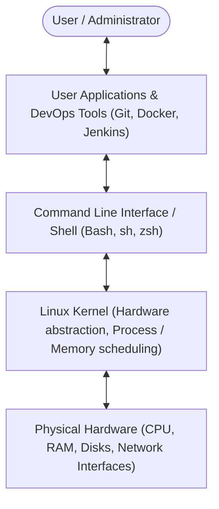
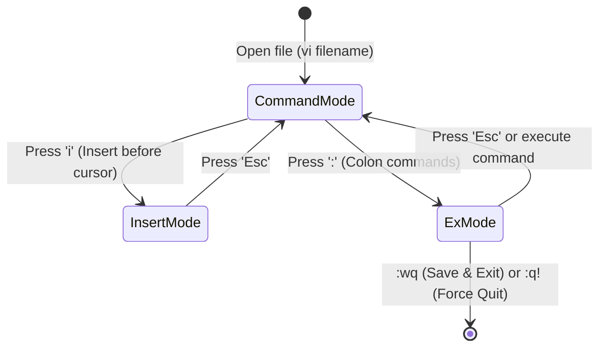
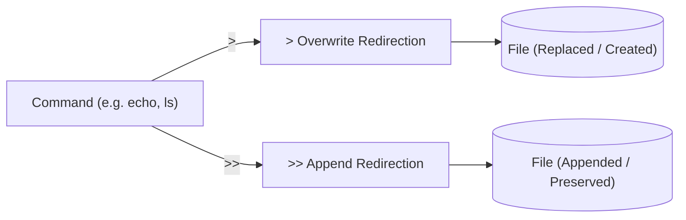
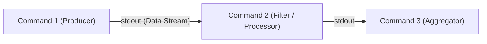
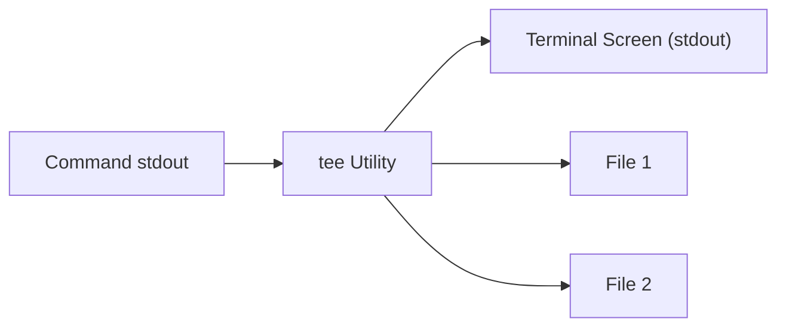
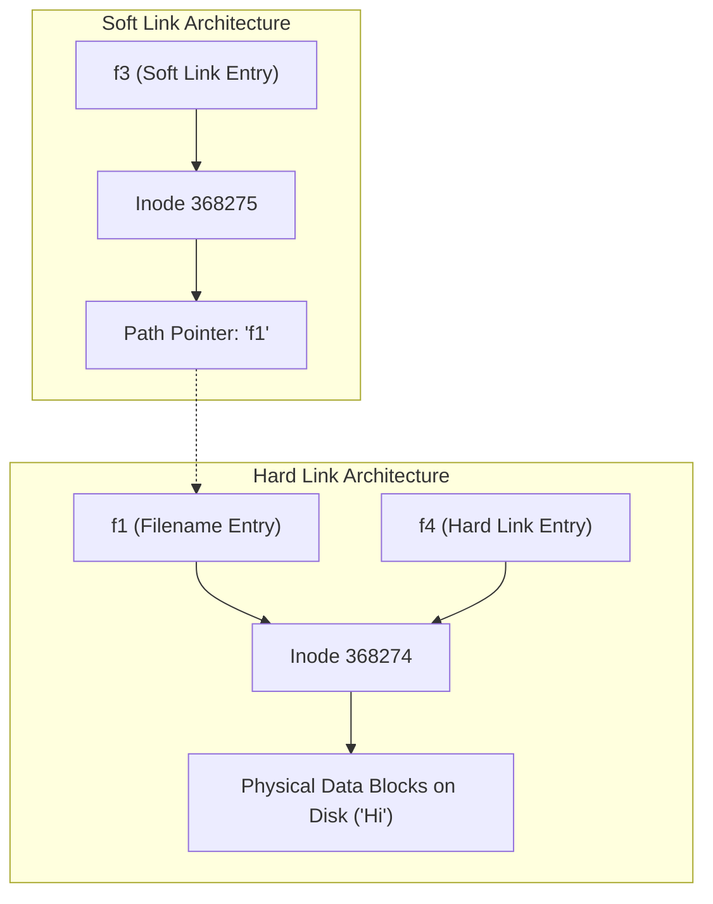
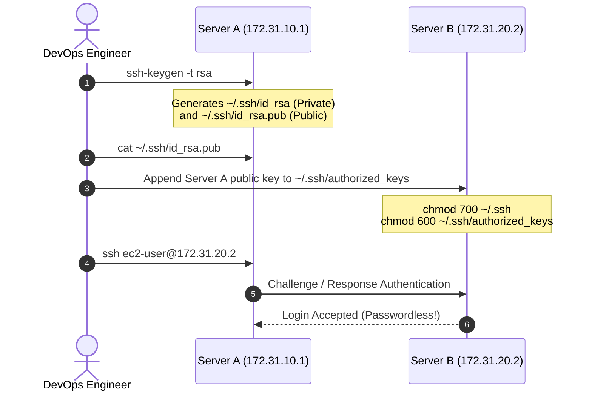
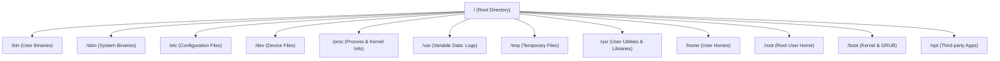

# Linux Complete Engineering & DevOps Notes

Welcome to the comprehensive, beginner-friendly Linux engineering notes. This documentation covers Linux fundamentals, shell operations, text manipulation, user administration, security permissions, process management, networking, system architecture, and practical DevOps assignments.

---

## Table of Contents

1. [Linux Fundamentals & System Architecture](#1-linux-fundamentals--system-architecture)
2. [Text Editing with vi / vim](#2-text-editing-with-vi--vim)
3. [File Inspection, Paging, Documentation & Basic File Operations](#3-file-inspection-paging-documentation--basic-file-operations)
4. [Standard IO, Redirection, Pipelines & Text Utilities](#4-standard-io-redirection-pipelines--text-utilities)
5. [File Searching & System Resource Monitoring](#5-file-searching--system-resource-monitoring)
6. [Advanced Text Processing: grep, sed, cut, and awk](#6-advanced-text-processing-grep-sed-cut-and-awk)
7. [User Administration, Group Management & Sudo Privileges](#7-user-administration-group-management--sudo-privileges)
8. [File Permissions, Ownership & Umask Configuration](#8-file-permissions-ownership--umask-configuration)
9. [System Information, IO Splitting & File Links (Inodes)](#9-system-information-io-splitting--file-links-inodes)
10. [Process Management, Services & System Performance](#10-process-management-services--system-performance)
11. [Networking, SSH, Remote File Transfer & Archiving](#11-networking-ssh-remote-file-transfer--archiving)
12. [Linux Filesystem Hierarchy & Package Management](#12-linux-filesystem-hierarchy--package-management)
13. [Assignments](#assignments)

---

## 1. Linux Fundamentals & System Architecture

### What is an Operating System?
An **Operating System (OS)** is system software that manages computer hardware, software resources, and provides common services for computer programs. It acts as an intermediary / interface between the user, user applications, and the physical computer hardware.



### What is Linux?
**Linux** is a free, open-source, Unix-like operating system kernel created by Linus Torvalds in 1991. When combined with GNU utilities, system libraries, and software packages, it forms a complete Linux distribution (Linux OS).

#### Key Features of Linux
- **Open Source:** The source code is freely available under the GNU General Public License (GPL), allowing anyone to view, modify, and distribute it.
- **Multi-User Capability:** Multiple users can access system memory, RAM, applications, and storage concurrently without interfering with each other's sessions.
- **Multi-Tasking:** The Linux kernel efficiently schedules and runs multiple processes simultaneously using preemptive multitasking.
- **Security & Stability:** Linux enforces a strict permission model (user, group, others) and isolates processes, ensuring high uptime and resistance to viruses and crashes.
- **Portability:** Linux can run across diverse hardware architectures, from tiny embedded systems and ARM processors to large x86_64 enterprise servers and mainframes.

#### Where is Linux Used?
- **IoT (Internet of Things):** Smart home devices, thermostats, smart TVs, and industrial automation equipment.
- **Embedded Systems & Automotive:** Vehicle infotainment units, engine management systems, and robotics.
- **Web & Cloud Infrastructure:** Over 90% of cloud workloads on AWS, Azure, and Google Cloud run Linux, powering web servers, microservices, and databases.
- **Network Devices:** Routers, switches, load balancers, and hardware firewalls.
- **Supercomputers:** Over 99% of the world's top 500 fastest supercomputers run specialized Linux operating systems.

#### Popular Linux Distributions (Flavors)
- **Debian / Ubuntu:** Known for ease of use, extensive package ecosystems via `apt`, and wide adoption in cloud and developer environments.
- **Red Hat Enterprise Linux (RHEL) / CentOS / Amazon Linux / Rocky Linux:** Industry-standard RPM-based distributions widely used in corporate and financial enterprises.
- **Alpine Linux:** An ultra-lightweight distribution (around 5 MB base image) utilizing `musl libc` and `BusyBox`, making it the gold standard for Docker container images.
- **OpenSUSE:** A robust distribution popular in European enterprises, featuring the YaST administration tool and `zypper` package manager.
- **Arch Linux:** A minimalist, bleeding-edge rolling-release distribution favored for complete system customization.

---

### Remote Server Connection Setup via SSH

In cloud environments (such as Amazon Web Services - AWS EC2), servers are accessed remotely using SSH (Secure Shell) with cryptographic key pairs (`.pem` files).

#### Step-by-Step Connection Process:
1. **Navigate to the Directory Containing the Private Key:**
   When you download your private key file from AWS (e.g., `jan2026.pem`), open your terminal or WSL (Windows Subsystem for Linux) and navigate to the `Downloads` directory:
   ```bash
   cd Downloads
   ```
2. **Restrict Key Permissions:**
   SSH requires private keys to be strictly private. If permissions are too open, SSH will reject the connection with an error such as `Permissions 0644 for 'key.pem' are too open`. Set the file permission to read-only for the owner:
   ```bash
   chmod 400 "jan2026.pem"
   ```
   *(400 gives read permission to the owner, and no permissions to group or others).*
3. **Connect to the Remote Server:**
   Execute the `ssh` command using the `-i` (identity file) flag, specifying the remote username and the Public DNS or Public IP address of the EC2 instance:
   ```bash
   ssh -i "jan2026.pem" ec2-user@ec2-15-206-145-107.ap-south-1.compute.amazonaws.com
   ```

---

### Basic Navigation & Directory Commands

#### Checking the Current Working Directory
- `pwd` (Print Working Directory): Displays the absolute path of the directory you are currently located in.
  ```bash
  pwd
  # Example output: /home/ec2-user
  ```

#### Navigating the Filesystem (`cd`)
- `cd` : Changes directory to the user's home path (`/home/username` or `~`).
- `cd ~` : Explicitly navigates to the current user's home directory.
- `cd ..` : Moves one level up to the parent directory.
- `cd <directory-name>` : Moves into the specified child directory.
  ```bash
  cd Downloads       # Enters the Downloads folder
  cd /var/log        # Enters the absolute path /var/log
  cd ../..           # Moves up two directory levels
  ```

#### Creating Files (`touch`)
- `touch <file-name>` : Creates a new empty file. If the file already exists, it updates its last accessed and modified timestamps without altering its contents.
  ```bash
  touch notes.txt
  ```

#### Creating Files with Historical / Custom Timestamps
The `-d` (`--date`) flag allows setting custom creation and modification dates:
```bash
# Create a file with timestamp from 45 days ago
touch -d "45 days ago" file1.txt

# Create a file with timestamp from 30 minutes ago
touch -d "30 minutes ago" file2.txt

# Create a file with timestamp from 1 hour ago
touch -d "1 hour ago" file3.txt

# Create a file with timestamp from 50 seconds ago
touch -d "50 seconds ago" file5.txt

# Create a file with a specific calendar date (Jan 1, 2025)
touch -d "Jan 1 2025" file6.txt
touch -d "1 Jan 2025" file7.txt
```

#### Creating Directories (`mkdir`)
- `mkdir <directory-name>` : Creates a single directory in the current path.
  ```bash
  mkdir projects
  ```
- `mkdir -p <dir1/dir2/dir3>` : Creates nested directory hierarchies along with any missing parent directories (`-p` stands for parents).
  ```bash
  mkdir -p devops/linux/scripts
  ```

#### Listing Directory Contents (`ls`)
The `ls` command lists files and folders. Various flags provide detailed metadata:
- `ls` : Lists the names of files and directories in the present working directory.
- `ls -l` : Long listing format displaying detailed information: file permissions, number of hard links, owner name, group name, file size in bytes, modification timestamp, and file/folder name.
- `ls -lt` : Lists files in long format, sorted by modification time (`-t`), showing the most recently modified files first.
- `ls -lrt` : Lists files in long format, sorted by modification time in **reverse** order (`-r`), placing the most recently modified files at the very bottom of the output (very useful when checking newly created files).
- `ls -lRt` or `ls -R` : Recursive listing (`-R`), displaying all files and subdirectories throughout the entire directory tree.

---

## 2. Text Editing with vi / vim

The **vi** (Visual) editor is a standard text editor bundled with Unix and Linux operating systems. Its modern, enhanced successor is **vim** (Vi IMproved). It is a modal editor, meaning keystrokes behave differently depending on the active operational mode.



### Opening a File in vi
```bash
vi filename.txt
```
*Note: By default, vi opens in **Command Mode**.*

### Switching Modes
- `i` : Switches from Command Mode to **Insert Mode**. You can now type and edit text.
- `Esc` : Exits Insert Mode and returns to **Command Mode**.

### Saving and Exiting
All file write and exit commands are executed from Command Mode using the `:` (colon) prefix:
- `Esc` + `:w` : **Write** (saves the changes made to the file without exiting).
- `Esc` + `:q` : **Quit** (closes the editor; fails if there are unsaved changes).
- `Esc` + `:q!` : **Force Quit** (quits immediately without saving any changes).
- `Esc` + `:wq` : **Write & Quit** (saves all changes and exits vi).
- `Esc` + `:x` : Saves and exits (equivalent to `:wq`).

*Syntax Breakdown:*
- `w` = Write / Save
- `q` = Quit / Exit
- `!` = Force / Override

---

### Viewing File Contents
- `cat <file-name>` : Displays the complete text content of a file on the terminal screen.
- `cat -n <file-name>` : Displays the text content along with continuous line reference numbers.

---

### Managing Line Numbers in vi
- `Esc` + `:set nu` : Enables and displays line numbers on the left margin.
- `Esc` + `:set nonu` : Disables and hides line numbers.

---

### Searching for Strings and Patterns in vi
- `Esc` + `/<pattern>` : Searches forward from the cursor for the specified text pattern. Press `Enter` to find the first match.
- `Esc` + `/\c<pattern>` : Performs a **case-insensitive** forward search for the pattern.
- `n` : Jumps to the **next** occurrence of the search match.
- `N` : Jumps to the **previous** occurrence of the search match.

---

### Find and Replace Engine in vi

The substitution command in vi follows the syntax:
```text
:[range]s/<old-pattern>/<new-pattern>/[flags]
```

#### Global Search and Replace Across the Entire File:
```text
Esc + :%s/<old-pattern>/<new-pattern>/igc
```

#### Detailed Flag Breakdown:
- `%` : Applies the substitution across **all lines** in the file (from line 1 to `$`).
- `s` : Invokes the **substitute** operation.
- `<old-pattern>` : The existing text string or pattern to locate.
- `<new-pattern>` : The replacement text string.
- `i` : **Ignore case** (matches both uppercase and lowercase variants).
- `g` : **Global** flag (replaces all occurrences on every matching line, rather than just the first occurrence on that line).
- `c` : **Confirmation** prompt. Prompts the user before each substitution:
  - `y` : Confirm and perform substitution on this occurrence.
  - `n` : Skip this occurrence and proceed to next.
  - `a` : Substitute this and all remaining occurrences automatically.
  - `q` : Quit the substitution process immediately.

#### Scoped Line Substitutions:
- `:3s/<old>/<new>/g` : Replaces `<old>` with `<new>` **only on line 3**.
- `:3,6s/<old>/<new>/g` : Replaces `<old>` with `<new>` on lines **3 through 6** inclusive.
- `:3,$s/<old>/<new>/g` : Replaces `<old>` with `<new>` starting from line 3 up to the **end of the file** (`$`).

---

### Undo and Redo in vi
- `Esc` + `:undo` or simply pressing `u` in Command Mode: **Undoes** the last change.
- `Esc` + `:redo` or pressing `Ctrl + r` in Command Mode: **Redoes** the previously undone change.

---

### Deleting Lines in vi
All deletion shortcuts operate from Command Mode:
- `dd` : Deletes the current single line where the cursor is positioned.
- `3dd` : Deletes **3 lines** starting from the current cursor position downwards.
- `:3d` : Deletes line 3 of the file.
- `:3,6d` : Deletes all lines from line 3 to line 6 inclusive.
- `:3,$d` : Deletes all lines from line 3 to the end of the file.
- `:%d` : Deletes **all lines** in the entire file, leaving an empty buffer.

---

## 3. File Inspection, Paging, Documentation & Basic File Operations

### Viewing Portions of Files: `head` and `tail`

#### The `head` Command
The `head` command displays the beginning lines of a file.
- `head <filename>` : Prints the first 10 lines by default.
- `head -n 6 <filename>` or `head -6 <filename>` : Prints the first 6 lines of the file.

#### The `tail` Command
The `tail` command displays the ending lines of a file.
- `tail <filename>` : Prints the last 10 lines by default.
- `tail -n 6 <filename>` or `tail -6 <filename>` : Prints the last 6 lines of the file.
- `tail -f <filename>` : **Follow mode**. Continuously monitors and outputs newly appended data in real-time as the file grows. Essential in DevOps for tracking application and server logs (`/var/log/messages`, `catalina.out`, `nginx/access.log`).

#### Combining `head` and `tail` via Pipelines
By passing the output of `head` into `tail` via a pipe (`|`), you can isolate any specific line range within a file:
- `head -6 file.txt | tail -2` : Takes the first 6 lines of `file.txt` and then outputs the last 2 lines of that selection. Result: **Lines 5 and 6**.
- `head -10 file.txt | tail -4` : Takes the first 10 lines and outputs the last 4 lines. Result: **Lines 7, 8, 9, and 10**.
- `head -10 file.txt | tail -1` : Takes the first 10 lines and outputs the last single line. Result: **The 10th line**.

---

### Paging Large Files with `less`

When inspecting very large log files or configurations, `cat` can overwhelm the terminal. The `less` utility opens files in a fast, navigable viewer without loading the whole file into RAM.

```bash
less large_file.log
less -N large_file.log    # Displays line numbers (-N)
```

#### Navigation Shortcuts Inside `less`:
- `f` or `Space` : Scroll **forward** by one full screen page.
- `b` : Scroll **backward** by one full screen page.
- `g` : Jump directly to the **first line** of the file.
- `G` : Jump directly to the **last line** of the file.
- `/<pattern>` : Search forward for a pattern.
- `n` : Jump to the next search match.
- `N` : Jump to the previous search match.
- `q` : **Quit** and exit `less`.

---

### Built-in System Documentation: `man` and `--help`
- `man <command>` : Displays the complete system manual page for the given command, including descriptions, all available options, exit statuses, and examples.
  ```bash
  man ls
  man grep
  ```
- `<command> --help` : Outputs a concise, fast reference summary of syntax, usage, and commonly used flags.
  ```bash
  tar --help
  find --help
  ```

---

### Basic File and Directory Operations

#### Copying Files and Directories (`cp`)
- `cp <source-file> <destination-file>` : Copies a file to a new destination or copies and renames it.
  ```bash
  cp app.conf app.conf.bak
  ```
- `cp -r <source-dir> <destination-dir>` : Copies a directory and all of its nested contents recursively (`-r` = recursive).
  ```bash
  cp -r /opt/config /opt/backup/
  ```

#### Moving and Renaming Files and Directories (`mv`)
- `mv <source> <destination>` : Moves a file or directory to a different location or renames it.
  ```bash
  mv test.txt prod.txt               # Renames test.txt to prod.txt
  mv script.sh /usr/local/bin/       # Moves script.sh to /usr/local/bin/
  ```

#### Deleting Files and Directories (`rm`)
- `rm <file-name>` : Deletes a file.
- `rm -f <file-name>` : Forcefully deletes a file without prompting for confirmation (`-f` = force).
- `rm -r <directory-name>` : Deletes a directory and its contents recursively.
- `rm -rf <directory-name>` : Forcefully and recursively removes a directory and all nested files and subfolders without prompts. *(Use with caution!)*

---

### Pattern Matching with Wildcards (`*`)
The asterisk wildcard (`*`) represents zero or more characters in bash:
- `rm test*` : Removes all files and folders starting with the word `test` (e.g., `test1`, `test_app`, `testing.py`).
- `rm *.sh` : Removes all files ending with the extension `.sh`.
- `rm a*.sh` : Removes all files that start with the letter `a` and end with `.sh` (e.g., `app.sh`, `admin.sh`).
- `rm -f test*` : Forcefully removes all files starting with `test` without prompting.

---

## 4. Standard IO, Redirection, Pipelines & Text Utilities

### Printing Text with `echo`
The `echo` command prints text strings or variable values to standard output (the terminal):
```bash
echo "Hello DevOps Engineers"
```

#### Interpreting Escape Characters (`-e`):
Using the `-e` flag enables the interpretation of backslash escape characters:
- `
` : Newline character (breaks output onto the next line).
- `	` : Horizontal tab.

```bash
echo -e "Hello
How are You"
# Output:
# Hello
# How are You
```

---

### Output Redirection (`>` and `>>`)

In Linux, standard output (`stdout`) generated by any command can be captured and saved directly into a file.



#### 1. Overwrite Redirection (`>`)
Redirects the standard output of a command to a file. If the file does not exist, it creates it. If the file already exists, it **completely overwrites and replaces** the file contents.
```bash
echo "hello" > test.txt
# test.txt now contains: hello
```

#### 2. Append Redirection (`>>`)
Appends standard output to the very end of the file. If the file exists, previous data is preserved and new lines are added at the bottom. If the file does not exist, it creates it.
```bash
echo "how are you" >> test.txt
# test.txt now contains:
# hello
# how are you
```

---

### The Linux Pipeline (`|`)

The pipeline operator (`|`) routes the standard output (`stdout`) of the preceding command directly into the standard input (`stdin`) of the succeeding command. This enables chaining multiple single-purpose tools together.



#### Practical Pipeline Examples:
```bash
# Print lines 7 through 10 of a file
head -10 test.txt | tail -4

# Print exactly line 10
head -10 test.txt | tail -1

# Count the total number of words across the first 10 lines of a file
head -10 test.txt | wc -w
```

---

### Word, Line, and Character Count (`wc`)

The `wc` (word count) utility analyzes and reports line counts, word counts, and byte counts of files or standard input streams:
- `wc <filename>` : Prints three metrics: line count, word count, and byte count.
- `wc -l <filename>` : Prints **only the number of lines**.
- `wc -w <filename>` : Prints **only the number of words**.
- `wc -c <filename>` : Prints **only the number of bytes / characters**.

```bash
wc notes.txt
# Example output: 45  320 2048 notes.txt
# (45 lines, 320 words, 2048 bytes)

wc -l notes.txt
# 45 notes.txt
```

---

## 5. File Searching & System Resource Monitoring

### Finding Files and Directories with `find`

The `find` utility recursively searches filesystems based on search criteria such as file names, extensions, file types, modification times, sizes, and permissions.

#### 1. Basic Name Searching
- `find -name <name>` : Searches for files or directories matching `<name>` (case-sensitive).
  ```bash
  find -name "server.xml"
  ```
- `find -iname <name>` : Searches for files or directories ignoring case (`-i` = case-insensitive).
  ```bash
  find -iname "readme.txt"    # Matches README.txt, Readme.Txt, readme.txt
  ```
- `find <path> -name <name>` : Searches within a specific starting directory path.
  ```bash
  find /var/log -name "*.log"
  find scripts -type f init.sh
  ```
- `find / -name <name>` : Initiates search from the root filesystem (`/`), scanning the entire operating system.

#### 2. Filtering by Type (`-type`)
- `-type f` : Restricts search to regular **files**.
  ```bash
  find . -type f -name "*.sh"
  ```
- `-type d` : Restricts search to **directories**.
  ```bash
  find . -type d -name "config"
  ```

#### 3. Controlling Search Depth (`-maxdepth` and `-mindepth`)
- `-maxdepth 1` : Restricts search exclusively to the current directory level, preventing descent into subdirectories.
  ```bash
  find . -maxdepth 1 -type f -name "*.txt"
  ```
- `-mindepth 3` : Ignores results until at least 3 directory levels deep.
  ```bash
  find . -mindepth 3 -type f -name "*.conf"
  ```

#### 4. Time-Based Search Criteria (`-mtime` and `-mmin`)
Modification time can be evaluated in whole days (`-mtime`) or minutes (`-mmin`):
- `find -mtime -7` : Files/directories modified within the last 7 days (`-7` = less than 7 days ago).
- `find -mtime +7` : Files/directories modified more than 7 days ago (`+7` = greater than 7 days ago).
- `find . -type f -mmin -360` : Files modified within the last 360 minutes (last 6 hours).
- `find . -type f -mmin -30` : Files modified within the last 30 minutes.

#### 5. Locating Empty Files and Deleting Them
- `find . -type f -empty` : Finds all files of size 0 bytes.
- `find . -type f -empty -delete` : Automatically deletes all identified 0-byte empty files.

#### 6. Size-Based Searching (`-size`)
The `-size` parameter matches file sizes. Standard units:
- `c` : Bytes
- `k` : Kilobytes (note: lowercase `k`)
- `M` : Megabytes (note: uppercase `M`)
- `G` : Gigabytes (note: uppercase `G`)

```bash
# Find all non-empty files (size greater than 0 bytes)
find . -type f -size +0

# Find all files larger than 1 Kilobyte
find . -type f -size +1k

# Find all files larger than 1 Megabyte
find . -type f -size +1M

# Find all files larger than 1 Gigabyte
find . -type f -size +1G

# Find all files smaller than 5 Megabytes
find . -type f -size -5M
```

---

### System & Disk Resource Monitoring

#### 1. Filesystem Disk Space Usage (`df -h`)
Displays disk space usage of all mounted filesystems:
- `-h` : Human-readable format (displays sizes in GB, MB, KB rather than raw 1K blocks).
```bash
df -h
```
*Output columns:* Filesystem, Size, Used, Available, Use%, Mounted on.

#### 2. Directory and File Space Consumption (`du -h`)
Displays disk usage consumed by individual directories or files:
- `-h` : Human-readable format.
```bash
du -h /var/log
du -sh /opt/tomcat      # -s displays summary total for the directory
```

#### 3. Exact File Size in Bytes (`stat`)
Displays detailed file metadata (inode, size, permissions, access/modify/change timestamps):
```bash
stat -c %s filename.txt
# Returns the exact size of filename.txt in raw bytes
```

#### 4. Memory Utilization (`free -h`)
Displays total, used, and available physical RAM and virtual Swap memory:
```bash
free -h
```
*Output columns:* total, used, free, shared, buff/cache, available.

---

## 6. Advanced Text Processing: grep, sed, cut, and awk

### Pattern Matching with `grep` (Global Regular Expression Print)

The `grep` command searches text files for lines matching a specified string or regular expression pattern.

```bash
grep "<string>" <file-name>
```

#### Commonly Used Flags:
- `grep -i "<string>" <file>` : **Case-insensitive** search (matches uppercase and lowercase).
- `grep -n "<string>" <file>` : Displays matching lines alongside their **line numbers**.
- `grep -c "<string>" <file>` : Outputs only the **count** of matching lines.
- `grep -e "<str1>" -e "<str2>" <file>` : Matches **multiple patterns** simultaneously.
- `grep -v "<string>" <file>` : **Invert match** (prints all lines that do NOT contain the string).
- `grep -lR "<string>" <path>` : Recursively (`-R`) searches directories and displays **only the filenames** (`-l`) that contain matching text.

#### Anchoring with Regular Expressions:
- `grep "^<string>" <file>` : Matches lines that **start with** `<string>` (`^` = beginning of line).
- `grep "<string>$" <file>` : Matches lines that **end with** `<string>` (`$` = end of line).
- `grep "^<string>$" <file>` : Matches lines containing **strictly and only** `<string>` from start to finish.

#### Inverted File Listing (`-L`):
- `grep -L "<string>" <file-pattern>` : Lists the names of files that **do NOT contain** the matching string.

---

### Stream Editing with `sed` (Stream Editor)

`sed` is a powerful non-interactive stream editor that parses text and performs transformations, substitutions, deletions, and line-specific printing.

#### 1. Find and Replace Strings
```bash
sed 's/<old>/<new>/ig' <filename>
```
- `s` : Substitute command.
- `old` : Target text to find.
- `new` : Replacement text.
- `i` : Case-insensitive matching.
- `g` : Global (replaces all occurrences on each line).
*Note: By default, `sed` outputs the modified text to the terminal and leaves the source file unmodified.*

#### Modifying the File In-Place (`-i`):
```bash
sed -i 's/<old>/<new>/ig' <filename>
# The file is updated directly on disk.
```

#### Line-Scoped Substitutions:
- `sed '3s/old/new/ig' file.txt` : Replaces text **only on line 3**.
- `sed '3,6s/old/new/ig' file.txt` : Replaces text from line 3 through line 6.
- `sed '3;6s/old/new/ig' file.txt` : Replaces text on line 3 and line 6.
- `sed '3,$s/old/new/ig' file.txt` : Replaces text from line 3 to the end of the file (`$`).

#### 2. Deleting Lines (`d`)
- `sed '3d' file.txt` : Deletes line 3 from the stream output.
- `sed -i '3d' file.txt` : Permanently deletes line 3 from the file.
- `sed '3,6d' file.txt` : Deletes lines 3 through 6.
- `sed '3d;6d' file.txt` : Deletes line 3 and line 6.
- `sed '3,$d' file.txt` : Deletes from line 3 to the end of the file.

#### 3. Printing Specific Lines (`p`)
Used with the `-n` flag (which suppresses automatic line printing):
- `sed -n '3p' file.txt` : Prints only line 3.
- `sed -n '3,6p' file.txt` : Prints lines 3 through 6.
- `sed -n '3,$p' file.txt` : Prints from line 3 to the end of the file.
- `sed -n '3p;6p' file.txt` : Prints line 3 and line 6.

#### Counting Pattern Matches with `sed` and `wc`:
```bash
sed -n '/<pattern>/p' <file> | wc -l
# Filters matching lines and counts them with wc -l
```

---

### Column Extraction with `cut`

The `cut` command extracts selected sections or fields from each line of a file based on delimiters.

#### Syntax:
```bash
cut -d "<delimiter>" -f<fields> <file-name>
```
- `-d` : Delimiter separating fields (default is Tab).
- `-f` : Field / column index to extract.

#### Examples:
- `cut -d " " -f3 file.txt` : Prints the 3rd field delimited by space.
- `cut -d " " -f3-6 file.txt` : Prints a contiguous range from field 3 through field 6.
- `cut -d " " -f3,6 file.txt` : Prints field 3 and field 6.

---

### Deep Dive: Delimiter Mechanics in `cut`

Consider this command pipeline:
```bash
echo "+ Version +ID = RHEL number is 111" | cut -d "=" -f2 | cut -d " " -f5
```

#### Step-by-Step Breakdown:
1. **Initial Input String:**
   `+ Version +ID = RHEL number is 111`
2. **First Processing Stage:** `cut -d "=" -f2`
   - Delimiter is `=`.
   - Field 1 (before `=`): `+ Version +ID `
   - Field 2 (after `=`): ` RHEL number is 111`
   - **Crucial Observation:** Notice the **leading space** immediately following `=`! Field 2 begins with a space character: `" RHEL number is 111"`.
3. **Second Processing Stage:** `cut -d " " -f5`
   - The string `" RHEL number is 111"` is now evaluated with a space delimiter (`" "`).
   - `cut` strictly treats every single delimiter character as a boundary, meaning the leading space creates an empty first field:

| Field Index | Extracted Token | Explanation |
|---|---|---|
| `-f1` | `""` (empty string) | Characters before the very first space |
| `-f2` | `RHEL` | Text between 1st space and 2nd space |
| `-f3` | `number` | Text between 2nd space and 3rd space |
| `-f4` | `is` | Text between 3rd space and 4th space |
| `-f5` | `111` | Text after the 4th space |

**Final Command Output:** `111`

*Note on `cut` vs `awk`:* Unlike `cut`, which treats each individual space character as a separate delimiter, `awk` by default treats continuous consecutive whitespace as a single separator. Therefore, `awk '{print $4}'` on `" RHEL number is 111"` yields `111`.

---

### Pattern Scanning and Data Processing with `awk`

`awk` is a full programming language designed for text processing, reporting, and structured column/row extraction.

#### Basic Usage:
- `awk '{print}' <file-name>` : Prints the entire file content (equivalent to `cat`).

#### Column Extraction with `-F` (Field Separator):
*Space is the default field separator in awk.*
- `awk -F " " '{print $3}' <file>` : Prints the 3rd column of each line.
- `awk -F " " '{print $3, $6}' <file>` : Prints the 3rd and 6th columns.
- `awk -F " " '{print $NF}' <file>` : Prints the **last column** (`$NF` = Number of Fields).
- `awk -F " " '{print $(NF-1)}' <file>` : Prints the second-to-last column.
- `awk -F " " '{print NF}' <file>` : Prints the total count of columns present in each row.

#### Row Extraction using `NR` (Number of Records / Line Number):
- `awk 'NR==3 {print}' <file>` : Prints row 3 of the file.
- `awk 'NR==3, NR==6 {print}' <file>` : Prints rows 3 through 6.
- `awk 'NR==3; NR==6 {print}' <file>` : Prints row 3 and row 6.
- `awk 'END {print NR}' <file>` : Evaluates all lines and prints the **total row count** of the file.

#### Counting String Occurrences with `awk`:
```bash
awk '/<string>/ {count++} END {print count}' <file-name>
# Increments variable 'count' for every line matching <string>, then prints total at END
```

---

## 7. User Administration, Group Management & Sudo Privileges

### Administrative Privilege Escalation with `sudo`

`sudo` stands for **SuperUser DO**. It allows a permitted user to execute commands with administrative (root) security privileges.

```bash
sudo <command>
# Example:
sudo yum install unzip -y
```

#### The Sudoers Configuration File (`/etc/sudoers`)
The permissions governing who can run what as root are defined in `/etc/sudoers`.

> [!IMPORTANT]
> **CRITICAL RULE:** Never edit `/etc/sudoers` with regular editors like `vi` or `nano`! Always use the specialized command:
> ```bash
> sudo visudo
> ```
> `visudo` locks the file against simultaneous modifications and strictly parses syntax before writing changes. A syntax error in `/etc/sudoers` can completely lock all administrators out of root access!

#### Configuration Syntax in `/etc/sudoers`:
- **Granting Privileges to an Individual User:**
  ```text
  username ALL=(ALL) ALL
  ```
  *(Allows user `username` on ALL hosts, as ALL users, to run ALL commands).*
  - For passwordless sudo:
    ```text
    username ALL=(ALL) NOPASSWD: ALL
    ```
- **Granting Privileges to a Group:**
  In Linux, group entries in `/etc/sudoers` are prefixed with a percent sign (`%`):
  ```text
  %groupname ALL=(ALL) ALL
  # Example:
  %wheel ALL=(ALL) ALL
  ```

---

### User Management Commands

#### 1. Creating a User Account (`useradd`)
```bash
sudo useradd <username>
# Example:
sudo useradd devops
```
*When a user is created, Linux automatically:*
- Assigns a unique UID (User ID) and GID (Group ID).
- Creates the user's primary group.
- Creates the user's home directory under `/home/<username>`.
- Copies shell profiles (`.bashrc`, `.bash_profile`) from `/etc/skel`.

#### 2. Setting or Changing User Password (`passwd`)
```bash
sudo passwd <username>
# Prompts securely for the new password twice
```

#### 3. Deleting a User Account (`userdel`)
- `sudo userdel <username>` : Deletes the user account from `/etc/passwd`, but leaves their home directory and user files intact on disk.
- `sudo userdel -r <username>` : **Recursive deletion** (`-r`). Deletes the user account AND completely removes their home directory (`/home/<username>`) and mail spool.

---

### Switching User Accounts (`su`)
The `su` (Switch User) command switches between accounts:
- `su <username>` : Switches to `<username>`. Prompts for the target user's password. Retains the current shell's environment variables.
- `sudo su <username>` : Switches to `<username>` using sudo credentials without requiring the target user's password.
- `sudo su -` : Switches to the `root` superuser and initiates a full login shell with root's environment (`PATH`, home directory `/root`, etc.).
- `sudo su - <username>` : Switches to `<username>` with a fresh login shell, loading their personal home directory and environment variables.

---

### User Account Database: `/etc/passwd`
System user account records are stored in `/etc/passwd`.
```bash
cat /etc/passwd
getent passwd <username>
```

#### Structure of an Entry in `/etc/passwd`:
```text
username:password:UID:GID:comment:home_directory:login_shell
```
*Example:*
```text
ec2-user:x:1000:1000:EC2 Default User:/home/ec2-user:/bin/bash
```
- `ec2-user` : Login username.
- `x` : Password placeholder (actual hashed passwords reside securely in `/etc/shadow`).
- `1000` : User ID (UID). Root has UID 0; system users typically have 1-999; regular users start at 1000+.
- `1000` : Primary Group ID (GID).
- `EC2 Default User` : Comment / Full Name / GECOS field.
- `/home/ec2-user` : User's home directory.
- `/bin/bash` : Default login shell executable.

---

### Group Management Commands

#### 1. Creating a Group (`groupadd`)
```bash
sudo groupadd devteam
```

#### 2. Deleting a Group (`groupdel`)
```bash
sudo groupdel devteam
```

#### 3. Adding a User to a Group (`gpasswd -a`)
```bash
sudo gpasswd -a <username> <groupname>
# Example: Add devops user to docker group:
sudo gpasswd -a devops docker
```

#### 4. Removing a User from a Group (`gpasswd -d`)
```bash
sudo gpasswd -d <username> <groupname>
# Example:
sudo gpasswd -d devops docker
```

#### 5. Inspecting Groups (`/etc/group`)
```bash
cat /etc/group
getent group devteam
```
*Format:* `group_name:password_placeholder:GID:member_list` (e.g., `devteam:x:1001:devops,john,alice`).

---

## 8. File Permissions, Ownership & Umask Configuration

### Linux Permission Architecture

Every file and directory in Linux has an ownership model divided into three categories:
- `u` = **User / Owner** (The account that owns the file).
- `g` = **Group** (The user group that owns the file).
- `o` = **Others** (Everyone else with access to the system).

#### Permission Types and Octal Values:
| Permission | Character Code | Octal Value | Meaning on a File | Meaning on a Directory |
|---|---|---|---|---|
| **Read** | `r` | **4** | Can view file contents | Can list contents with `ls` |
| **Write** | `w` | **2** | Can modify file contents | Can create / delete files inside |
| **Execute**| `x` | **1** | Can run as a binary / script | Can enter directory with `cd` |

The maximum permission for any category is `4 + 2 + 1 = 7` (`rwx`).

---

### Modifying File Permissions (`chmod`)

#### 1. Numeric (Octal) Mode
You supply a three-digit octal number representing User, Group, and Others:
- `chmod 644 <file>` :
  - Owner: `6` (`4+2` = `rw-`)
  - Group: `4` (`r--`)
  - Others: `4` (`r--`)
  - *(Standard permission for regular configuration and text files).*
- `chmod 764 <file>` :
  - Owner: `7` (`4+2+1` = `rwx`)
  - Group: `6` (`4+2` = `rw-`)
  - Others: `4` (`r--`)
- `chmod 400 <file>` :
  - Owner: `4` (`r--`)
  - Group: `0` (`---`)
  - Others: `0` (`---`)
  - *(Required permission for SSH private keys).*
- `chmod 600 <file>` :
  - Owner: `6` (`rw-`)
  - Group: `0` (`---`)
  - Others: `0` (`---`)
  - *(Confidential files accessible only by owner).*
- `chmod -R <permission> <directory>` :
  - Applies permission changes **recursively** to the directory and all files/subdirectories inside.

#### 2. Symbolic Mode
Uses letters representing identities (`u`, `g`, `o`, `a`) and operators (`+`, `-`, `=`):
- `chmod u+x <file>` : Adds executable permission to the user/owner.
- `chmod o+rw <file>` : Adds read and write permissions to others.
- `chmod g-w <file>` : Removes write permission from the group.
- `chmod u+x,g+w,o+rw <file>` : Combines multiple operations in a single command: grants execute to owner, write to group, and read/write to others.

---

### Modifying Ownership (`chown` and `chgrp`)

- `chown <username> <file>` : Changes the owner of the file.
- `chgrp <groupname> <file>` : Changes the group ownership of the file.
- `chown <username>:<groupname> <file>` : Changes **both** the owner and the group in a single command.
- `chown -R <username>:<groupname> <directory>` : Recursively changes owner and group for a directory and its entire contents.

```bash
# Example:
sudo chown -R tomcat:tomcat /opt/tomcat
```

---

### Default Permissions and `umask`

When a new file or directory is created, Linux determines its initial permissions using the system **Base Permissions** minus the **Umask** value.

#### System Base Permissions:
- **Files Base Permission:** `666` (`rw-rw-rw-`). Files are never given execute (`x`) permissions by default for security.
- **Directories Base Permission:** `777` (`rwxrwxrwx`). Directories require execute permissions so users can enter (`cd`) and traverse them.

#### What is `umask`?
The `umask` (User Mask) is a setting that controls default permissions for newly created files and directories by subtracting (masking) permission bits from the base permission.

$$	ext{Default Permissions} = 	ext{Base Permissions} - 	ext{Umask}$$

#### Calculations:

1. **When `umask = 022` (Standard default on most Linux distributions):**
   - **Files:** `666 - 022 = 644` (`rw-r--r--`). Owner has read/write; Group and Others have read-only.
   - **Directories:** `777 - 022 = 755` (`rwxr-xr-x`). Owner has full access; Group and Others can read and enter.

2. **When `umask = 002` (Common for collaborative group environments):**
   - **Files:** `666 - 002 = 664` (`rw-rw-r--`). Owner and Group have read/write; Others have read-only.
   - **Directories:** `777 - 002 = 775` (`rwxrwxr-x`). Owner and Group have full control; Others can read and enter.

3. **When `umask = 066` (Strict security environment):**
   - **Files:** `666 - 066 = 600` (`rw-------`). Owner has read/write; Group and Others have no permissions.
   - **Directories:** `777 - 066 = 711` (`rwx--x--x`). Owner has full access; Group and Others can only traverse.

To check your current umask:
```bash
umask
# Output: 0022
```

---

## 9. System Information, IO Splitting & File Links (Inodes)

### System Information Commands

- `who` : Lists all users currently logged into the server, their terminal devices, and login timestamps.
- `whoami` : Prints the effective username of the current user executing the command.
- `id` : Displays the current user's User ID (`uid`), primary Group ID (`gid`), and all supplementary groups the user belongs to.
- `uname` : Prints the operating system kernel name (e.g., `Linux`).
- `uname -a` : Displays complete kernel and system architecture information:
  - Kernel name (`Linux`)
  - Hostname / node name
  - Kernel release version (e.g., `5.10.16-200.fc33.x86_64`)
  - Kernel build timestamp
  - Machine hardware architecture (`x86_64`, `aarch64`)
  - Processor type and operating system
- `cat /etc/os-release` : Displays official Linux distribution details, release version, code name, and vendor documentation URLs.
- `ping <hostname/IP/website>` : Tests network reachability of a remote host and measures round-trip packet latency using the **ICMP** (Internet Control Message Protocol).
  ```bash
  ping -c 4 google.com
  ```

---

### Output Splitting with `tee`

The `tee` command reads from standard input and writes simultaneously to standard output (the terminal) **and** to one or more files.



#### Common Usage Patterns:
- `<command> | tee <filename>` : Redirects output to `<filename>` (overwriting) while also displaying it on the screen.
  ```bash
  echo "Server Deployment Successful" | tee deploy.log
  ```
- `<command> | tee -a <filename>` : **Appends** output to `<filename>` (`-a` = append) while also displaying it on the screen.
  ```bash
  echo "New build completed" | tee -a deploy.log
  ```
- `<command> | tee <file1> <file2>` : Writes output simultaneously to multiple files and the terminal.

---

### Deep Dive: Inodes, Hard Links & Soft Links

#### What is an Inode?
An **inode** (index node) is a fundamental data structure in Linux filesystems that stores all metadata about a file or directory.

#### What an Inode Contains:
- File type (regular file, directory, socket, symbolic link)
- Permissions (read, write, execute)
- Owner UID and Group GID
- File size in bytes
- Timestamps (atime: access time, mtime: modification time, ctime: metadata change time)
- Number of hard links pointing to the inode
- Pointers to physical storage data blocks on disk

> [!NOTE]
> **What an Inode Does NOT Store:**
> An inode does **NOT** store the filename or the file's data contents! Filenames are stored in directory tables alongside their mapped inode numbers.

#### Inode Commands:
- `ls -i` : Displays the inode number of files and directories.
- `df -i` : Displays inode capacity and usage across all mounted filesystems. (A disk can run out of inodes even when free gigabytes remain if millions of tiny files are created!).

---

### Soft Link (Symbolic Link) vs Hard Link



#### Detailed Comparison:

| Feature | Hard Link (`ln original hardlink`) | Soft / Symbolic Link (`ln -s original softlink`) |
|---|---|---|
| **Inode Number** | **Same** inode number as the original file | **Different**, unique inode number |
| **Pointer Target** | Points directly to the inode and physical disk data blocks | Points to the path / filename of the original file |
| **If Original is Deleted** | **Still works!** Data remains accessible through the hard link until all links are removed | **Breaks!** Becomes a "dangling link" pointing to a non-existent path |
| **Directory Support** | Cannot be created for directories (prevents infinite filesystem loops) | Can link both files and directories |
| **Filesystem Boundaries**| Cannot span across different filesystems / partitions | Can cross different filesystems and mount points |

#### Practical Demonstration:
```bash
# Step 1: Create a file with content using tee
echo "Hi" | tee f1
# Output: Hi

# Step 2: Create a soft link to f1 named f3
ln -s f1 f3

# Step 3: Check long listing
ls -l
# Output shows: f3 -> f1

# Step 4: Create a hard link to f1 named f4
ln f1 f4

# Step 5: Check long listing
ls -l
# Output shows link count is 2 for both f1 and f4

# Step 6: Inspect inode numbers
ls -i
# Output:
# 368274 f1
# 368275 f3  (Soft link has a distinct inode)
# 368274 f4  (Hard link shares the exact same inode as f1!)
```

---

## 10. Process Management, Services & System Performance

### Process Management

A **process** is an instance of an executing program in memory. Every process in Linux is assigned a unique **Process ID (PID)**.

#### Listing Processes:
- `ps -ef` : Lists all processes running across the entire system from all users:
  - `-e` : Selects all processes.
  - `-f` : Generates full-format listing (UID, PID, PPID, C, STIME, TTY, TIME, CMD).
- `ps -u <username>` : Lists all processes initiated by a specific user.

#### Terminating Processes (`kill`):
- `kill <PID>` : Sends the default **SIGTERM (Signal 15)**. Graceful termination: signals the process to stop safely, release system resources, close open database connections/file descriptors, and clean up before exiting.
- `kill -9 <PID>` : Sends **SIGKILL (Signal 9)**. Forceful termination: the Linux kernel immediately halts and destroys the process without allowing it to clean up. Used when a process is completely frozen or unresponsive.

---

### Interactive Process Monitoring with `top`

The `top` utility provides a dynamic, real-time interactive monitor of system processes, CPU utilization, memory consumption, and load averages.

#### Interactive Keybindings Inside `top`:
- `k` : Prompts to kill a process (type the PID and signal number).
- `u` : Filters process display by a specific username.
- `q` : Quits `top` and returns to shell.
- `M` : Sorts processes by memory usage.
- `P` : Sorts processes by CPU usage.

---

### Hardware Capacity: Memory and CPU Cores
- `free -h` : Checks physical RAM and virtual Swap memory usage in human-readable units.
- `nproc` : Returns the total number of processing units (CPU cores) available to the current process.

---

### Managing System Services

#### 1. Traditional Init System (`service`)
Used on legacy Linux distributions (SysVinit):
- `service <service-name> status` : Checks if a service is running.
- `sudo service <service-name> start` : Starts the service.
- `sudo service <service-name> stop` : Stops the service.
- `sudo service <service-name> restart` : Restarts the service.

#### 2. Modern Init System (`systemctl` / `systemd`)
Modern Linux distributions use `systemd` as the init system and service manager:
- `systemctl status <service-name>` : Checks status, active state, recent logs, and PID.
- `sudo systemctl start <service-name>` : Starts the service.
- `sudo systemctl stop <service-name>` : Stops the service.
- `sudo systemctl restart <service-name>` : Restarts the service.
- `sudo systemctl enable <service-name>` : Enables the service to start automatically upon system boot.
- `sudo systemctl disable <service-name>` : Disables the service from starting automatically at boot.
- `sudo systemctl daemon-reload` : Reloads `systemd` manager configuration after modifying unit files (`/etc/systemd/system/*.service`).

```bash
# Examples:
sudo systemctl status sshd
sudo systemctl stop docker
sudo systemctl enable nginx
```

---

### System Performance Concepts: Load Average & Swap Memory

#### 1. Load Average
The **load average** represents the average system load (workload) over time. It is expressed as a set of three numbers representing the average number of processes that are either:
- Actively executing on the CPU (running), or
- Waiting for CPU time (runnable in run-queue), or
- Waiting for uninterruptible disk/network I/O.

The three metrics report system workload over:
1. **The last 1 minute**
2. **The last 5 minutes**
3. **The last 15 minutes**

*Example:* `load average: 0.12, 0.23, 0.45`

#### How to Interpret Load Average:
Always compare load average against the total number of CPU cores returned by `nproc`:
- On a **4-core system** (`nproc` = 4):
  - A load average of `4.00` indicates the system is at 100% capacity with zero queue latency.
  - A load average of `2.00` indicates the system is 50% utilized.
  - A load average of `8.00` indicates CPU overload: processes are queuing and waiting for CPU time.

#### 2. Swap Memory
**Swap memory** is a designated storage area on disk (a dedicated swap partition or swap file) that the Linux operating system uses as **virtual memory** when physical RAM is exhausted.

#### How Swap Works:
When physical RAM runs low, the kernel moves less frequently accessed memory pages ("cold pages") from RAM onto the swap space on disk. This frees up physical RAM for active, high-priority processes. While swap prevents system out-of-memory (OOM) crashes, disk access is significantly slower than RAM, so high swap activity indicates a need for more physical RAM.

---

## 11. Networking, SSH, Remote File Transfer & Archiving

### Network Ports

#### What is a Port?
A **port** is a virtual 16-bit communication endpoint (ranging from 0 to 65535) where network connections begin and end. Ports allow an operating system to route network traffic to specific software applications and services.

#### Well-Known Ports in DevOps & Web Infrastructure:
| Service / Application | Default Port | Protocol | Purpose / Description |
|---|---|---|---|
| **FTP** (File Transfer Protocol) | `21` | TCP | File transfers |
| **SSH** (Secure Shell) | `22` | TCP | Secure command-line remote access |
| **SFTP** (Secure FTP) | `22` | TCP | Encrypted file transfer over SSH |
| **Telnet** | `23` | TCP | Legacy unencrypted remote communication |
| **HTTP** | `80` | TCP | Standard unencrypted web traffic |
| **Nginx** | `80` | TCP | Web server default port |
| **HTTPS** | `443` | TCP | Encrypted web traffic (TLS / SSL) |
| **Apache Tomcat** | `8080` | TCP | Java servlet application server |
| **Jenkins** | `8080` | TCP | CI/CD automation server |
| **RDP** (Remote Desktop Protocol) | `3389` | TCP | Windows remote desktop administration |
| **Kubernetes API Server** | `6443` | TCP | Kubernetes control plane management API |
| **SonarQube** | `9000` | TCP | Automated code quality analysis server |

---

### Remote Access with SSH (Secure Shell)

SSH is a cryptographic network protocol providing secure communication, command execution, and authentication between client machines and remote Linux servers.

#### Connecting via Identity File:
```bash
ssh -i <private-key.pem> <username>@<server-ip>
# Example:
ssh -i jan2026.pem ubuntu@172.31.36.45
```

---

### Step-by-Step Walkthrough: SSH Passwordless Authentication

Passwordless authentication allows one Linux server (Server A) to connect to another (Server B) securely without entering passwords or passing manual `-i` flags.



#### Step-by-Step Procedure:
1. **Launch Two Instances:** Create two Linux EC2 instances in AWS: **Server A** and **Server B**.
2. **Login to Server A via SSH.**
3. **Generate Keypair on Server A:**
   ```bash
   ssh-keygen -t rsa
   ```
   *(Press `Enter` to accept default paths: `~/.ssh/id_rsa` and `~/.ssh/id_rsa.pub`).*
4. **Copy Public Key from Server A:**
   ```bash
   cat ~/.ssh/id_rsa.pub
   # Copy the entire printed text starting with ssh-rsa ...
   ```
5. **Install Public Key on Server B:**
   - Log into **Server B**.
   - Open or create `~/.ssh/authorized_keys`:
     ```bash
     mkdir -p ~/.ssh
     echo "<public-key-copied-from-Server-A>" >> ~/.ssh/authorized_keys
     ```
   - Set strict security permissions on Server B:
     ```bash
     chmod 700 ~/.ssh
     chmod 600 ~/.ssh/authorized_keys
     ```
6. **Connect from Server A to Server B:**
   Go back to the terminal on Server A and run:
   ```bash
   ssh <username>@<Server-B-IP>
   ```
   *The shell logs in directly without prompting for a password.*

---

### Secure Copy Protocol (`scp`)

`scp` securely copies files and directories between network hosts using the SSH protocol.

#### Syntax with Private Key:
```bash
scp -i <private-key> <file-or-dir> <username>@<server-ip>:<destination-path>
# Example:
scp -i jan2026.pem app.jar ec2-user@172.31.36.45:/home/ec2-user/
```

#### Passwordless `scp` (once passwordless SSH is configured):
```bash
scp <file-or-dir> <username>@<server-ip>:<destination-path>
# Example:
scp config.json ubuntu@172.31.36.45:/opt/app/
```

---

### Network Inspection with `netstat`

The `netstat` (network statistics) utility inspects open ports, listening sockets, and active network connections.
*(Installed on RHEL/CentOS via `sudo yum install net-tools -y`).*

```bash
sudo netstat -tulnp
```

#### Flag Breakdown:
- `-t` : Shows **TCP** sockets.
- `-u` : Shows **UDP** sockets.
- `-l` : Filters for **listening** sockets (services actively awaiting incoming connections).
- `-n` : Displays **numeric** addresses and port numbers (prevents slow DNS and service name lookups).
- `-p` : Displays the **PID** and program name owning the listening socket.

---

### Querying Public IP from the Terminal
To determine the external public IP address assigned to your Linux server:
```bash
curl ifconfig.me
```

---

### Archiving & Compression with `tar` (Tape Archive)

The `tar` utility packages multiple files and directories into a single archive file, optionally compressing it using `gzip`.

#### Flag Breakdown:
- `c` : **Create** a new archive file.
- `x` : **Extract** files from an archive.
- `v` : **Verbose** output (lists files as they are processed).
- `z` : Compress / decompress using **gzip** (`.tar.gz`).
- `f` : Specifies the **filename** of the archive.

#### 1. Creating a Compressed Archive (`.tar.gz`):
```bash
tar -cvzf backup.tar.gz file1 file2 folder1
```

#### 2. Extracting a Compressed Archive (`.tar.gz`):
```bash
tar -xvzf backup.tar.gz
```

#### 3. Creating an Uncompressed Archive (`.tar`):
```bash
tar -cvf backup.tar ./
```

#### 4. Extracting an Uncompressed Archive (`.tar`):
```bash
tar -xvf backup.tar
```

---

## 12. Linux Filesystem Hierarchy & Package Management

### Linux Filesystem Hierarchy Standard (FHS)

Everything in Linux is organized under a single unified hierarchical tree starting at the root directory (`/`).



#### Complete Directory Reference:
- `/root` : Personal home directory of the `root` superuser (administrator).
- `/home` : Base directory containing home folders for standard system users (e.g., `/home/ec2-user`, `/home/john`). Stores personal files and user configuration.
- `/opt` : **Optional software packages**. Reserved for installing standalone, self-contained third-party software (e.g., `/opt/tomcat`, `/opt/nexus`).
- `/tmp` : **Temporary storage**. Accessible by all users and applications. Many Linux systems automatically wipe `/tmp` upon reboot.
- `/bin` : **Essential user binaries**. Contains executable programs required for single-user recovery mode and basic system operations (`ls`, `cp`, `cat`, `rm`, `bash`).
- `/sbin` : **System binaries**. Contains essential executables reserved for system administrators for maintenance and recovery (`reboot`, `fdisk`, `iptables`, `ip`).
- `/etc` : **Editable Text Configuration**. Contains system-wide configuration files and startup scripts that control application behavior (`/etc/passwd`, `/etc/sudoers`, `/etc/nginx/`).
- `/var` : **Variable data**. Stores files that dynamically change and grow over time:
  - `/var/log` : System and service logs (`messages`, `secure`, `nginx/`).
  - `/var/spool` : Queued items (mail queues, print spools).
  - `/var/cache` : Application cached data.
- `/dev` : **Device nodes**. Virtual directory representing hardware components as files (e.g., `/dev/sda` for disk drives, `/dev/null`, `/dev/zero`, `/dev/random`).
- `/proc` : **Process information pseudo-filesystem**. Contains virtual files generated dynamically by the Linux kernel on the fly representing system hardware, kernel parameters, and currently active processes (`/proc/cpuinfo`, `/proc/meminfo`, `/proc/<PID>/`).
- `/usr` : **Unix System Resources**. Houses secondary user applications, documentation, header files, and shared libraries (`/usr/bin`, `/usr/lib`, `/usr/local`).
- `/boot` : **Bootloader files**. Contains the static Linux kernel image (`vmlinuz`), initial RAM disk (`initramfs`), and GRUB bootloader configuration files required to boot the OS.
- `/lib` & `/lib64` : **Shared system libraries**. Contains core shared library dependencies required by binaries in `/bin` and `/sbin`.
- `/mnt` : **Temporary mount point**. Used by system administrators to manually mount external filesystems, ISO images, or remote NFS shares.
- `/media` : **Removable media mount point**. Automatic mount point for removable storage devices (USB sticks, CD-ROMs).
- `/srv` : **Service data**. Contains site-specific data served by system network services (e.g., web server data, FTP directories).

---

### Package Managers Across Linux Distributions

| Linux Distribution Family | Primary Package Managers | Common Commands |
|---|---|---|
| **Red Hat Enterprise Linux (RHEL), CentOS, Amazon Linux, Rocky, Fedora** | `yum` (traditional)<br/>`dnf` (modern default) | `sudo yum install <pkg>`<br/>`sudo dnf install <pkg>` |
| **Debian, Ubuntu, Linux Mint** | `apt`, `apt-get`, `dpkg` | `sudo apt update`<br/>`sudo apt install <pkg>` |
| **Alpine Linux** | `apk` | `apk update`<br/>`apk add <pkg>` |
| **OpenSUSE, SUSE Linux Enterprise** | `zypper` | `sudo zypper install <pkg>` |
| **Arch Linux, Manjaro** | `pacman` | `sudo pacman -S <pkg>` |

---

# Assignments

This section contains all practical engineering assignments with exact solutions. Click on each question to expand and review the step-by-step resolution.


### 1. Install and configure Tomcat version 9 on your Linux machine with the Manager and Host Manager sections enabled.

<details>
<summary>Answer</summary>

Ans:

→ sudo yum install update \-y

→ sudo yum install java-25-openjdk-devel \-y

→ java \-version

Output: openjdk version "25.0.2"

→ sudo useradd \-m \-U \-d /opt/tomcat \-s /bin/false tomcat

→ sudo yum install wget \-y

→ cd /tmp

→ wget [https://dlcdn.apache.org/tomcat/tomcat-11/v11.0.18/bin/apache-tomcat-11.0.18.tar.gz](https://dlcdn.apache.org/tomcat/tomcat-11/v11.0.18/bin/apache-tomcat-11.0.18.tar.gz)&nbsp;&nbsp;

→ sudo tar xf /tmp/apache-tomcat-11.0.18.tar.gz \-C /opt/tomcat \--strip-components=1

→ rm apache-tomcat-11.0.18.tar.gz

→ sudo chown \-R tomcat:tomcat /opt/tomcat

→ sudo chmod \-R 755 /opt/tomcat

→ sudo vi /etc/systemd/system/tomcat.service

&nbsp;

\[Unit\]

Description=Apache Tomcat Web Application Container

After=network.target

\[Service\]

Type=forking

User=tomcat

Group=tomcat

Environment="JAVA\_HOME=/usr/lib/jvm/jre"

Environment="CATALINA\_PID=/opt/tomcat/temp/tomcat.pid"

Environment="CATALINA\_HOME=/opt/tomcat"

Environment="CATALINA\_BASE=/opt/tomcat"

Environment="CATALINA\_OPTS=-Xms512M \-Xmx1024M \-server

\-XX:+UseParallelGC"

Environment="JAVA\_OPTS=-Djava.awt.headless=true

\-Djava.security.egd=file:/dev/./urandom"

ExecStart=/opt/tomcat/bin/startup.sh

ExecStop=/opt/tomcat/bin/shutdown.sh

\[Install\]

WantedBy=multi-user.target

&nbsp;

→ :wq

→ sudo systemctl daemon-reload

→ sudo systemctl start tomcat

→ sudo systemctl enable tomcat

&nbsp;

Output: Access the Tomcat dashboard using public IP with port 8080:

http://23.22.255.141:8080/ \- \-\> (do not use https, it won’t work. Use http)


&nbsp;

**Enable the manager and host manager:**

→ sudo vi /opt/tomcat/conf/tomcat-users.xml

&nbsp;

\<role rolename="manager-gui"/\>

\<role rolename="manager-script"/\>

\<role rolename="manager-jmx"/\>

\<role rolename="manager-status"/\>

\<role rolename="admin-gui"/\>

\<role rolename="admin-script"/\>

\<user username="admin" password="admin"

roles="manager-gui,admin-gui"/\>

\<\!-- manager-gui,admin-gui \-Roles assigned to the user, allowing access to both Manager and Host Manager interfaces \--\>

&nbsp;

→ :wq

→ sudo vi /opt/tomcat/webapps/manager/META-INF/context.xml

→ comment on the Valve className …. line.

**i.e., Before:**

&nbsp;

\<Context antiResourceLocking="false" privileged="true" \>

\<CookieProcessor

className="org.apache.tomcat.util.http.Rfc6265CookieProcessor"

sameSiteCookies="strict" /\>

\<Valve className="org.apache.catalina.valves.RemoteAddrValve"

allow="\\127\\.d+\\.\\d+\\.\\d+|::1|0:0:0:0:0:0:0:1" /\>

\<Manager

sessionAttributeValueClassNameFilter="java\\.lang\\.(?:Boolean|Integer|Long|Num

ber|String)|org\\.apache\\.catalina\\.filters\\.CsrfPreventionFilter\\$LruCache(?:\\$1)?|j

ava\\.util\\.(?:Linked)?HashMap"/\>

\</Context\>

&nbsp;

**After:**

&nbsp;

\<Context antiResourceLocking="false" privileged="true" \>

\<CookieProcessor

className="org.apache.tomcat.util.http.Rfc6265CookieProcessor"

sameSiteCookies="strict" /\>

**\<\!--** \<Valve className="org.apache.catalina.valves.RemoteAddrValve"

allow="\\127\\.d+\\.\\d+\\.\\d+|::1|0:0:0:0:0:0:0:1" /\>

**\--\>**

\<Manager

sessionAttributeValueClassNameFilter="java\\.lang\\.(?:Boolean|Integer|Long|Num

ber|String)|org\\.apache\\.catalina\\.filters\\.CsrfPreventionFilter\\$LruCache(?:\\$1)?|j

ava\\.util\\.(?:Linked)?HashMap"/\>

\</Context\>

&nbsp;

&nbsp;

→ sudo vi /opt/tomcat/webapps/host-manager/META-INF/context.xml

Repeat the above step:

&nbsp;

**After:**

&nbsp;

\<Context antiResourceLocking="false" privileged="true" \>

\<CookieProcessor

className="org.apache.tomcat.util.http.Rfc6265CookieProcessor"

sameSiteCookies="strict" /\>

**\<\!--** \<Valve className="org.apache.catalina.valves.RemoteAddrValve"

allow="\\127\\.d+\\.\\d+\\.\\d+|::1|0:0:0:0:0:0:0:1" /\>

**\--\>**

\<Manager

sessionAttributeValueClassNameFilter="java\\.lang\\.(?:Boolean|Integer|Long|Num

ber|String)|org\\.apache\\.catalina\\.filters\\.CsrfPreventionFilter\\$LruCache(?:\\$1)?|j

ava\\.util\\.(?:Linked)?HashMap"/\>

\</Context\>

&nbsp;

&nbsp;

→ sudo systemctl restart tomcat

&nbsp;

**Output**: Now you can access http://23.22.255.141:8080/ and click on manager app and

host-manager app button or else use: http://23.22.255.141:8080/manager/html and

http://23.22.255.141:8080/host-manager/html

Enter user: **admin**

Password: **admin**

&nbsp;

Screenshot of manager:


&nbsp;

Screenshot of Host manager:	

&nbsp;

&nbsp;

</details>

---

### 2. Change the default Tomcat port to 9050\.

<details>
<summary>Answer</summary>

   Ans:  
   → sudo vi /opt/tomcat/conf/server.xml  
   **Before:**  
   &nbsp;  
   \<Connector port=**"8080"** protocol="HTTP/1.1"  
   connectionTimeout="20000"  
   redirectPort="8443" /\>  
   &nbsp;  
   **After:**  
   &nbsp;  
   \<Connector port=**"9050"** protocol="HTTP/1.1"  
   connectionTimeout="20000"  
   redirectPort="8443" /\>  
   &nbsp;  
   → :wq  
   → sudo systemctl restart tomcat  
   &nbsp;  
   Output:  
   http://23.22.255.141:9050/  
   &nbsp;  
     
   &nbsp;  

</details>

---

### 3. Create a new user and configure the necessary settings for secure login via Putty or other remote access tools.

<details>
<summary>Answer</summary>

   Ans:  
* Created a new server and logged in via ssh client and copied the public key from authorized\_keys file.  
* Created new user using this command:

→ sudo useradd nagaraj

→ sudo su \- nagaraj

→ mkdir .ssh

→ touch .ssh/authorized\_keys

→ paste the public key to authorized\_keys file.

→ Open ssh client and enter server IP, username and private key.&nbsp;

Username as: nagaraj

→ Able to login to ssh using the new user.

&nbsp;


&nbsp;

</details>

---

### 4. Establish passwordless connection between two linux servers

<details>
<summary>Answer</summary>

   Ans:  
   → Create 2 servers  
   → login to 1st server and generate private key and public key using ssh-keygen command and copy the public key to 2nd server and now will be able to access 2nd server via first server.  
   &nbsp;  
   → cd .ssh  
   → ssh-keygen \-t rsa  
   → ls  
   authorized\_keys id\_rsa id\_rsa.pub  
   → cat id\_rsa.pub  
   Copy the content of id\_rsa.pub.  
   &nbsp;  
   → Login to the 2nd server via ssh.  
   → echo “copy of public key from 2nd server” \>\> authorized\_keys  
   **ex:**  
   **echo "**ssh-rsa AAAAB3NzaC1yc2EAAAADAQABAAABgQCvoXVGUdkPyZBbvteFAVYk6ycasNDV5OLOOdjlCnHKOrrjSqMxEZ77Uvb4ApP+0uWKiqAeH134u3Gi2dcg/nq/tglviiijNQpSJLKyewkBS7KF0tNnL68p9WnKwlp2opcGsvmO0YYce2Bd6iXyEvO7BsSkOsWO6C82H9IHrD+REtY5fWAXQeWo9ahp9FqwP+oVl68oAyScfaufros8MtdzotNowRDAzx1fSjuEYum5z1wPa80gb3Kv1svO/aDubaXp0QNl3ndIRD8VfjrkeRocNVRpeFQ/qcTmGmYXlwkOUsboh5gJeEEYzd93Vgr0u5X6yYRrwOeaZF7yxtJp7Otup1QGolp7UkPZH/WxQ2vjE1W7Lh2cezeJPDMw33cRi1kHKNoGZsEssLuckQdDpxq5FMJ47Az7NFNQnp+UqClw+S5Y71flqktjyMYWiERJo58azSi96ZXlKJPh8IBzAIw9RCWiJ28HzTzo5RACQZkMClB+5KiA79ey3Vsi5ZSPY4c= ec2-user@ip-172-31-22-79.ec2.internal**"** **\>\>** **authorized\_keys**  
   &nbsp;  
   **→** From the first server access the 2nd server  
   \-\> ssh ec2-user@3.90.88.72  
     
   &nbsp;  

</details>

---

### 5. Create a new user account on your Linux machine and grant them sudo privileges.

<details>
<summary>Answer</summary>

   Ans:  
   → Created new user using this command:

sudo useradd nagaraj

&nbsp;

→ sudo visudo /etc/sudoers

→ nagaraj ALL=(ALL) NOPASSWD: ALL

→ sudo su \- nagaraj

→ sudo yum install git \-y

&nbsp;


&nbsp;

</details>

---

### 6. Use the 'scp' command to securely copy files and directories between Linux machines without password

<details>
<summary>Answer</summary>

   Ans:  
   &nbsp;  
   → Created 2 servers and created public and private key using ssh-keygen  
   → Login to 1st server via ssh  
   → cd .ssh  
   → ssh-keygen \-t rsa  
   → cat id\_rsa.pub  
   Copy the content shown in public key file  
   → login to 2nd server via ssh  
   → paste the public key content to authorized\_key file in .ssh folder  
   → Copy the file to 2nd server from first server using scp command:  
   scp \<filename\> ec2-user@\<2nd-server-IP\>:\<destination\_path\>  
   scp f1.txt ec2-user@3.90.88.72:/home/ec2-user/  
   &nbsp;  

</details>

---

### 7. How can you list the contents of a tar.gz file and extract a particular file

<details>
<summary>Answer</summary>

   Ans:  
   → touch f1 f2 f3          (created 3 files)  
   → tar \-cvzf backup.tar.gz f1 f2 f3                      (compress file and folders to [.tar.gz](http://.tar.gz))  
   → Now I will delete f2 from the server and will restore it from the archive.  
   → rm f2  
   → ls  
   Output: backup.tar.gz  f1  f3                             (f2 file is missing)  
   → tar \-tzf backup.tar.gz                                    (lists all the files in the archive)  
   Output:  
   f1  
   f2  
   f3  
   &nbsp;  
   → tar \-xzf backup.tar.gz f2                  (extract file f2 from the archive)  
   → ls  
   Output: backup.tar.gz  f1  f2  f3  
   &nbsp;  

</details>

---

### 8. How can you compress a directory or file into a tar archive on Linux

<details>
<summary>Answer</summary>

   Ans:  
   → tar \-cvf backup.tar ./  

</details>

---

### 9. Write a command to synchronise files and directories between 2 local folders

<details>
<summary>Answer</summary>

   Ans:  
   rsync \-a /source/path/ /destination/path/ \- \-\> (-a, \--archive: Archive mode; preserves symbolic links, permissions, timestamps, and recursively copies Directories.)  
   &nbsp;  
   → mkdir \-p  d1/f1  d2  
   → ls \-R  
   &nbsp;  
   Output:&nbsp;  
   .:  
   d1  d2  
   ./d1:  
   f1  
   ./d1/f1:  
   ./d2:  
   &nbsp;  
   → rsync \-a  d1/f1  d2  
   → ls \-R&nbsp;  
   &nbsp;  
   **Output:**  
   .:  
   d1  d2  
   ./d1:  
   f1  
   ./d1/f1:  
   ./d2:  
   f1  
   ./d2/f1:  
   &nbsp;  

</details>

---

### 10. What is load average and swap memory in Linux

<details>
<summary>Answer</summary>

    Ans:  
    **Load average:** The load average is a set of three numbers that represent the average  
    number of processes waiting to run over different periods of time (typically over the last  
    1, 5, and 15 minutes). It's a measure of system load or workload.  
    ex:  
    load average: 0.12, 0.23, 0.45  
    &nbsp;  
    **Swap memory** (or swap space) is a designated area on disk that the operating system  
    uses as virtual memory when it runs out of physical RAM (Random Access Memory). Swap memory allows the system to move less frequently accessed memory pages out  
    of physical RAM and onto disk, freeing up RAM for more active processes.  
    &nbsp;  

</details>

---

### 11. What are the important system directories in linux and what are they generally used for \[Ex: var, home etc\]

<details>
<summary>Answer</summary>

    Ans:  
    /root:  
    ● Home directory for the root user (superuser/administrator). It contains configuration files specific to the root user.  
    &nbsp;  
    /home:  
    ● User home directories are usually located here. Each user has their own subdirectory within /home where they can store personal files and configuration settings.  
    &nbsp;  
    /opt (Optional):  
    ● Typically used for installing optional software packages that are not part of the core operating system distribution. OR Directory which is used for installing third party applications.  
    &nbsp;  
    /tmp (Temporary):  
    ● A directory for temporary files created by various programs. Files in /tmp are usually deleted automatically upon reboot.  
    &nbsp;  
    /var (Variable):  
    ● Contains variable data files—files that are expected to grow in size during normal operation of the system. This includes log files, spool files (e.g., mail), and temporary files from user sessions.  
    &nbsp;  
    /bin (Binary Binaries):  
    ● Contains essential executable binaries (programs) that are required for system operation and for booting into single-user mode.  
    &nbsp;  
    /etc (Editable Text Configuration):  
    ● Contains system-wide configuration files and scripts that are used by various programs. Configuration files for the system and installed applications are typically stored here.  
    &nbsp;  
    /boot:  
    ● Contains the kernel and files needed for booting the operating system, including bootloader configuration files (e.g., GRUB configuration).  
    &nbsp;  
    /dev (Devices):  
    ● Contains device files representing physical and virtual devices attached to the system, such as hard drives, USB devices, serial ports, etc.  
    &nbsp;  
    /lib (Libraries):  
    ● Contains shared libraries required by the essential binaries in /bin and /sbin. These libraries are crucial for the functioning of core system programs.  
    &nbsp;  
    /mnt (Mount):  
    ● A standard location where temporary filesystems (such as external drives, network shares) are mounted manually.  
    &nbsp;  
    /proc (Process Information):  
    ● A virtual filesystem that provides detailed information about system processes and kernel parameters. It's used by many system utilities to obtain runtime system information.  
    &nbsp;  
    /run:  
    ● A temporary filesystem (tmpfs) that stores runtime information about the system since the last boot. It often contains PID files and sockets.  
    &nbsp;  
    /sbin (System Binaries):  
    ● Contains essential system administration binaries that are crucial for system maintenance and management. These binaries are typically used by the root user.  
    &nbsp;  
    /srv (Service):  
    ● Used to store data for services provided by the system. It often contains data that is served by the system, such as websites, FTP data, etc.&nbsp;  
    &nbsp;  
    /sys (System):  
    ● A virtual filesystem that exposes kernel-related information and configuration options. It's used for interacting with the kernel and adjusting kernel parameters at runtime.  
    &nbsp;  
    /usr (Unix System Resources):  
    ● Contains the majority of user utilities and applications. It's typically read-only after the system is installed, with the exception of /usr/local which is used for locally installed software.  
    &nbsp;  

</details>

---

### 12. What are the package installers forRedhat, Ubuntu, Debian, CentOS, Alpine

<details>
<summary>Answer</summary>

    Ans:  
    1\. Red Hat, CentOS: yum (older versions), dnf (newer versions)  
    2\. Debian, Ubuntu: apt  
    3\. Alpine Linux: apk  
    4\. OpenSUSE: zypper  
    &nbsp;  

</details>

---

### 13. Configure Gmail on your Linux machine using Postfix/Sendmail to enable sending emails from your Gmail Account through the command line

<details>
<summary>Answer</summary>

    Ans:&nbsp;  
    \-\> sudo yum install s-nail cyrus-sasl-plain \-y  
    **Note**: First you need to get the app password from gmail for smtp settings. Go to manage your google account \>\> search for "App password" from the search bar as it won't be visible in the dashboard. Then you can set the app password and use it.  
    &nbsp;  
    →  vi \~/.mailrc

&nbsp;

\# Set MTA to use Gmail's SMTP server with STARTTLS

set mta=smtp://smtp.gmail.com:587

\# Authentication settings

set smtp-auth=login

set smtp-auth-user=nagarajkamath602@gmail.com

\#Update gmail app password in smtp-auth-password

set smtp-auth-password=vjjanpvkwoliktoe

\# Email settings

set from="nagarajkamath602@gmail.com"

\# Enable TLS

set ssl-verify=ignore

set smtp-use-starttls

&nbsp;

→ :wq

→ echo "This mail from my server" | s-nail \-s "Server email" nagarajkamath602@gmail.com

&nbsp;


&nbsp;

</details>

---
