# Docker Notes
---

## 1. Introduction to Docker, Containers, and Virtual Machines

### What is Docker?
- **Docker** is a containerization platform used to package and run applications in isolated environments.
- **OR**: Docker is a tool that lets you package an application and its dependencies into a container and run it anywhere.
- Docker is written in **Go lang** (Golang).
- **OR**: Docker is used to create, run, and deploy applications in containers.

---

### Docker Hub
- **Docker Hub** is a cloud-based registry where you can store, share, and download docker images.

#### Alternatives for Docker Hub:
- Amazon ECR (Elastic Container Registry)
- Google Container Registry
- Azure Container Registry
- GitHub Container Registry
- JFrog Container Registry
- Harbor
- GitLab Container Registry

---

### Containers & Virtual Machines

- One of the goals of modern Software Development (SDLC) is to keep applications on the same host or clusters isolated from one another so they don't interfere with each other's operation or maintenance.

#### Virtual Machines:
- One solution to the above problem is virtual machines, which keep applications on the same hardware entirely separate and reduce conflicts among software components and competition for hardware resources to a minimum.
- But virtual machines are bulky; each requires its own OS, so it is typically GB in size and difficult to maintain and upgrade.

#### Containers:
- A container is a standalone unit of software that packages together applications with all its dependencies and configurations/libraries.
- Containers share the same underlying kernel and isolate application execution environments from one another. Due to this, they are usually in MB and boot up instantly.
- You can have multiple containers on the same kernel, and each container won't have access to other containers and their processes, network, or volumes.
- Each container will be much smaller, much faster, faster to create, easier to ship from one server to another server by creating images, etc.
- Most containers are written for Linux. Windows containers are less in use.

---

## 2. Virtual Machine (VM) vs Container Comparison

| # | Virtual Machine (VM) | Container |
| :--- | :--- | :--- |
| **1** | Virtual machine is a hardware-level virtualization that uses a hypervisor to run a full guest OS, which in turn runs applications. | Container is an OS-level virtualization unit that packages an application and its dependencies and runs as an isolated process using the host OS kernel. |
| **2** | When we use VM, applications will have many compatibility issues, as it needs OS dependencies for each application. So it is heavier in size. | The container will use different images to run applications. So if the application needs RedHat OS but you are using Ubuntu, then it can use a Docker container and use the RedHat OS image, and then the application will run. So it is lightweight in size. |
| **3** | Application will communicate with the OS that is installed on the VM to run the application. | Even though we install the container in a VM, the container will not use the OS of the VM; instead, it will communicate with the Linux kernel directly to run the application. |
| **4** | For having different libraries and dependencies, it needs a microservice and we cannot have a different VM for each microservice because it costs more for each VM. | Since we are using different containers with images, there is no need to purchase multiple virtual machines and cost gets reduced. |
| **5** | Resource consumption is high. | Resource consumption is low as it uses the kernel from the virtual machine. |
| **6** | *How VM looks:* (See VM Architecture below) | *How Docker looks:* (See Docker Architecture below) |

---

## 3. Architecture Diagrams: VM vs Docker

### How VM Looks:
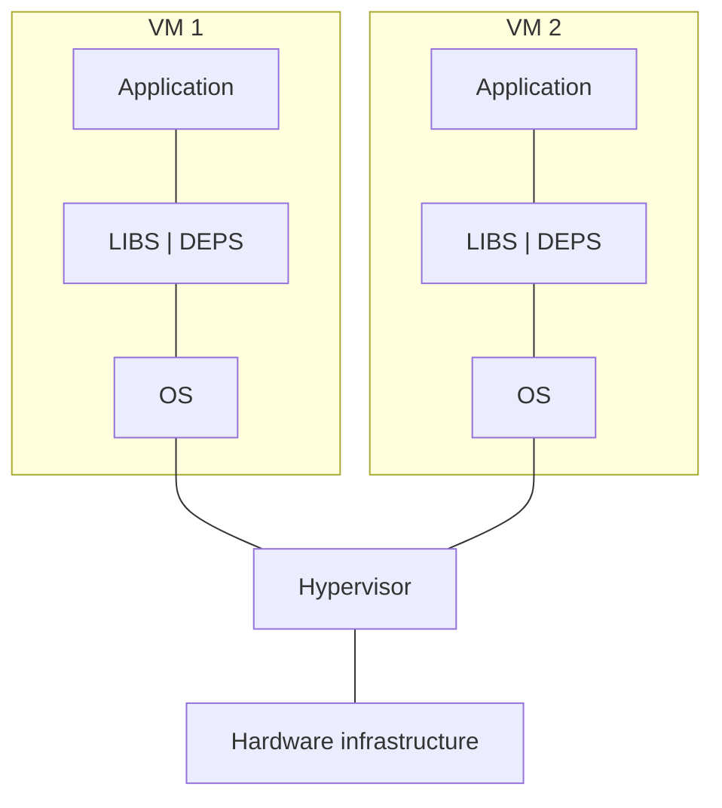

### How Docker Looks:
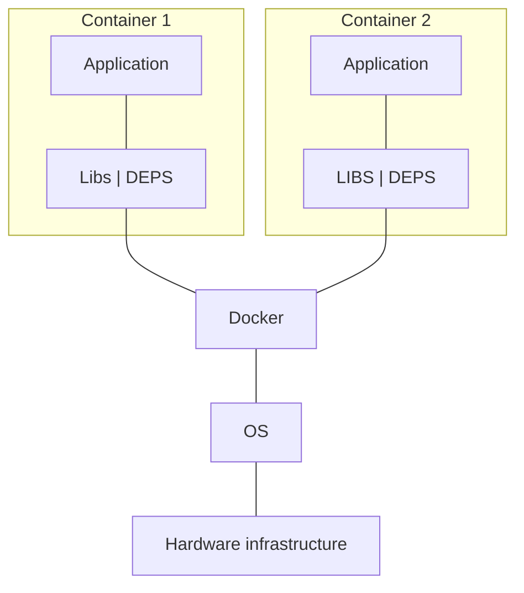

**Abbreviations:**
- **LIBS**: Libraries
- **DEPS**: Dependencies

---

## 4. Docker Architecture & Core Components

**Docker Architecture has 3 parts: Docker host, Docker client, Docker registry.**

### Docker Architecture Diagram:
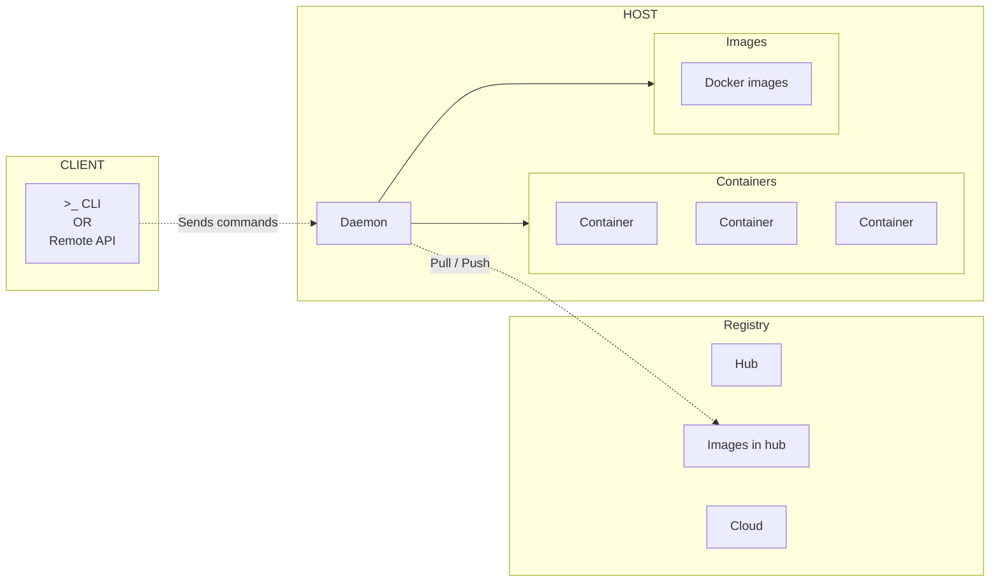

### Explanation of Docker Architecture Components:

1. **Docker Host:**
   - It is the host on which Docker is installed.
   - It is the physical host on which the Docker Daemon is running, and Docker images and containers are created.

2. **Docker Daemon (OR `dockerd`):**
   - It accepts Docker API requests and manages Docker objects such as images, containers, networks, and volumes.
   - It can also communicate with other daemons to manage Docker services.
   - > [!NOTE]
     > **What is a Daemon?** A daemon is a service process that runs in the background and provides functionality to other processes.

3. **Docker Client:**
   - It is the way that enables users to interact with Docker.
   - It sends the Docker commands to the Docker daemon.
   - The Docker client can communicate with more than one daemon.

4. **Docker Registry:**
   - It hosts the Docker images and is used to pull and push Docker images from/to the registry.
   - **Docker Hub** is the public registry that anyone can use, and Docker is configured to look for images on Docker Hub by default.

---

## 5. Docker Hub, Installation & Socket Permissions

### Exploring Docker Hub (`https://hub.docker.com`)
- It is the place where you can see all the base images.
- You can search for any images like `ubuntu`.
- It shows the `ubuntu` image with different versions.
- If you want to pull that image to your machine, you can click on tags and copy the image.
- You will see the `docker pull` command in the Overview section -> Right side panel:
  ```bash
  docker pull ubuntu:rolling
  ```

---

### Docker Documentation URL
- `docs.docker.com`

---

### Installing Docker
You can install Docker in 2 types:
- **Desktop edition**: Paid for organizations & free for individuals.
- **CLI / Docker engine**: Free to use.

- You can find the installation instructions for different operating systems on `docs.docker.com`.
- You can install Docker using this script provided by Docker:
  ```bash
  curl -fsSL https://get.docker.com -o get-docker.sh
  sudo sh get-docker.sh
  ```
- It has all the codes including keys which helps Docker to identify if it is from a legitimate Docker Hub source or not.

---

### Permission Denied Error
If you try to search for images on Docker Hub right after installation:
```bash
docker search ubuntu
```
**Output:**
```
permission denied while trying to connect to the docker API at unix:///var/run/docker.sock
```

---

### Understanding `/var/run/docker.sock` vs `/var/lib/docker`
- The Docker daemon is installed at `/var/run/docker` (with socket at `/var/run/docker.sock`), while all the other Docker files are saved at `/var/lib/docker`.
- So we need to use:
  ```bash
  sudo docker search ubuntu
  ```
  Then only it works.
- **Why?** The current user (`ubuntu`) does not have permission to access Docker without `sudo`, because `docker.sock` has no permission for regular users.

- Check socket permissions:
  ```bash
  ls -l /var/run/docker.sock
  ```
  **Output:**
  ```
  srw-rw---- 1 root docker 0 May 2 03:53 /var/run/docker.sock
  ```
  - Here, the owner is `root` & the group is `docker`.
  - But other users do not have permission. That is why we cannot access it.

- **Solution: Add user to the docker group:**
  ```bash
  sudo gpasswd -a ubuntu docker
  ```

- Once added, if you try to search for an image in Docker Hub again, it still shows the permission denied error:
  ```bash
  docker search ubuntu
  # Output: permission denied ...
  ```
  - **Why?** Even though we added the user to the group, the permission has not updated to the current shell.
  - **Fix:** You need to close your SSH session and open it again, and it should work:
    ```bash
    docker search ubuntu
    ```
    Now it shows all the list of images from Docker Hub.

---

### What is a Docker Image?
- A Docker image contains application code, libraries, tools, dependencies, and other files needed to make an application run.
- In simple words, a Docker image is an executable file that creates a Docker container.
- A Docker image is comparable to an **AMI in AWS**.
- Docker images are reusable and can be deployed on any host. Developers can take the Docker image from one project and use it in another. This saves the user time, because they do not have to recreate an image from scratch.
- Docker images can be stored in private or public repositories, such as Docker Hub, Amazon Container Registry, Harbor.
- Public repository: `https://hub.docker.com/`
- The very lightweight Docker image in Docker is **alpine**.

---

## 6. Image Management & Running Your First Container

### Essential Docker Image Commands

1. **Search for an image on Docker Hub:**
   ```bash
   docker search <image-name>
   # Example:
   docker search ubuntu
   ```

2. **Download (pull) an image from a registry / artifactory:**
   ```bash
   docker pull <image>:<tag>
   # Examples:
   docker pull ubuntu          # By default it takes the 'latest' tag
   docker pull ubuntu:26.04    # Pulling image with a specific tag
   docker pull ubuntu:rolling
   docker pull alpine:3.23
   ```
   > [!NOTE]
   > If no tag is specified, Docker automatically defaults to `:latest`.

3. **List images available locally:**
   ```bash
   docker image ls
   # OR:
   docker images
   ```

4. **Remove an image from the local server:**
   ```bash
   docker rmi <image-id / image:tag>
   # Example:
   docker rmi ubuntu:latest
   ```

---

### Running Containers (`docker run`)

- `docker run <image>:<tag>`: To create and run a container.
- `docker run -it <image>:<tag>`: To create a container with an interactive terminal attached to it.
  - `-it`:
    - `-i`: Interactive (keeps STDIN open).
    - `-t`: TTY or terminal.

#### Example: Running an Interactive Ubuntu Container
```bash
docker run -it ubuntu
```
**Output:**
```
root@01948ffc97cg:/#
```
- This opens a container terminal with the username as `root`.
- `01948ffc97cg` is the **Container ID**.

#### Installing Packages Inside the Container:
Since this Ubuntu container has nothing pre-installed, you can install packages of your choice:
```bash
apt update
apt install vim -y          # Installs vi / vim editor
apt install default-jre -y  # Installs Java runtime
```

---

## 7. Container Lifecycle, Process Exits & Detached Mode

### What Happens When You Type `exit`?
When you are inside an interactive container (`docker run -it ubuntu`) and type `exit`:
```bash
root@a1b2c3d4e5f6:/# exit
```
- The interactive shell terminates.
- Because the shell was the primary running process (PID 1) of the container, the container **immediately stops running**.

---

### Inspecting Running vs Stopped Containers
- **`docker ps`:** Lists only **currently active (running)** containers. Running this after `exit` shows an empty list.
- **`docker ps -a`:** Lists **all** containers, including stopped, exited, and running ones.
  - The status column will show: `Exited (0) 10 seconds ago`.

---

### Running Application Services vs OS Containers
Let us test running an application service, such as Jenkins:
```bash
docker run jenkins/jenkins
```
- Docker automatically pulls `jenkins/jenkins` if not present locally.
- Jenkins starts up, initializes its JVM, outputs startup logs to your terminal, and **stays running**.
- Why does Jenkins stay running while Ubuntu stopped? Because Jenkins starts a continuous server process in the foreground!

---

### Detached Mode (`-d` Flag)
Running containers in the foreground blocks your current terminal session. To run a container in the background, use the `-d` (`--detach`) flag:

```bash
# Runs Jenkins as a background service; prints the container ID
docker run -d jenkins/jenkins
```
Checking `docker ps` shows Jenkins running happily in the background.

#### What Happens When Running Base OS Images with `-d`?
Let us compare what happens with different flag combinations:

```bash
# Case 1: Running alpine with detached mode ONLY
docker run -d alpine

# Check status:
docker ps -a
```
- **Surprising Result:** The container immediately exits (`Exited (0)`)!
- Why? Alpine’s default command is `/bin/sh`. With `-d` alone, there is no interactive input stream attached, so `/bin/sh` sees EOF (end of file) and immediately terminates!

```bash
# Case 2: Running with interactive TTY in background
docker run -itd ubuntu
docker run -itd alpine
```
- **Result:** Both containers stay running in the background (`Up`)! The `-it` flags allocate an open pseudo-terminal that keeps the shell process active and waiting.

---

## 8. The Golden Rule of Container Lifecycle

### Experimenting with Java / Base Environment Images
Let us test running an Amazon Corretto (Java) container in detached mode:

```bash
docker run -d amazoncorretto
```
- Running `docker ps` shows: **Nothing!**
- Running `docker ps -a` shows:
  ```
  CONTAINER ID   IMAGE            COMMAND      STATUS                     NAMES
  3f4e5d6c7b8a   amazoncorretto   "jshell"     Exited (0) 2 seconds ago   pedantic_raman
  ```
- What happens if you try to start it again?
  ```bash
  docker start 3f4e5d6c7b8a
  ```
  It exits immediately again!

---

### Daemon / Service Containers vs Base Environment Containers

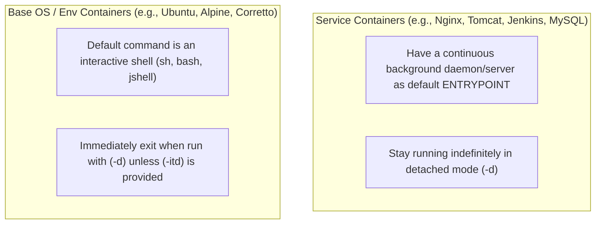

### 🌟 The Golden Rule of Docker Containers:
> [!IMPORTANT]
> **A Docker container only lives as long as its main foreground process (PID 1) is running.**
>
> Once PID 1 finishes its task, crashes, or receives an exit signal, the container **immediately dies**.

---

## 9. Process Model: Containers vs Virtual Machines

> [!IMPORTANT]
> **Fundamental Rule of Containers:**
> **"Container is meant for application. As long as application is up, container will work. Container is never meant for operating system (OS)."**

### Deep Dive: Containers Are for Applications, Not Full OSes
- In a traditional **Virtual Machine**, the operating system boots an `init` or `systemd` process as PID 1.
- `systemd` then spawns and manages dozens of background daemons (e.g., `sshd`, `cron`, `syslogd`, `systemd-journald`).
- In a **Docker Container**, there is **no `systemd` or `init`** running by default.
- The single application process specified by the Dockerfile's `ENTRYPOINT` or `CMD` runs directly as **PID 1**.

#### Real-World Example: Tomcat Server Container
Consider running an Apache Tomcat web server container:
- When the container starts, Tomcat's Java process is **PID 1**.
- If an administrator runs the Tomcat shutdown script inside the container:
  ```bash
  docker exec <CONTAINER_ID> /usr/local/tomcat/bin/shutdown.sh
  ```
- Tomcat stops its Java engine.
- Because Tomcat was PID 1 and it terminated, the entire container stops immediately!

#### What is the "Pseudo-Process" Hack?
When running an OS base container:
```bash
docker run -itd ubuntu
```
The Docker engine executes `/bin/bash` with an open TTY. `/bin/bash` sits as PID 1, waiting indefinitely for user input. This pseudo-process trick keeps the container alive in the background.

---

## 10. Inspecting Processes, Container Naming & Lifecycle Controls

### Process Tree Inside an Interactive Container
Connect to an interactive container and run `ps -ef`:
```bash
root@9a8b7c6d5e4f:/# ps -ef
```
**Output:**
```
UID        PID  PPID  C STIME TTY          TIME CMD
root         1     0  0 10:15 pts/0    00:00:00 /bin/bash
root         9     1  0 10:18 pts/0    00:00:00 ps -ef
```
- Notice that there are only **two processes** in the entire process namespace!
- `PID 1` is `/bin/bash`.
- `PID 9` is the transient `ps -ef` command itself.
- If you run `exit`, you kill PID 1, causing the container to terminate.

---

### Container Naming (`--name` Flag)
- If you do not provide a name when running a container, Docker automatically generates a random two-word name.
- You can assign an explicit name using `--name`:
  ```bash
  docker run -itd --name Nag ubuntu
  ```
- Verifying with `docker ps`:
  The container name will be displayed as `Nag`.

> [!NOTE]
> **Note on Renaming Containers:**
> If you have already created a container, you cannot rename it simply; you have to delete the container and recreate it with the `--name` flag.
> Also, container names **must be unique** on the Docker host (even among stopped containers). If a container with the same name already exists, Docker will throw a conflict error.

---

### Stopping Containers
```bash
# Standard graceful stop (default 10-second grace period):
docker stop <CONTAINER_ID_or_NAME>

# Stop faster with custom timeout (e.g., 5 seconds):
docker stop --timeout 5 <CONTAINER_ID_or_NAME>
# OR:
docker stop -t 5 <CONTAINER_ID_or_NAME>

# Stop immediately / forcefully (0 seconds timeout):
docker stop --timeout 0 <CONTAINER_ID_or_NAME>
# OR:
docker kill <CONTAINER_ID_or_NAME>
```
- **How `docker stop` works:** By default, Docker takes **10 seconds** (grace period) to stop the container gracefully. It sends a `SIGTERM` signal to PID 1. If the process does not terminate within 10 seconds, Docker forcefully terminates it with `SIGKILL`.

### Starting Stopped Containers
```bash
docker start <CONTAINER_NAME_or_ID>
```
Starts a stopped container in the background without recreating its file system.

---

## 11. Interactive Container Restarts (`docker start -i`) & Shell Attachment

### Starting a Container in Interactive Mode: `docker start -i`
When you have a stopped container that was originally created with interactive flags (`-it`), you can start it and immediately attach your terminal to it in one command:

```bash
docker start -i <CONTAINER_ID_or_NAME>
```
This boots the container and attaches your local standard input/output directly to the container's shell prompt.

> [!CAUTION]
> **Prerequisite for `docker start -i`:**
> This command only works as expected if the container was originally instantiated with `-it` or `-itd`. If you run `docker start -i` on a container created without interactive flags, it will fail to attach an interactive terminal.

---

### Transitioning to Running Containers
How do you interact with a container that is **already running** in the background?
There are two primary commands:
1. `docker attach`
2. `docker exec`

Each command behaves fundamentally differently.

---

## 12. Attaching to Containers (`docker attach`), Detach Sequences & Logs

### The `docker attach` Command
```bash
docker attach <CONTAINER_ID_or_NAME>
```
- **What it does:** Attaches your terminal's standard input, output, and error streams directly to the container's **already running main process (PID 1)**.
- **The Major Pitfall of `attach`:**
  - If you attach to a running container and type `exit` (or press `Ctrl + C`), you send an interrupt/terminate signal directly to PID 1!
  - **Result:** PID 1 exits, and your container **stops dead** immediately!

### How to Safely Detach Without Stopping the Container
If you attached to a container using `docker attach` and want to disconnect your terminal while leaving the container running:
- **Escape Key Sequence:**
  `Ctrl + P + Q`
  *(Hold `Ctrl`, press `P`, release `P`, press `Q`, then release `Ctrl`)*
- This detaches your terminal cleanly, leaving the container running in the background (`Up` state).

---

### Viewing Container Logs: `docker logs`
To view what a background container is outputting without attaching to it:

```bash
# View all logs generated so far
docker logs <CONTAINER_NAME_or_ID>

# Follow logs in real-time (live stream, like 'tail -f')
docker logs -f <CONTAINER>

# View only the last 50 lines
docker logs --tail 50 <CONTAINER>

# Show timestamps alongside log messages
docker logs -t <CONTAINER>
```

---

## 13. Executing Commands Inside Containers (`docker exec`)

### What is `docker exec`?
The `docker exec` command executes a **brand new command / process** inside an already running container.

#### 1. Non-Interactive Execution (Single Commands):
You can run diagnostic or operational commands from your host without entering the container:
```bash
# Check current working directory inside container:
docker exec <CONTAINER> pwd

# Create a file inside container:
docker exec <CONTAINER> touch /tmp/healthcheck.txt

# Create a directory:
docker exec <CONTAINER> mkdir -p /var/log/myapp

# List directory contents:
docker exec <CONTAINER> ls -la /tmp
```

#### 2. Interactive Execution (Spawning a New Shell):
To open an interactive shell inside a running container:
```bash
docker exec -it <CONTAINER_ID_or_NAME> bash
# If bash is not installed (e.g., Alpine Linux):
docker exec -it <CONTAINER_ID_or_NAME> sh
```

---

### Why Typing `exit` in `docker exec` Does NOT Kill the Container
When you start an interactive shell via `docker exec -it <id> bash`:
- Docker creates a **brand new child process** inside the container's namespace.
- The container's original main process (PID 1) continues running undisturbed.
- When you type `exit`, you are only terminating your newly created child process!
- PID 1 remains active, so the container **stays running**!

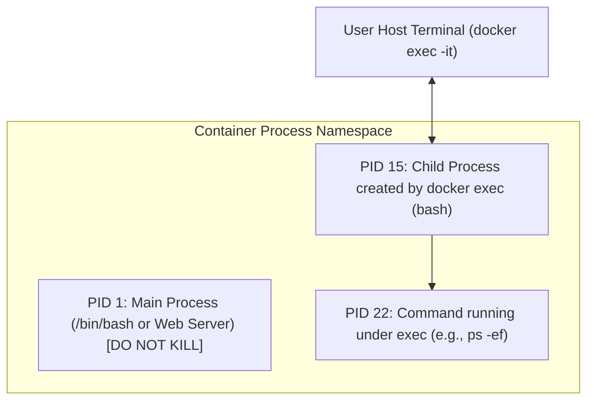

---

## 14. Process Verification Inside `exec`, `attach` vs `exec`, and Container Deletion

### Verifying Process Tree Inside `docker exec`
When you execute `docker exec -it <container> bash` and run `ps -ef`:
```bash
root@a2b3c4d5e6f7:/# ps -ef
```
**Process Table Output:**
```
UID        PID  PPID  C STIME TTY          TIME CMD
root         1     0  0 10:00 pts/0    00:00:00 /bin/bash
root        15     0  0 10:10 pts/1    00:00:00 bash
root        22    15  0 10:12 pts/1    00:00:00 ps -ef
```
- **PID 1:** The original container entry process (`/bin/bash`).
- **PID 15:** The separate `bash` session spawned by `docker exec`.
- **PID 22:** The `ps -ef` command spawned by PID 15.
- Exiting PID 15 leaves PID 1 completely untouched and running!

---

### Side-by-Side Comparison: `docker attach` vs `docker exec`

| Feature / Property | `docker attach` | `docker exec` |
| :--- | :--- | :--- |
| **Target Process** | Attaches directly to the **existing main process (PID 1)**. | Spawns a **brand new, independent process** inside the container. |
| **Impact of `exit` or `Ctrl+C`** | **Kills PID 1**, which causes the entire container to immediately stop! | Only terminates the spawned child process; **container continues running**. |
| **Detaching Safely** | Must use the escape key sequence: `Ctrl + P`, then `Ctrl + Q`. | Simple `exit` command detaches safely without stopping the container. |
| **Primary Use Case** | Monitoring live stdout/stderr of the main process. | Administrative troubleshooting, modifying configs, and inspecting files. |
| **Container State Requirement** | Container must already be running. | Container must already be running. |

---

### Deleting Containers: `docker rm`
To remove containers and reclaim disk space:

```bash
# 1. Remove a stopped container:
docker rm <CONTAINER_ID_or_NAME>

# Attempting to remove a running container:
# docker rm my-running-app
# Error: You cannot remove a running container. Stop the container before attempting removal or force remove.

# 2. Force remove a running container (sends SIGKILL then deletes):
docker rm -f <CONTAINER_ID_or_NAME>

# 3. Remove multiple containers at once:
docker rm container1 container2 container3

# 4. Remove all stopped containers in one command:
docker container prune -f

# 5. Remove all stopped containers using subshell:
docker rm $(docker ps -a -q)
```

---

## 15. Advanced Container Cleanup & Port Mapping (Docker Proxy)

### Advanced Container Deletion Commands
- **Remove a stopped container:**
  ```bash
  docker rm <CONTAINER_ID_or_NAME>
  ```
- **Forcefully remove a running container:**
  ```bash
  docker rm <CONTAINER_ID_or_NAME> --force
  # or
  docker rm -f <CONTAINER_ID_or_NAME>
  ```
- **Delete all stopped containers at once:**
  ```bash
  docker container prune
  ```
  *(This prompts for confirmation before removing all stopped containers)*
- **Alternative using subshell or xargs (removes all stopped containers):**
  ```bash
  docker ps -aq | xargs docker rm
  # or
  docker rm $(docker ps -aq)
  ```
- **Delete ALL containers (both running and stopped):**
  ```bash
  docker ps -aq | xargs docker rm --force
  # or
  docker rm -f $(docker ps -aq)
  ```

---

### Port Mapping (`-p` Flag) & Docker Proxy
By default, Docker containers run inside their own isolated network namespace with private IP addresses (typically on a private bridge network like `172.17.0.0/16`).

#### Why Port Mapping is Necessary:
- When you install and run an application (such as Jenkins, Nginx, or Tomcat) inside a container on a specific port (e.g., port 8080), **you cannot access it directly from your browser using the Host machine's public IP address**.
- The public IP points to the host machine, but the host operating system has no application listening on that port; the service is encapsulated inside the isolated container network.
- To make the container application reachable from the external world, we must **map a port on the Host machine to the port inside the Container**.
- Docker establishes this bridge using a user-space routing process called **`docker-proxy`** and host `iptables` / NAT rules.

#### Port Mapping Syntax:
```bash
docker run -d -p <HOST_PORT>:<CONTAINER_PORT> <IMAGE_NAME>
```

#### Example: Running Jenkins with Port Mapping:
```bash
docker run -d -p 8080:8080 jenkins/jenkins
```
- **Host Port (`8080`):** The port on the Docker host that listens for incoming external traffic.
- **Container Port (`8080`):** The internal port where Jenkins is listening inside the container.

#### Verifying Port Mapping with `docker ps`:
```bash
docker ps
```
**Output shows:**
```
PORTS
0.0.0.0:8080->8080/tcp, [::]:8080->8080/tcp
```
This indicates that any incoming request on host port 8080 is forwarded directly to port 8080 inside the container.

#### Verifying Host Listening Ports with `netstat`:
Run the following command on the host machine:
```bash
sudo netstat -tulnp | grep 8080
```
**Output:**
```
Proto Recv-Q Send-Q Local Address           Foreign Address         State       PID/Program name    
tcp        0      0 0.0.0.0:8080            0.0.0.0:*               LISTEN      5357/docker-proxy   
```
Notice that `docker-proxy` is running with PID 5357, listening on `0.0.0.0:8080` and forwarding network packets to the container.

#### Running Multiple Instances on Different Host Ports:
Because each container has an isolated network stack, you can run multiple identical services on the same host simply by binding them to different host ports:
```bash
# First Jenkins instance on host port 8080:
docker run -d -p 8080:8080 jenkins/jenkins

# Second Jenkins instance on host port 9000:
docker run -d -p 9000:8080 jenkins/jenkins
```

---

## 16. Multi-Instance Port Mapping, Custom Images & Dockerfile `FROM`

### Running Apache Tomcat with Port Mapping
```bash
docker run -d -p 8090:8080 tomcat
```
- Maps Host Port `8090` $\rightarrow$ Container Tomcat Port `8080`.
- Users can access Tomcat in their browser at `http://<HOST_PUBLIC_IP>:8090`.

---

### Understanding Custom Docker Images & Layering
- A **Custom Docker Image** is built upon an existing image by adding custom layers.
- The existing pre-built image chosen as the foundation is known as the **Base Image**.
- Pre-built base images are pulled from Docker Hub to match application requirements (e.g., Ubuntu, Alpine, Debian, Amazon Corretto, Node, Python).
  > [!TIP]
  > **Alpine Linux** is the lightest base image (~5 MB), making it ideal for minimal attack surfaces and fast container startups.

#### Image Layer Architecture:
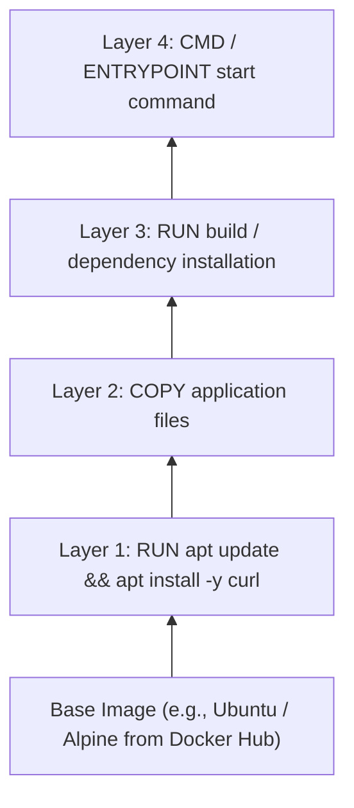

- Each instruction in a Dockerfile creates a new **read-only layer**.
- When layers increase unnecessarily, container image size grows and build/distribution time increases.
- **Best Practice:** Keep the number of layers minimal and combine related commands (e.g., `apt update && apt install -y ...`).

---

### What is a Dockerfile?
- A **Dockerfile** is a plain text file containing a sequential set of instructions that Docker reads to automate the creation of a custom Docker image.
- Each instruction executed during `docker build` produces a cached, read-only filesystem layer on top of previous layers.

---

### Dockerfile Instructions Deep Dive

#### 1. `FROM` Instruction:
- **Purpose:** Defines the base image upon which your custom container image will be built.
- It specifies the base Operating System or pre-configured runtime environment (e.g., Python, Node.js, OpenJDK).
- **Rule:** The `FROM` instruction must almost always be the **first instruction** in a Dockerfile (preceded only by `ARG` if defining build-time variables for the base image).
- **Multi-Stage Builds:** A Dockerfile can contain multiple `FROM` instructions when implementing multi-stage builds to produce ultra-lightweight final production images.
- **Syntax:**
  ```dockerfile
  FROM <image>:<tag>
  ```
- **Examples:**
  ```dockerfile
  FROM ubuntu:24.04
  FROM amazoncorretto:17-alpine
  FROM alpine:3.21
  ```

---

## 17. Core Dockerfile Directives: `RUN`, `COPY`, and `ADD`

### 2. `RUN` Instruction
- **Purpose:** The `RUN` instruction executes shell commands during the image build phase. It is primarily used to install software packages, update package repositories, compile source code, and configure system dependencies.
- **Layer Creation:** Each `RUN` instruction executed generates a brand new intermediate read-only image layer.
- **Best Practice (Layer Optimization):**
  - Instead of having multiple separate `RUN` statements which inflate image size:
    ```dockerfile
    # Inefficient (creates 2 separate layers):
    RUN apt update -y
    RUN apt install git unzip -y
    ```
  - **Combine commands** into a single `RUN` instruction using `&&` and line continuations (`\`). This creates only **one layer** and cleans up cache efficiently:
    ```dockerfile
    # Efficient (creates a single layer):
    FROM ubuntu:24.04
    RUN apt update -y && apt install -y git unzip
    ```

---

### 3. `COPY` Instruction
- **Purpose:** Copies local files or directories from the Docker build context on the host machine into the filesystem of the container image.
- **Syntax:**
  ```dockerfile
  COPY <host-machine-path> <image-path>
  COPY --chown=<user>:<group> <host-machine-path> <image-path>
  ```
- **Key Features:**
  - Fast, transparent, and copies files strictly as-is.
  - The `--chown` flag allows changing ownership of the copied files directly during build time without needing a separate `RUN chown` layer.

---

### 4. `ADD` Instruction
- **Purpose:** Like `COPY`, `ADD` copies files and directories from the host machine into the container image. However, `ADD` provides two additional advanced capabilities:
  1. **Remote URL Download:** It can download files directly from a remote HTTP/HTTPS URL into the container image.
  2. **Automatic Archive Extraction:** If a local compressed tar archive (`.tar`, `.tar.gz`, `.tgz`, `.tar.bz2`) is specified as the source from the host machine, `ADD` automatically unpacks and extracts it directly into the target directory inside the image.

> [!NOTE]
> **Important Distinction on `.tar.gz` Extraction:**
> - If you provide a **local** `.tar.gz` file located on your host machine, `ADD` will automatically **unpack and extract** its contents into the destination directory.
> - If you provide a **URL** pointing to a `.tar.gz` file, `ADD` will **NOT** extract it; it simply downloads and copies the compressed archive as a raw file into the image.

---

### Building Your First Custom Dockerfile (Hands-on Walkthrough)
Create a new Dockerfile:
```bash
vi Dockerfile
```
Add the following instructions:
```dockerfile
FROM ubuntu
RUN apt update -y
RUN apt install git unzip -y
```

---

## 18. Building Images (`docker build`), Custom Filenames (`-f`) & Verification

### Building an Image from a Dockerfile
Save and exit the Dockerfile editor (`:wq`).

Execute the build command:
```bash
docker build -t ubuntu:updated .
```

#### Understanding the Build Arguments:
- **`-t` (`--tag`):** Assigns a repository name and optional tag in the `name:tag` format (`ubuntu:updated`).
- **`.` (Build Context):** Specifies the build context path. The dot (`.`) denotes the **current working directory**. Docker packages files from this directory and sends them to the Docker daemon as the context.
- **Default Filename Behavior:** If the file is named `Dockerfile`, Docker automatically picks it up from the current directory without needing to specify the filename.

---

### Verifying the New Custom Image
1. **List local images:**
   ```bash
   docker image ls
   ```
   **Output:** You will see the new image `ubuntu:updated` listed alongside its image ID, creation date, and size.

2. **Launch a container from your custom image:**
   ```bash
   docker run -it ubuntu:updated
   ```
   **Shell Prompt:**
   ```bash
   root@53e76692090b:/#
   ```
3. **Verify installed packages inside the container:**
   ```bash
   git --version
   unzip -v
   ```
   Both commands execute successfully because Git and Unzip were baked directly into the image layers during build!

---

### Using Non-Default Dockerfile Names (`-f` Flag)
If your Dockerfile has a custom name (e.g., `test`, `Dockerfile.dev`, `Dockerfile.prod`):

1. **Create the file with a custom name:**
   ```bash
   vi test
   ```
   ```dockerfile
   FROM ubuntu
   RUN apt update -y
   ```
   Save and quit (`:wq`).

2. **Build specifying the file path with `-f`:**
   ```bash
   docker build -t ubuntu:new1 -f test .
   ```

3. **Verify and run:**
   ```bash
   docker image ls
   docker run -it ubuntu:new1
   ```

---

### Summary of Docker Build Commands

| Command | Description |
| :--- | :--- |
| `docker build -t <image>:<tag> .` | Builds an image using the default `Dockerfile` located in the current directory (`.`). |
| `docker build -t <image>:<tag> -f <dockerfile-path> .` | Builds an image using a specified custom Dockerfile name or path (`-f`). |

---

## 19. Build Context, Layer Caching Mechanisms & `COPY` Permissions

### Understanding the Build Context Path
```bash
docker build -t <image:tag> <context-path>
```
- The build context path tells Docker where the source code and files to be built reside.
- Passing `.` instructs the Docker daemon to resolve relative paths and send files starting from the **current directory**.

---

### Key Operational Notes

> [!NOTE]
> **1. Absence of `sudo` in Container Base Images:**
> Minimal base container images (such as Ubuntu, Alpine, Debian) do not have the `sudo` package pre-installed. You cannot execute `sudo` commands inside them.
> By default, containers execute commands as the **`root` user**, who already possesses full superuser privileges inside the container's isolated user namespace.

> [!TIP]
> **2. Minimizing Dockerfile Layers:**
> Reducing the number of layers in a Dockerfile significantly decreases both image build time and the network transfer time required to push/pull the image to/from remote container registries.

---

### Docker Build Cache Mechanism
Docker uses an intelligent layer caching system to accelerate builds:
- When Docker executes an instruction during `docker build`, it computes a checksum/hash of the instruction and its inputs.
- If identical commands have already been executed previously on the host and none of the source files changed, Docker reuses the existing cached layer instead of executing the step again (`Using cache`).

#### Example Demonstrating Build Caching:
```dockerfile
# vi Dockerfile
FROM ubuntu
RUN apt update -y && apt install -y git unzip
```
1. **Initial Build:**
   ```bash
   docker build -t ubuntu:update1 .
   ```
   Docker downloads the base image, updates package indexes, downloads `git` and `unzip`, and saves the resulting layer into Docker's local storage.

2. **Subsequent Build (New Tag):**
   ```bash
   docker build -t ubuntu:update2 .
   ```
   Because the instructions are identical to the previous build, Docker skips re-downloading packages and immediately uses the cache:
   ```
   Step 2/2 : RUN apt update -y && apt install -y git unzip
    ---> Using cache
    ---> a8b7c6d5e4f3
   Successfully tagged ubuntu:update2
   ```
   This saves considerable bandwidth and reduces build time from minutes to milliseconds.

---

### The `COPY` Instruction & File Permissions
- **Purpose:** Copies files or whole directory structures from the local host machine into the container image filesystem.
- **Syntax:**
  ```dockerfile
  COPY <host-machine-path> <destination-path>
  COPY --chown=<user>:<group> <host-machine-path> <destination-path>
  ```
- **Handling User & Group Permissions:**
  - By default, files copied into the container are owned by `root:root`.
  - If a non-root application user/group has been defined inside the container, use the `--chown` flag directly in the `COPY` instruction to set proper file ownership:
    ```dockerfile
    COPY --chown=myuser:mygroup app.py /app/app.py
    ```

---

## 20. Deep Dive: `COPY` vs `ADD` & Compression Archive Extraction

### Comparing `COPY` vs `ADD`
While both instructions copy files into the container image, `ADD` provides specialized functionality:

```bash
COPY app.py /app/app.py
```

#### Advanced Features of `ADD`:
1. **Remote URL Fetching:**
   Can download files from remote web URLs directly into the container.
2. **Automatic Local Archive Extraction:**
   If a local `.tar` or `.tar.gz` archive from the host machine is supplied, `ADD` automatically decompresses and extracts its files into the specified container destination directory.

> [!IMPORTANT]
> **Critical Constraints on `ADD` Archive Extraction:**
> - **Only Local Archives are Extracted:** If you supply a remote URL ending in `.tar.gz` to `ADD`, it will **NOT** extract it. It merely downloads and copies the compressed archive as-is into the destination.
> - **Supported Formats:** Automatic extraction only applies to standard Unix tarballs (`.tar`, `.tar.gz`, `.tgz`, `.tar.bz2`). It does **not** automatically extract `.zip` or other compressed formats.

---

### `ADD` Instruction Syntaxes & Examples
```dockerfile
# 1. Standard file copy:
ADD app.py /app/app.py

# 2. File copy with custom ownership:
ADD --chown=<user>:<group> <host-machine-path> <destination-path>

# 3. Local tar archive (automatically extracted into /opt/):
ADD apache-tomcat-10.1.54.tar.gz /opt/

# 4. Remote URL download (downloaded without extraction into /opt/):
ADD https://wordpress.org/latest.tar.gz /opt/
```

---

### Practical Experiment: Verifying `COPY` vs `ADD` Behavior
Create a test Dockerfile to observe how `COPY` and `ADD` treat identical tarballs:

```dockerfile
# vi Dockerfile
FROM ubuntu
COPY apache-tomcat-10.1.54.tar.gz copy/
ADD apache-tomcat-10.1.54.tar.gz add/
ADD https://wordpress.org/latest.tar.gz url/
```

Build the custom image:
```bash
docker build -t ubuntu:copyadd .
```

---

## 21. Practical Verification: `COPY` vs `ADD` in Action

### Hands-on Verification: How `COPY` and `ADD` Process Archives
Let us launch an interactive container from the `ubuntu:copyadd` image built previously:

```bash
docker run -it ubuntu:copyadd
```

Once inside the container shell, verify directory contents:
```bash
root@da936d45dd54:/# ls
# Output lists the newly created directories: add, copy, and url
```

#### 1. Inspecting the `copy/` directory:
```bash
root@da936d45dd54:/# cd copy/
root@da936d45dd54:/copy# ls
# Output: apache-tomcat-10.1.50.tar.gz
```
> **Observation:** `COPY` kept the archive file exactly as it was on the host—in compressed `.tar.gz` format without extracting.

#### 2. Inspecting the `add/` directory:
```bash
root@da936d45dd54:/copy# cd ../add/
root@da936d45dd54:/add# ls
# Output: apache-tomcat-10.1.50/ (or uncompressed folder contents: bin, conf, lib, logs, webapps...)
```
> **Observation:** `ADD` automatically extracted the local `.tar.gz` archive into a fully uncompressed directory tree upon being copied.

#### 3. Inspecting the `url/` directory:
```bash
root@da936d45dd54:/add# cd ../url/
root@da936d45dd54:/url# ls
# Output: latest.tar.gz (or apache-tomcat-10.1.50.tar.gz)
```
> **Observation:** `ADD` fetched the remote URL, but **did not extract** it. It saved it as a raw `.tar.gz` file.

---

### Example 2: Copying Regular Files (e.g., Shell Scripts)
Now let us observe how standard, non-archive files are handled:

1. **Create a local shell script on the host:**
   ```bash
   vi script.sh
   ```
   ```bash
   #!/bin/bash
   echo "Hello"
   ```
   Save and exit (`:wq`).

2. **Create a Dockerfile:**
   ```dockerfile
   # vi Dockerfile
   FROM ubuntu
   COPY script.sh copy/
   ADD script.sh add/
   ```
   Save and exit (`:wq`).

3. **Build and test the container:**
   ```bash
   docker build -t ubuntu:copyadd2 .
   docker run -it ubuntu:copyadd2
   ```

---

## 22. Regular File Behavior & Low-Level Inspection (`docker inspect`)

### Executing Copied Scripts Inside the Container
Verify both destination folders inside the container:
```bash
root@container:/# cd copy
root@container:/copy# ls
# Output: script.sh

root@container:/copy# cd ../add
root@container:/add# ls
# Output: script.sh

root@container:/add# bash script.sh
# Output: Hello.
```

### 🔑 Key Takeaway: `COPY` vs `ADD`
> [!NOTE]
> For standard text files, configuration files, source code, and binaries, **`COPY` and `ADD` behave identically**.
> The only functional differences are:
> 1. `ADD` automatically extracts **local `.tar.gz` / `.tar` archives**.
> 2. `ADD` can download files from **remote HTTP/S URLs**.
> **Best Practice:** Official Docker best practices strongly recommend using **`COPY`** for all standard file operations because its behavior is transparent and predictable. Only use `ADD` when you specifically need automatic local tar extraction.

---

### Low-Level Object Inspection: `docker inspect`
The `docker inspect` command outputs detailed, low-level JSON configuration and runtime state for any Docker object:
- **Containers**
- **Images**
- **Volumes**
- **Networks**

#### Syntax:
```bash
docker inspect <CONTAINER_NAME_or_ID>
```

#### Example Usage:
1. **Run a container:**
   ```bash
   docker run -d --name mytomcat tomcat
   ```
2. **Inspect the container:**
   ```bash
   docker inspect mytomcat
   ```
3. **Information returned in the JSON payload:**
   - Container ID and creation timestamp
   - IP address and Gateway details
   - Mounted volumes and host bind mounts
   - Environment variables (`ENV`)
   - `CMD` and `ENTRYPOINT` settings
   - Network settings (Bridge, Ports, MAC address)
   - Working directory (`WORKDIR`)
   - Restart policy configurations
   - Healthcheck status and execution state

---

## 23. Image Inspect vs Container Inspect & Modern Docker CLI

### Understanding the Difference Between Image and Container Inspection

1. **Inspecting a Container:**
   ```bash
   docker inspect <CONTAINER_NAME_or_ID>
   # Or using modern CLI:
   docker container inspect <CONTAINER_NAME_or_ID>
   ```
   - Shows **live runtime information**.
   - Details how the specific container is currently configured, running processes, its dynamic IP address, runtime mount points, state, and port bindings.

2. **Inspecting an Image:**
   ```bash
   docker image inspect <IMAGE_NAME_or_ID>
   ```
   - Shows **static image metadata**.
   - Details the immutable build instructions: layer hashes, default `CMD` / `ENTRYPOINT`, baked-in environment variables, architecture (`amd64`, `arm64`), author, and build history.

---

### The Danger of Ambiguity in Generic `docker inspect`
> [!WARNING]
> If you run:
> ```bash
> docker inspect tomcat
> ```
> Docker searches all local Docker objects broadly. If you have both an image named `tomcat` and a running container or volume named `tomcat`, the command becomes ambiguous and Docker might return data for an object you did not intend.
>
> **Best Practice:** Use the scoped modern Docker CLI command:
> ```bash
> docker image inspect tomcat
> ```
> This explicitly instructs Docker to inspect only the image named `tomcat`.

---

### Evolution: Legacy Generic CLI vs Modern Scoped CLI
Historically, Docker used flat commands. The modern Docker CLI organizes commands cleanly under specific object namespaces:

| Object Type | Legacy Command Syntax | Modern Scoped Command Syntax |
| :--- | :--- | :--- |
| **Container** | `docker inspect <container>` | `docker container inspect <container-name-or-id>` |
| **Image** | `docker inspect <image>` | `docker image inspect <image-name>:<tag>` |
| **Volume** | `docker inspect <volume>` | `docker volume inspect <volume-name-or-id>` |
| **Network** | `docker inspect <network>` | `docker network inspect <network-name-or-id>` |

---

### `docker inspect` vs `docker logs`
Both commands serve fundamentally distinct debugging roles:
- **`docker inspect`:** Used to retrieve detailed **architectural metadata, configuration, and state** about a container, image, network, or volume in JSON format.
- **`docker logs`:** Used to stream or view the **stdout (standard output) and stderr (standard error)** streams generated by the application running inside the container.

---

## 24. Parsing Container Metadata & Introducing `docker logs`

### Inspecting JSON Structure
Running `docker inspect <container>` returns an extensive JSON array containing:
- **`Id`:** Full 64-character SHA-256 container identifier
- **`Created`:** Timestamp of creation
- **`State`:** Real-time runtime status (running, paused, exited, OOMKilled)
- **`Image`:** Source image ID and repo digest
- **`NetworkSettings`:** IP addresses, Gateway, MAC address, port mappings
- **`Mounts`:** Attached host volumes and bind mounts
- **`Config`:** Environment variables (`Env`), `Cmd`, `Entrypoint`, Working directory (`WorkingDir`), Labels
- **`HostConfig`:** Restart policies, CPU/memory limits, DNS configurations

#### Example JSON State Snippet:
```json
"State": {
    "Status": "running",
    "Running": true,
    "Paused": false,
    "Restarting": false,
    "OOMKilled": false,
    "Dead": false,
    "Pid": 2456,
    "ExitCode": 0,
    "Error": "",
    "StartedAt": "2026-09-16T10:15:30.123456789Z",
    "FinishedAt": "0001-01-01T00:00:00Z"
}
```

#### Common Scenarios for Using `docker inspect`:
1. **Troubleshooting container configurations** and checking environment variable values.
2. **Finding the container's private IP address** to communicate directly on a bridge network.
3. **Checking mapped ports** when dynamic port binding was used.
4. **Verifying volume mounts** to ensure local host directories are mounted to the correct container paths.
5. **Debugging network attachments** across custom user-defined bridge networks.

---

### Container Logging: `docker logs`
- **Purpose:** Fetches the `stdout` and `stderr` streams emitted by the container's PID 1 process.
- It displays application logs regardless of the application type (Java, Node.js, Python, Go, Nginx).

#### Real-World Example: Jenkins Container Logs
When running Jenkins in the foreground:
```bash
docker run jenkins/jenkins
```
- Docker pulls `jenkins/jenkins` and starts it.
- Jenkins streams its full initialization logs to your terminal, including the critical **`initialAdminPassword`** required to unlock Jenkins upon first setup.
- However, if the container was launched in background detached mode (`-d`), you must retrieve these logs using `docker logs` (explored on the next page).

## 25. Advanced Log Filtering, Timestamps, and Logs vs `RUN`

### Inspecting Container Logs (`docker logs`)
When running containers in detached mode (`-d`), you cannot see their console output directly. Use `docker logs` to view standard output (`stdout`) and standard error (`stderr`):

```bash
docker logs <CONTAINER_NAME_or_ID>
```

#### Filtering Logs with Linux Utilities:
You can pipe log output into standard Linux text processing tools:
```bash
# View only the first 20 lines of logs:
docker logs <CONTAINER_NAME_or_ID> | head -20
```

#### Real-time Log Streaming (`-f` / `--follow`):
To view logs live in real time as they are generated (analogous to Linux `tail -f`):
```bash
docker logs -f <CONTAINER_NAME_or_ID>
```
Press `Ctrl + C` to exit the live log stream without stopping the container.

---

### Understanding Startup Logs with `ENTRYPOINT` and `CMD`

#### Example 2 Dockerfile:
```dockerfile
# vi Dockerfile
FROM ubuntu
ENTRYPOINT ["echo"]
CMD ["Hello from CMD"]
```

1. **Build the image:**
   ```bash
   docker build -t ubuntu:ep-cmd .
   ```
2. **Run a container:**
   ```bash
   docker run ubuntu:ep-cmd
   ```
   *Behavior:* The container executes the combined command `echo "Hello from CMD"`, prints the text to the terminal, and exits immediately.
3. **Check the logs of the stopped container:**
   ```bash
   docker logs <CONTAINER_NAME_or_ID>
   ```
   *Output:*
   ```
   Hello from CMD
   ```
4. **Interactive restart:**
   ```bash
   docker start -i <CONTAINER_NAME_or_ID>
   ```
   *Output:*
   ```
   Hello from CMD
   ```

---

### ⚠️ Crucial Concept: `docker logs` vs `RUN` Instruction

> [!IMPORTANT]
> **Why doesn't `RUN echo "Hello"` show up in `docker logs`?**
> - Commands executed via **`RUN`** run strictly during the **image build time** (`docker build`). Their output is printed to the build terminal and committed into the image layers, NOT stored in the container's runtime log buffers.
> - `docker logs` **only captures runtime output** generated when the container starts and runs, which comes exclusively from commands triggered by **`CMD`** or **`ENTRYPOINT`** instructions.

---

### Common Use Cases for `docker logs`
1. **Application Crash Investigation:** Inspect why a container abruptly terminated or failed to start (`Exited (1)` or `Exited (137)`).
2. **Runtime Error Checking:** Trace application stack traces, unhandled exceptions, and database connection timeouts.
3. **Retrieving Initial Secrets / Tokens:** Access generated setup tokens (e.g., Jenkins initial admin password, SonarQube / Jupyter tokens).
4. **Monitoring Startup Messages:** Confirm that web servers (Tomcat, Nginx, Apache) have bound to ports and initialized successfully.
5. **Live Traffic Observation:** Monitor ongoing HTTP access logs and API requests using `docker logs -f`.

---

## 26. The `CMD` Instruction: Exec Form vs Shell Form

### 5. `CMD` Instruction
- **Purpose:** Specifies the default command that executes automatically when a container starts from the image.
- **Single Execution Rule:** While a Dockerfile can contain multiple `CMD` instructions, **only the last `CMD` takes effect**. Any earlier `CMD` instructions are completely overwritten.

#### Syntax Formats:
1. **Exec Form (Preferred / Recommended):**
   ```dockerfile
   CMD ["executable", "param1", "param2"]
   ```
   *Examples:*
   ```dockerfile
   CMD ["bash", "script.sh"]
   CMD ["java", "-jar", "app.jar"]
   CMD ["catalina.sh", "run"]
   ```
   > [!NOTE]
   > The exec form parses parameters as a JSON array and runs the executable directly as PID 1 without invoking a subshell wrapper.

2. **Shell Form:**
   ```dockerfile
   CMD command param1 param2
   ```
   *Example:*
   ```dockerfile
   CMD echo "Hello World"
   ```
   *(Executes internally as `/bin/sh -c "echo Hello World"`).*

---

### Inspecting Default `CMD` of Official Images
You can inspect what default command an image runs using `docker inspect`:

#### 1. Apache Tomcat Image:
```bash
docker pull tomcat
docker inspect tomcat
```
Under `"Config"`, you will find:
- `"Cmd": ["catalina.sh", "run"]`
- `"WorkingDir": "/usr/local/tomcat"`
- Environment variables (`CATALINA_HOME`, `JAVA_HOME`, etc.)

#### 2. Ubuntu Official Image:
```bash
docker inspect ubuntu
```
Under `"Config"`, you will find:
- `"Cmd": ["/bin/bash"]`
- Architecture: `amd64`
- OS: `linux`

When you execute `docker run -it ubuntu`, Docker executes its default `CMD` (`/bin/bash`), which provides you with an interactive shell.

---

### Hands-on: Setting Container Starting Point with `CMD`
Let us create a startup script and configure it via `CMD`:

1. **Create `script.sh` on the host:**
   ```bash
   vi script.sh
   ```
   ```bash
   #!/bin/bash
   sleep infinity
   ```
   Save and exit (`:wq`).
---

## 27. Hands-on with `CMD`: Custom Processes vs Interactive Shells

### Step-by-Step Hands-on Walkthrough: Background Process Container
Continuing from the previous page where we created `script.sh` with `sleep infinity`:

1. **Create the Dockerfile:**
   ```bash
   vi Dockerfile
   ```
   ```dockerfile
   FROM ubuntu
   COPY script.sh script/script.sh
   CMD ["bash", "script/script.sh"]
   ```
   Save and quit (`:wq`).

2. **Run a standard bare Ubuntu container:**
   ```bash
   docker run -itd ubuntu
   # Output: ab91451fe... (Container ID)
   ```

3. **Build the custom image with our CMD instruction:**
   ```bash
   docker build -t ubuntu:cmd .
   ```

4. **Run a container from our custom image in detached mode:**
   ```bash
   docker run -d ubuntu:cmd
   # Output: 41cfee9e4da5... (Container ID)
   ```

---

### Comparing Both Containers with `docker ps`
Execute `docker ps` to observe the fundamental difference between the two running containers:

```bash
docker ps
```

**Output:**
```
CONTAINER ID   IMAGE         COMMAND                    CREATED          STATUS
41cfee9e       ubuntu:cmd    "bash script/script.sh"    Up 8 seconds     Up 8 seconds
ab91451fe      ubuntu        "/bin/bash"                Up 20 seconds    Up 20 seconds
```

---

### Why `docker attach` Fails on Custom Background Containers

> [!IMPORTANT]
> **Key Architectural Difference:**
> - In the bare Ubuntu container (`ab91451fe`), the base process (PID 1) is `/bin/bash`. Because it is an interactive shell, `docker attach` connects your terminal to that shell session.
> - In the custom container (`41cfee9e`), the base process is `"bash script/script.sh"`. It is executing a shell script running `sleep infinity`, NOT an interactive login terminal.
> - **Result:** If you attempt `docker attach 41cfee9e`, you cannot get a terminal prompt. The screen remains completely blank because the process is sleeping and not reading or writing to stdin/stdout.

#### Why `docker exec` is the Correct Solution:
To access a container running a background script or service, you must use **`docker exec`**:
```bash
docker exec -it 41cfee9e bash
```
- **Why this works:** Rather than attaching to the non-interactive PID 1 process, `docker exec` spawns a **brand-new, independent `/bin/bash` terminal process** inside the container's execution namespaces.
- Once connected, you get a full command prompt:
  ```bash
  root@41cfee9e:/#
  ```
- Because the underlying `script.sh` continues executing `sleep infinity` as PID 1, the container remains running continuously in the background and does not exit.

---

## 28. Container Process Tree (`ps -ef`) & Finite Lifecycle Demonstration

### What Happens if You Try `docker attach` on a Non-Terminal Container?
If you still attempt to run:
```bash
docker attach 41cfee9e
```
- The terminal hangs blank.
- Standard terminal escape sequences like `Ctrl + P, Ctrl + Q` will not work as expected because there is no pseudo-TTY allocated.
- If you press `Ctrl + C`, because the script is executing `sleep`, the container might ignore the signal or forcefully terminate PID 1, unexpectedly killing the entire container.

---

### Inspecting the Process Tree with `ps -ef`
Log inside the container using `docker exec` and examine running processes:
```bash
docker exec -it 41cfee9e bash
root@41cfee9e:/# ps -ef
```

**Output:**
```
UID        PID  PPID  C STIME TTY          TIME CMD
root         1     0  0 10:20 ?        00:00:00 bash script/script.sh
root         7     1  0 10:20 ?        00:00:00 sleep infinity
root         8     0  0 10:22 pts/0    00:00:00 bash
root        15     8  0 10:22 pts/0    00:00:00 ps -ef
```

#### Process Tree Breakdown:
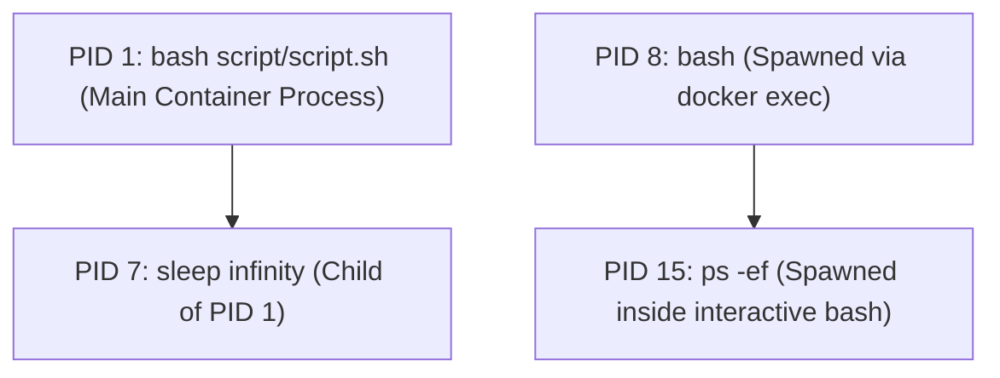

- **PID 1:** The base process established by the Dockerfile `CMD`. As long as this process remains alive, the container remains running (`Up`).
- **PID 7:** The child process executing `sleep infinity`.
- **PID 8:** The separate interactive shell created by `docker exec -it`.
- **PID 15:** The ephemeral command running inside the exec shell.

---

### Demonstrating Finite Lifecycle: Running a Finite Process via `CMD`
Instead of `sleep infinity`, what happens if the script runs for a finite duration (e.g., 10 seconds)?

1. **Update `script.sh` on the host:**
   ```bash
   vi script.sh
   ```
   ```bash
   #!/bin/bash
   echo "container is starting"
   sleep 10
   ```
   Save and quit (`:wq`).

2. **Update the Dockerfile:**
   ```bash
   vi Dockerfile
   ```
   ```dockerfile
   FROM ubuntu
   COPY script.sh scripts/script.sh
   CMD ["bash", "scripts/script.sh"]
   ```
   Save and quit (`:wq`).

3. **Build the new image:**
   ```bash
   docker build -t ubuntu:cmd2 .
   ```

4. **Run the container in detached mode:**
   ```bash
   docker run -d ubuntu:cmd2
   # Output: 41437ce2d1df...
   ```

5. **Immediately check active containers:**
   ```bash
   docker ps
   ```
   **Output:**
   ```
   CONTAINER ID   IMAGE         COMMAND                   STATUS
   41437ce2d1df   ubuntu:cmd2   "bash scripts/script.sh"  Up for 4 seconds
   ```

6. **Check again after 10 seconds:**
   ```bash
   docker ps
   # The container is no longer listed in active containers!

   docker ps -a
   ```
   **Output:**
   ```
   CONTAINER ID   IMAGE         COMMAND                   STATUS
   41437ce2d1df   ubuntu:cmd2   "bash scripts/script.sh"  Exited (0) 2 seconds ago
   ```

> [!NOTE]
> **Core Principle Verified:**
> Because the base process (`script.sh`) only lasted for 10 seconds (sleeping for 10s and then reaching end-of-file), PID 1 exited with return code 0. Docker immediately terminated the container lifecycle and marked its status as `Exited (0)`.

---

## 29. The `ENTRYPOINT` Instruction Deep Dive

### Verifying Previous Container Output with `docker logs`
Checking the execution output of the finite container (`41437ce2d1df`) created previously:
```bash
docker logs 41437ce2d1df
```
**Output:**
```
container is starting
```

---

### 6. `ENTRYPOINT` Instruction
- **Purpose:** Similar to `CMD`, `ENTRYPOINT` specifies the starting executable or default process that runs when a container launches.
- **Key Difference from `CMD`:**
  - In `CMD`, any arguments or commands passed after the image name during `docker run` will **completely overwrite** the default `CMD`.
  - In `ENTRYPOINT`, commands passed during `docker run` do **not** replace the entrypoint; instead, they are appended as **arguments** to the executable defined in `ENTRYPOINT`.
- **How to Override `ENTRYPOINT`:**
  To forcefully override the entrypoint executable, you must explicitly use the `--entrypoint` flag:
  ```bash
  docker run --entrypoint <custom-binary> <image>:<tag>
  ```

#### Syntax Formats:
1. **Exec Form (Standard & Recommended):**
   ```dockerfile
   ENTRYPOINT ["executable", "param1", "param2"]
   ```
   *Examples:*
   ```dockerfile
   ENTRYPOINT ["bash", "script.sh"]
   ENTRYPOINT ["java", "-jar", "app.jar"]
   ENTRYPOINT ["python", "app.py"]
   ```
2. **Shell Form:**
   ```dockerfile
   ENTRYPOINT command param1 param2
   ```

---

### Hands-on Walkthrough: Creating an `ENTRYPOINT` Container

1. **Create the shell script on the host:**
   ```bash
   vi script.sh
   ```
   ```bash
   #!/bin/bash
   echo "container is starting"
   sleep 10
   ```
   Save and quit (`:wq`).

2. **Create the Dockerfile:**
   ```bash
   vi Dockerfile
   ```
   ```dockerfile
   FROM ubuntu
   COPY script.sh script/
   ENTRYPOINT ["bash", "script/script.sh"]
   ```
   Save and quit (`:wq`).

3. **Build the image:**
   ```bash
   docker build -t ubuntu:ep .
   ```

4. **Launch the container in detached mode:**
   ```bash
   docker run -d ubuntu:ep
   # Output: 09c59a1a977e... (Container ID)
   ```

5. **Observe lifecycle:**
   ```bash
   docker ps
   ```
   The container runs for 10 seconds (sleeping) and then automatically terminates into `Exited (0)`.
   If you restart it with `docker start 09c59a1a977e`, it runs again for 10 seconds and stops.

---

## 30. Differences Between `CMD` and `ENTRYPOINT`

### Deep Comparison: `CMD` vs `ENTRYPOINT` Behavior
While both instructions define what process runs when a container starts, their reaction to command-line parameters passed to `docker run` is fundamentally different:

| Feature | `CMD` | `ENTRYPOINT` |
| :--- | :--- | :--- |
| **Default behavior** | Defines default executable and/or default parameters. | Defines fixed executable that the container runs as a dedicated tool/CLI. |
| **Passing arguments at `docker run`** | **Completely replaces / overwrites** the `CMD` instruction. | **Appends** as parameters to the existing `ENTRYPOINT` command. |
| **Override mechanism** | Simply pass a command: `docker run <image> <command>` | Requires explicit flag: `docker run --entrypoint <binary> <image>` |

---

### Demonstrating How `docker run` Overrides `CMD`

Recall that our `ubuntu:cmd2` image was configured with:
```dockerfile
CMD ["bash", "scripts/script.sh"]
```

#### Example 1: Passing `sleep 5` at runtime:
```bash
docker run -d ubuntu:cmd2 sleep 5
# Output: a3ad4256d8...
```
Check container status:
```bash
docker ps -a
```
**Output:**
```
CONTAINER ID   IMAGE         COMMAND      STATUS
a3ad4256d8     ubuntu:cmd2   "sleep 5"    Exited (0) 5 seconds ago
```
> **Observation:** The original command (`bash scripts/script.sh`) was **completely replaced** by `"sleep 5"`. The container slept for 5 seconds instead of executing the script.

#### Example 2: Passing `echo hello` at runtime:
```bash
docker run -d ubuntu:cmd2 echo hello
# Output: 9e9c5df3b930...
```
Check container status:
```bash
docker ps -a
```
**Output:**
```
CONTAINER ID   IMAGE         COMMAND        STATUS
9e9c5df3b930   ubuntu:cmd2   "echo hello"   Exited (0)
```
> **Observation:** The command was replaced with `"echo hello"`, which printed "hello" and exited instantly.

---

### Demonstrating Dynamic Arguments with `ENTRYPOINT`
Because `ENTRYPOINT` appends runtime arguments, we can make our container act like a configurable command-line utility.

1. **Modify `script.sh` to accept command-line arguments:**
   ```bash
   vi script.sh
   ```
   ```bash
   #!/bin/bash
   echo "container is starting"
   if [ $# -eq 1 ]; then
       sleep $1
   else
       sleep 10
   fi
   ```
   Save and quit (`:wq`).


---

## 31. Passing Dynamic Runtime Arguments to `ENTRYPOINT`

### Hands-on: Dynamic Argument Handling in `ENTRYPOINT`
Continuing from the parameterized script created previously:

1. **Create the Dockerfile:**
   ```bash
   vi Dockerfile
   ```
   ```dockerfile
   FROM ubuntu
   COPY script.sh scripts/script.sh
   ENTRYPOINT ["bash", "scripts/script.sh"]
   ```
   Save and quit (`:wq`).

2. **Build the image:**
   ```bash
   docker build -t ubuntu:ep2 .
   ```

---

### Case 1: Running Without Any Runtime Arguments
Launch the container without passing arguments:
```bash
docker run -d ubuntu:ep2
# Output: 33ee93f3... (Container ID)
```

Inspect the running processes inside the container:
```bash
docker exec 33ee93f3 ps -ef
```

**Output:**
```
UID        PID  PPID  C STIME TTY          TIME CMD
root         1     0  0 10:30 ?        00:00:00 bash scripts/script.sh
root         7     1  0 10:30 ?        00:00:00 sleep 10
root         8     0  0 10:30 ?        00:00:00 ps -ef
```
> **Explanation:** Because no arguments were passed, `$#` was 0. The `else` block executed, defaulting to `sleep 10`.

---

### Case 2: Running With a Custom Runtime Argument
Now run the container and pass `100` as a command-line parameter:
```bash
docker run -d ubuntu:ep2 100
# Output: 615aacb5... (Container ID)
```

Inspect the running processes inside the container:
```bash
docker exec 615aacb5 ps -ef
```

**Output:**
```
UID        PID  PPID  C STIME TTY          TIME CMD
root         1     0  0 10:32 ?        00:00:00 bash scripts/script.sh 100
root         7     1  0 10:32 ?        00:00:00 sleep 100
root         8     0  0 10:32 ?        00:00:00 ps -ef
```
> **Explanation:** The argument `100` was automatically forwarded to the entrypoint script as `$1`. The script evaluated `sleep $1` $\rightarrow$ `sleep 100`. The container now remains running for 100 seconds!

---

### ⚠️ Important Contrast: Syntax Errors in `CMD` vs `ENTRYPOINT`

> [!WARNING]
> - **In `CMD`:** Passing an argument at `docker run` **completely replaces** the original command. If you pass a valid executable (e.g., `ls`), it executes `ls` instead.
> - **In `ENTRYPOINT`:** Any argument passed to `docker run` is **appended** to the defined entrypoint executable.
>
> **Example of Invalid Parameter Appending:**
> Suppose an image has:
> ```dockerfile
> ENTRYPOINT ["sleep", "100"]
> ```
> If the user runs:
> ```bash
> docker run -d ubuntu:ep3 ls
> ```
> Docker constructs and executes the command:
> ```bash
> sleep 100 ls
> ```
> Because `sleep` does not accept `ls` as a valid argument, the command fails with a syntax error. The container is created, immediately crashes, and exits into stopped state.

---

## 32. Combining `ENTRYPOINT` and `CMD` for Default Fallbacks

### The Coexistence Rule: `ENTRYPOINT` + `CMD`
What happens when both `CMD` and `ENTRYPOINT` are specified in the same Dockerfile?

> [!IMPORTANT]
> **The Golden Formula:**
> $$\text{Final Container Process} = \text{ENTRYPOINT} + \text{CMD}$$
> - When both exist, **`ENTRYPOINT` specifies the executable command**, and **`CMD` provides the default arguments** to that executable.
> - **Order Independence:** It does not matter whether `CMD` is placed before or after `ENTRYPOINT` in the Dockerfile. Docker does NOT execute them sequentially.
> - If multiple `CMD` or `ENTRYPOINT` statements are defined, only the **last `CMD`** and the **last `ENTRYPOINT`** take effect.

---

### Hands-on Example: `CMD` Placed Before `ENTRYPOINT`
Create a test Dockerfile:
```bash
vi Dockerfile1a
```
```dockerfile
FROM ubuntu
CMD ["Hello from CMD"]
ENTRYPOINT ["echo"]
```
Save and quit (`:wq`).

1. **Build the image:**
   ```bash
   docker build -t ubuntu:cmd-ep -f Dockerfile1a .
   ```

2. **Run the container without runtime arguments:**
   ```bash
   docker run ubuntu:cmd-ep
   ```
   **Output:**
   ```
   Hello from CMD
   ```

---

### Detailed Architectural Explanation:
1. **Docker does NOT do this:**
   - Step 1: Execute `CMD`
   - Step 2: Then execute `ENTRYPOINT`
2. **Instead, Docker combines them internally:**
   - At build time, Docker stores both fields separately in the image metadata:
     - `Config.Entrypoint = ["echo"]`
     - `Config.Cmd = ["Hello from CMD"]`
   - At container launch, the Docker runtime engine concatenates them:
     ```
     ["echo", "Hello from CMD"]
     ```
   - This executes `echo "Hello from CMD"` as PID 1.

---

## 33. Permutations and Combinations of `ENTRYPOINT` & `CMD`

### Understanding How Docker Combines `ENTRYPOINT` and `CMD`
Recall the previous example:
```dockerfile
FROM ubuntu
CMD ["Hello from CMD"]
ENTRYPOINT ["echo"]
```
At build time, Docker stores:
- `ENTRYPOINT = ["echo"]`
- `CMD = ["Hello from CMD"]`

At runtime, Docker evaluates:
$$\text{Command} = \text{echo} + \text{"Hello from CMD"} \implies \text{Output: } \texttt{Hello from CMD}$$

---

### Analysis of the 4 Common Order Permutations in Dockerfile

#### Case A: Single `ENTRYPOINT` and Single `CMD`
```dockerfile
ENTRYPOINT ["echo"]
CMD ["Hello from CMD"]
```
- **Default Execution:** Docker runs `echo "Hello from CMD"`.
  - *Terminal Output:* `Hello from CMD`
- **When Runtime Argument is Passed (`docker run <image> "Hello from Runtime"`):**
  - The runtime parameter replaces `CMD`.
  - Docker runs: `echo "Hello from Runtime"`.
  - *Terminal Output:* `Hello from Runtime`

#### Case B: Multiple `ENTRYPOINT` Instructions
```dockerfile
ENTRYPOINT ["ls"]
ENTRYPOINT ["echo"]
```
- **Rule:** If multiple `ENTRYPOINT` instructions are specified, **only the last `ENTRYPOINT` takes effect**. The earlier ones are completely ignored.
- **Default Execution (no arguments passed):** Runs `echo` with no parameters.
  - *Terminal Output:* A blank line.
- **When Runtime Argument is Passed (`docker run <image> Runtime`):**
  - Runs: `echo Runtime`.
  - *Terminal Output:* `Runtime`

#### Case C: Multiple `CMD` Instructions
```dockerfile
CMD ["echo", "First CMD"]
CMD ["echo", "Second CMD"]
```
- **Rule:** If multiple `CMD` instructions are specified, **only the last `CMD` is executed**.
- **Default Execution:** Runs `echo "Second CMD"`.
  - *Terminal Output:* `Second CMD`
- **When Runtime Argument is Passed (`docker run <image> echo "Runtime CMD"`):**
  - The entire `CMD` instruction is replaced.
  - *Terminal Output:* `Runtime CMD`

#### Case D: Single `ENTRYPOINT` and Multiple `CMD` Instructions
```dockerfile
ENTRYPOINT ["echo"]
CMD ["First CMD"]
CMD ["Second CMD"]
```
- **Rule:** Docker takes the defined `ENTRYPOINT` and appends the **last `CMD`** as its default argument.
  - *Default Output:* `Second CMD`
- **When Runtime Argument is Passed (`docker run <image> CustomArg`):**
  - Overrides the last `CMD` and appends directly to `ENTRYPOINT`.
  - *Output:* `CustomArg`

---

## 34. The `ENV` Instruction (Environment Variables)

### 7. `ENV` Instruction
- **Purpose:** Used to define environment variables inside the container. These variables persist both during the remaining image build steps and throughout container runtime.
- **Syntax:**
  ```dockerfile
  ENV <KEY>=<VALUE>
  ENV <KEY1>=<VALUE1> <KEY2>=<VALUE2> ...
  ```
  > [!TIP]
  > **Layer Optimization:** Defining multiple key-value pairs within a single `ENV` instruction combines them into a single image layer, keeping image size minimal.

---

### Hands-on Walkthrough: Defining `ENV` in Dockerfile

1. **Create the Dockerfile:**
   ```bash
   vi Dockerfile
   ```
   ```dockerfile
   FROM ubuntu
   ENV USER=nagaraj
   ENV DB_NAME=postgres DB_USER=postgres
   ```
   Save and quit (`:wq`).

2. **Build the image:**
   ```bash
   docker build -t ubuntu:env .
   ```

3. **Run an interactive container:**
   ```bash
   docker run -it ubuntu:env
   ```

4. **Verify environment variables inside container shell:**
   ```bash
   root@247b7481c53:/# printenv
   # Or using export:
   root@247b7481c53:/# export -p
   ```
   **Output:** Lists all active environment variables, including:
   ```
   USER=nagaraj
   DB_NAME=postgres
   DB_USER=postgres
   ```

---

### Passing Environment Variables at Runtime (`--env` / `-e`)

> [!WARNING]
> Sensitive credentials (passwords, access tokens, API secrets) should **never be hardcoded in a Dockerfile**, as anyone with access to the image can inspect them. Instead, pass them securely at runtime.

Run the container passing dynamic environment variables via `--env` (or `-e`):
```bash
docker run -it --env DB_PASSWORD=test123 ubuntu:env
```
Inside the container:
```bash
root@b617eb37c4:/# printenv
```
**Output:** Confirms that `DB_PASSWORD=test123` is present alongside `USER`, `DB_NAME`, and `DB_USER`.

---

### Managing Multiple Variables with Environment Files (`--env-file`)
When managing numerous environment variables, passing each one individually via `-e` becomes unwieldy. Instead, consolidate them into a configuration file:

1. **Create an environment variables file on the host:**
   ```bash
   vi vars
   ```
   ```properties
   DB_NAME=postgres
   DB_USER=test1
   DB_PASSWORD=1234@
   ```
   Save and quit (`:wq`).

**

---

## 35. Runtime Environment Variables & The `ARG` Instruction

### Loading Environment Variables from a File (`--env-file`)
Continuing further, pass the `vars` file directly into `docker run`:

```bash
docker run -it --env-file vars ubuntu:env
```
Inside the container:
```bash
root@8707dc76:/# printenv
```
**Output:** Contains all environment variables declared in `vars`:
- `DB_NAME=postgres`
- `DB_USER=test1`
- `DB_PASSWORD=1234@`

---

### Environment Variable Precedence Rule

> [!IMPORTANT]
> If a variable is declared in the Dockerfile using `ENV`, and you pass a variable with the **same name** during `docker run` (via `-e` / `--env` or `--env-file`), the **runtime value overrides the Dockerfile value**.

#### Passing Multiple Variables via CLI:
```bash
docker run --env DB_NAME=postgres --env DB_PASSWORD=postgres --env DB_USER=test <image>:<tag>
```

---

### Summary of `ENV` Syntaxes

| Context | Syntax Format | Description |
| :--- | :--- | :--- |
| **Dockerfile** | `ENV <KEY>=<VALUE>`<br>`ENV <K1>=<V1> <K2>=<V2>` | Sets persistent variables inside image and container layers. |
| **CLI Runtime Flag** | `docker run --env <KEY>=<VALUE> <image>` | Injects individual variables dynamically at runtime. |
| **CLI Runtime File** | `docker run --env-file <file-path> <image>` | Injects bulk variables from a formatted key-value file. |

---

### 8. `ARG` Instruction (Build-Time Variables)
- **Purpose:** Defines variables that users can pass exclusively during the image build process (`docker build`).
- **Build-Time vs Runtime (`ARG` vs `ENV`):**
  - `ARG` values are available **only while the image is being built**. They do not persist into the running container environment.
  - `ENV` values persist both during build time and inside the final running container.
- **Position in Dockerfile:**
  - `ARG` is the **only instruction** permitted to appear **before** the `FROM` instruction in a Dockerfile (when used to parameterize the base image tag).
- **Syntax:**
  ```dockerfile
  ARG <variable_name>
  # OR with a default fallback value:
  ARG <variable_name>=<default_value>
  ```
- **Passing Value via CLI:**
  ```bash
  docker build --build-arg <VAR_NAME>=<value> -t <image>:<tag> .
  ```

---

## 36. Parameterized Image Builds with `ARG` & Hands-on Assignment

### Hands-on: Dynamic Base Images Using `ARG` Before `FROM`

#### Case 1: `ARG` Without Default Value
```dockerfile
# vi Dockerfile
ARG VERSION
FROM ubuntu:$VERSION
CMD ["sleep", "1000"]
```
Save and quit (`:wq`).

Build the image:
```bash
docker build --build-arg VERSION=22.04 -t ubuntu:22.04-cmd .
```
> [!WARNING]
> While the image builds successfully, Docker displays a warning:
> `InvalidDefaultArgFrom: Default value for ARG ubuntu:$VERSION results in empty or invalid base image.`
> This warning occurs because no default fallback value was provided in the Dockerfile if `--build-arg` is omitted.

---

#### Case 2: Best Practice — Providing a Default Value for `ARG`
Update the Dockerfile to specify a safe fallback:
```dockerfile
# vi Dockerfile
ARG VERSION=latest
FROM ubuntu:$VERSION
CMD ["sleep", "1000"]
```
Save and quit (`:wq`).

1. **Build without passing `--build-arg`:**
   ```bash
   docker build -t ubuntu:cmd .
   ```
   *Behavior:* Docker automatically falls back to `latest` and pulls `ubuntu:latest`.

2. **Build by explicitly passing a version:**
   ```bash
   docker build --build-arg VERSION=24.04 -t ubuntu:24.04-cmd .
   ```
   *Behavior:* Docker substitutes `$VERSION` with `24.04` and builds on top of `ubuntu:24.04`.

> [!TIP]
> **Why this matters in CI/CD:** Parameterizing Dockerfiles with `ARG` allows a single Dockerfile template to build images across multiple environments, architectures, and language versions without code duplication.

---

### Hands-on Assignment: Multi-Step Application Packaging
> **Assignment 1:**
> Create a custom Docker image using a Dockerfile that:
> 1. Clones a Git source code repository.
> 2. Compiles and packages the application into a `.jar` artifact (using Maven/OpenJDK).
> 3. Executes the generated `.jar` file on container launch using `CMD` or `ENTRYPOINT`.

---
## 37. Multi-Step Application Packaging & `WORKDIR` Instruction

### Solution to Assignment 1: Automated Git Clone, Maven Build & Containerization

#### Implementation Option A: Using `CMD`
1. **Create Dockerfile (`Dockerfile1a`):**
   ```dockerfile
   FROM maven
   RUN apt-get update && apt-get install -y git
   RUN git clone https://github.com/nagaraj602/java-example-nag-jar.git
   WORKDIR /java-example-nag-jar
   RUN mvn clean package
   CMD ["java", "-jar", "target/demo-java-example-demo-1.0.0.jar"]
   ```
2. **Build and Run:**
   ```bash
   docker build -t nag-jar-app:1a -f Dockerfile1a .
   docker run -d -p 8085:8085 nag-jar-app:1a
   docker ps -a
   ```

#### Implementation Option B: Using `ENTRYPOINT`
1. **Create Dockerfile (`Dockerfile1b`):**
   ```dockerfile
   FROM maven
   RUN apt-get update && apt-get install -y git
   RUN git clone https://github.com/nagaraj602/java-example-nag-jar.git
   WORKDIR /java-example-nag-jar
   RUN mvn clean package
   ENTRYPOINT ["java", "-jar", "target/demo-java-example-demo-1.0.0.jar"]
   ```
2. **Build and Run:**
   ```bash
   docker build -t nag-jar-app:1b -f Dockerfile1b .
   docker run -d -p 8086:8085 nag-jar-app:1b
   docker ps -a
   ```

---

### 9. `WORKDIR` Instruction
- **Purpose:** Sets the active working directory inside the container for all subsequent Dockerfile instructions (`RUN`, `CMD`, `ENTRYPOINT`, `COPY`, `ADD`).
- Functions as the container's execution home directory.

---

## 38. Working Directory Path Resolution & Non-Root Execution with `USER`

### Syntax and Relative Path Resolution of `WORKDIR`
- **Syntax:**
  ```dockerfile
  WORKDIR /path/to/directory
  ```
- **Example:**
  ```dockerfile
  WORKDIR /app
  ```
  All subsequent commands execute from within `/app`.
- **Multiple `WORKDIR` Statements (Relative Paths):**
  If multiple relative `WORKDIR` instructions are used, each path resolves relative to the preceding one:
  ```dockerfile
  WORKDIR /a
  WORKDIR b
  WORKDIR c
  RUN pwd
  # Output will be: /a/b/c
  ```
- **Automatic Creation:** If the specified directory does not exist, Docker creates it automatically.

---

### 10. `USER` Instruction (Container Security & Non-Root Execution)
- **Purpose:** Specifies the username (or UID) and optionally usergroup (or GID) that Docker should use to run all subsequent commands and runtime processes.
- **Security Concern:** By default, Docker processes execute as the `root` superuser. Running production containers as `root` poses significant security vulnerabilities if a container breakout occurs.
- **Best Practice (Least Privilege Principle):** Create an unprivileged non-root user via `RUN useradd` and switch to it using `USER`:

```dockerfile
# vi Dockerfile
FROM ubuntu
RUN useradd nagaraj
USER nagaraj
CMD ["python", "app.py"]
```

#### Verification:
1. **Build and Run:**
   ```bash
   docker build -t ubuntu:1 .
   docker run -d ubuntu:1
   ```
2. **Access Interactive Shell:**
   ```bash
   docker exec -it <container_id> bash
   ```
3. **Shell Prompt Verification:**
   ```bash
   nagaraj@1efdef0cd:$
   ```
   Notice the prompt displays `nagaraj` with a non-root `$` prompt instead of `root@...:#`, proving the container runs under restricted privileges.

---
## 39. The `EXPOSE` Instruction & Introduction to `SHELL`

### 11. `EXPOSE` Instruction

#### Purpose and Function
- The `EXPOSE` instruction is used for **documentation** of ports intended to be exposed.
- It documents the network ports that should be published when the container is run.
- It informs Docker and operators which network ports the containerized application listens on at runtime.

> [!IMPORTANT]
> **Crucial Concept:** `EXPOSE` does **not** publish or open the container port automatically to the host or external networks!
> Actual port mapping/forwarding must be explicitly defined at container runtime using the `-p` (or `-P`) flag with the `docker run` command:
> ```bash
> docker run -d -p <host_port>:<container_port> <image_name>
> ```

#### Syntax
```dockerfile
EXPOSE <port> [<port>/<protocol>...]
# OR space-separated:
EXPOSE <port1> <port2> ...
```

#### Example
```dockerfile
EXPOSE 80
EXPOSE 443
```
- In this example:
  - Port `80` is intended for HTTP traffic.
  - Port `443` is intended for HTTPS traffic.

#### Practical Meaning
- This indicates that the application running inside the container is configured to listen on ports 80 and 443.
- However, to access these services from outside the Docker host or external networks, they must be explicitly mapped using `-p` when starting the container.

#### Summary Notes on `EXPOSE`
1. **Informational, Not Functional:** It acts as metadata/documentation rather than an active firewall rule or port-forwarding instruction.
2. **Developer Communication:** Helps developers, DevOps engineers, and system administrators immediately understand which ports the containerized service requires.
3. **Orchestration Integration:** Read by documentation generators and container orchestrators (like Kubernetes, Docker Swarm, and ECS) to configure service endpoints and load balancers.
4. **Actual Exposure Requirement:**
   ```bash
   docker run -p 8080:8080 image-name
   ```

---

### 12. `SHELL` Instruction (Part 1)

#### Definition
- The `SHELL` instruction in a `Dockerfile` is used to define the **default shell** that executes commands specified by `RUN` instructions during the image build process.

#### Default Shell Environments
By default, Docker uses:
- **Linux-based images:** `/bin/sh -c`
- **Windows-based images:** `cmd /S /C`

The `SHELL` instruction allows developers to override this default behavior to use a more powerful shell, such as Bash, which supports advanced scripting features (like brace expansion, process substitution, etc.).

---

## 40. Custom Execution Shells & Docker Security Scanning Fundamentals

### `SHELL` Instruction (Continued)

#### Syntax
```dockerfile
SHELL ["executable", "parameters"]
```

#### Example Configuration
```dockerfile
SHELL ["/bin/bash", "-c"]
```

#### Complete Dockerfile Example
Create a test Dockerfile to demonstrate Bash brace expansion `{1..3}` (which standard `/bin/sh` does not support):
```dockerfile
# vi Dockerfile
FROM ubuntu
SHELL ["/bin/bash", "-c"]
RUN for i in {1..3}; do echo "Number $i"; done
```

#### Advantages of the `SHELL` Instruction
- **Overrides Default Shell:** Explicitly replaces `/bin/sh` or `cmd.exe` for subsequent `RUN` instructions.
- **Enables Advanced Scripting:** Unlocks advanced shell features, loops, subshells, and syntax available in Bash, Zsh, or PowerShell.
- **Common DevOps Use Case:** Seamlessly switching from minimal POSIX `/bin/sh` to rich `/bin/bash` without having to prefix every line with `/bin/bash -c "..."`.
- **Improves Scripting Flexibility:** Enhances build logic clarity and maintainability directly within Dockerfiles.

---

### Docker Image Vulnerability Scanning (`Docker Scan` / `Docker Scout`)

#### What is Docker Scan?
- **Docker Scan** is a Docker security feature used to scan container images for known security vulnerabilities and compliance issues before deployment.

#### What Does It Check?
- **OS Package Vulnerabilities:** Outdated system binaries and libraries (e.g., `openssl`, `glibc`, `curl`).
- **Known CVEs:** Common Vulnerabilities and Exposures cataloged in global cybersecurity databases.
- **Dependency Security Risks:** Vulnerable third-party application libraries and packages (npm, pip, maven, etc.).
- **Base Image Weaknesses:** Insecurities inherited from unpatched parent images.

#### Why is Image Scanning Essential?
- It identifies insecure packages and security flaws **early in the CI/CD pipeline** before containers are deployed into production environments (shifting security left).

#### 3 Ways to Scan Docker Images
1. **Using CLI Commands:** `docker scan` (older integration with Snyk) or `docker scout` (modern Docker native tool).
2. **Using Docker Hub Website:** Built-in automated vulnerability scanning available on Docker Hub repositories upon image push.
3. **Using Trivy:** Industry-standard open-source vulnerability scanner by Aqua Security.

---
## 41. Image Vulnerability Scanning Tools (`docker scan`, `docker scout`, Docker Hub, Trivy)

### Method 1: Using the Docker CLI (`docker scan` & `docker scout`)

#### Legacy Method: `docker scan`
```bash
# Syntax:
docker scan <image-name>

# Examples:
docker scan nginx
docker scan myapp:1a
```
> [!NOTE]
> `docker scan` was powered by Snyk in earlier Docker versions and is now largely deprecated in favor of **Docker Scout**.

#### Modern Method: `docker scout`
Docker Scout is Docker’s native, next-generation vulnerability analysis tool integrated into modern Docker Desktop and Docker CLI.

Key commands available in `docker scout`:
1. **Quick Overview (`quickview`):**
   ```bash
   docker scout quickview <image-name>
   ```
   Provides a fast summary of total vulnerabilities categorized by severity (Critical, High, Medium, Low).

2. **Detailed CVEs Breakdown (`cves`):**
   ```bash
   docker scout cves <image-name>
   ```
   Displays the complete list of known CVEs, impacted packages, severity scores, and available patches.

3. **Remediation Advice (`recommendations`):**
   ```bash
   docker scout recommendations <image-name>
   ```
   Provides actionable recommendations, such as switching to an updated base image tag with fewer vulnerabilities.

---

### Method 2: Using Built-in Scanning on Docker Hub

When pushing images to [Docker Hub](https://hub.docker.com), you can configure automated repository-level scanning:

#### Configuration Steps:
1. Log in to [hub.docker.com](https://hub.docker.com).
2. Navigate to **Repositories** and select your repository.
3. Click on the **Settings** tab.
4. Select your preferred scanning mode:
   - **Docker Scout image analysis (Continuous):** Automatically tracks newly discovered CVEs that impact existing images, highlights where vulnerabilities were introduced, and suggests fixes.
   - **Static Scanning:** Performs a single static scan upon image push and records a snapshot report at that moment.
   - **None:** Disables scanning.
5. Click **Save**.

---

### Method 3: Using Trivy (Aqua Security)

**Trivy** is an industry-standard open-source vulnerability and misconfiguration scanner widely used in CI/CD pipelines.

#### Generating an HTML Vulnerability Report:
1. Download Trivy's official HTML template:
   ```bash
   wget https://raw.githubusercontent.com/aquasecurity/trivy/main/contrib/html.tpl
   ```
2. Run Trivy image scan using the HTML template output 
:

---

## 42. Trivy Vulnerability Scanning, Image Hardening & `docker commit`

### Generating an HTML Vulnerability Report with Trivy (Continued)

```bash
trivy image --format template \
  --template "@html.tpl" \
  -o trivy-image-report.html \
  <image-name>:<tag-name>
```
- This generates a clean, interactive `trivy-image-report.html` report viewable in any web browser.

---

### Why Scanning Docker Images is Vital in DevOps

Even if your application source code is 100% bug-free and secure, the **underlying base operating system and system packages** may contain critical vulnerabilities:
- Outdated OpenSSL (e.g., Heartbleed, remote execution)
- Vulnerable GNU C Library (`glibc`)
- Insecure `curl` / `wget` system binaries

> [!WARNING]
> Attackers frequently exploit OS-level package vulnerabilities inside the container rather than targeting application code directly!

---

### Production Best Practices: Container Hardening

#### 1. Use Minimal Base Images
Instead of heavy, general-purpose distributions with hundreds of unnecessary binaries:
- ❌ Avoid: `FROM ubuntu` (~75MB+, includes package managers, shells, utilities)
- ✅ Prefer: `FROM alpine` (~5MB, minimal footprint) or **distroless** images (e.g., `gcr.io/distroless/java`, `amazoncorretto:alpine`).

#### Advantages of Smaller / Minimal Images:
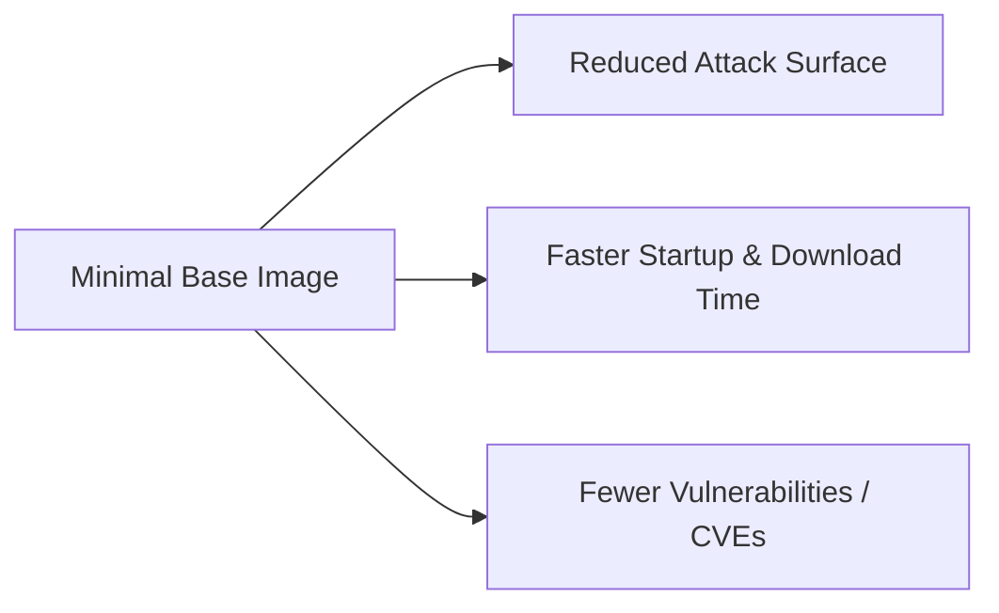

#### 2. CI/CD Security Gate (DevSecOps Pipeline)
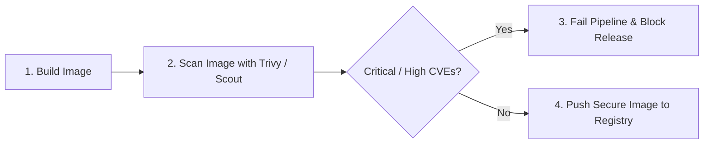
1. **Build image** from source Dockerfile.
2. **Scan image** using automated tools (`trivy`, `docker scout`).
3. **Quality gate:** Fail the build immediately if `CRITICAL` or `HIGH` vulnerabilities are found.
4. **Push:** Only push verified, secure images to the artifact registry / production.

> [!TIP]
> **Docker Hub Selection Rule:** When picking base images from Docker Hub, check their public vulnerability report. If there are unresolved **Critical** or **High** severity vulnerabilities, choose an alternate official or alpine tag.

---

### `docker commit`: Creating Images from Containers

#### Purpose
- `docker commit` creates a new image directly from changes made in a running or stopped container.
- Often used for quick manual backups, state preservation, or debugging sessions.

#### Syntax
```bash
docker commit <container_id_or_name> <new_image_name>[:tag]
```

#### Example
```bash
docker commit mycontainer myimage:1
```

---
## 43. Build Context Optimization with `.dockerignore`

### `.dockerignore` File

#### Definition & Purpose
- `.dockerignore` is a configuration file located in the root of your build context used to instruct Docker which files and directories to exclude when building an image.
- It works identically in syntax and behavior to Git's `.gitignore`.

#### Why `.dockerignore` is Critical
When executing:
```bash
docker build .
```
1. The Docker CLI first tars and transmits the **entire build context** (everything in the current directory) across the socket to the Docker daemon.
2. If instructions like `COPY . .` or `ADD . .` are present in the `Dockerfile`, every file in the directory is transferred and copied into the image.

Without a `.dockerignore`, massive or sensitive files are sent to the daemon and packaged into the image, such as:
- Source control metadata: `.git/`
- Dependency trees: `node_modules/`, `vendor/`
- Runtime logs: `*.log`, `logs/`
- Sensitive credentials: `.env`, secrets, `.aws/`, private keys
- Temporary & build artifacts: `tmp/`, `target/`, `dist/`
- Large test datasets or media dumps

#### Negative Consequences of Omitting `.dockerignore`:
- ⏳ **Slower Builds:** High network/IPC overhead sending gigabytes of build context to the Docker daemon.
- 📦 **Bloated Images:** Unnecessary layers add hundreds of megabytes to the final image size.
- 🚨 **Severe Security Vulnerabilities:** Accidental leakage of API keys, `.env` files, passwords, or Git history containing past secrets.
- 📉 **Inefficient CI/CD Pipelines:** Long transfer times between runners and registries.

#### Example `.dockerignore` Configuration
Create `.dockerignore` in the same directory as your `Dockerfile`:
```bash
vi .dockerignore
```
```text
node_modules
.git
*.log
.env
target/
dist/
```

---

### Docker Push & Enterprise Registries (Introduction)

Once a custom container image is created, tested, and validated locally, it must be pushed to a centralized artifact registry (Artifactory / Container Registry). From there, production environments, Kubernetes clusters, or deployment pipelines pull the image to deploy containers.

---

## 44. Container Registry Architecture, Naming Conventions & Push Workflow

### Supported Container Registries
Enterprises use various container registries:
- **AWS ECR:** Elastic Container Registry (Amazon Web Services)
- **Azure ACR:** Azure Container Registry (Microsoft Azure)
- **GCP GCR / Artifact Registry:** Google Cloud Platform
- **Self-Hosted / Third-Party:** JFrog Artifactory, Sonatype Nexus, Harbor
- **Public Default:** Docker Hub (`docker.io`)

> [!TIP]
> **DevOps Interview Tip:** In interviews, when asked about container workflows, state:
> *"In our organization, we use AWS ECR as our centralized Docker registry and deploy our containerized microservices to Amazon EKS (Elastic Kubernetes Service)."*

---

### Universal Image Naming Convention & Registry Routing

To push an image to Docker Hub, AWS ECR, or any registry, Docker strictly requires the image tag to follow this standardized namespace hierarchy:

$$\text{Format: } \mathbf{\langle registry\_url \rangle / \langle account\_or\_namespace \rangle / \langle repository\_name \rangle : \langle tag \rangle}$$

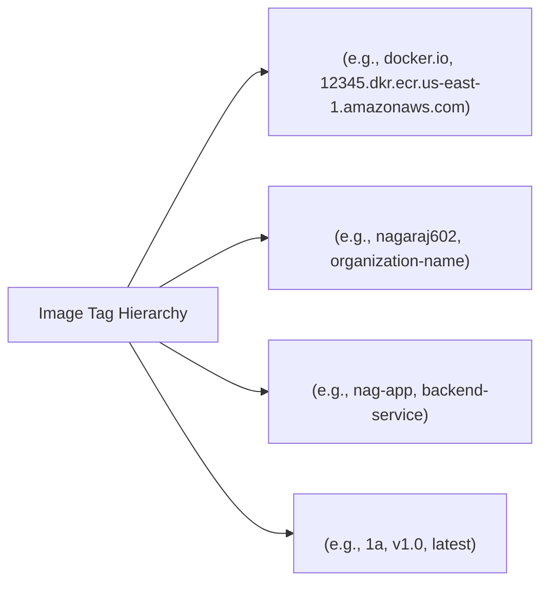

#### Why Default Names Fail (`denied: requested access to the resource is denied`):
- When an image is named locally as `ubuntu:1a` or `nag-app:1`, Docker assumes the default registry and default namespace:
  $$\text{Default: } \mathbf{docker.io/library/ubuntu:latest}$$
- Docker resolves missing accounts to the official Docker namespace `/library`.
- Because normal users have no write permissions to `/library`, pushing `nag-app:1` will fail with an authorization error.
- Therefore, your Docker Hub username or organization namespace **must** be prefixed to the image tag:
  $$\mathbf{docker.io/nagaraj602/nag-app:1a} \quad \text{or simply} \quad \mathbf{nagaraj602/nag-app:1a}$$

---

### Step-by-Step Guide: Docker Hub Repository Setup

1. Open your browser and navigate to [hub.docker.com](https://hub.docker.com).
2. Sign in using your Docker Hub credentials or connected GitHub account.
3. Click on the **Repositories** tab.
4. Click **Create Repository**.
5. Fill in details:
   - **Repository Name:** `nag-app`
   - **Visibility:** Select `Public` (or `Private` if proprietary)
6. Click **Create**.

---
## 45. Image Tagging Mechanics (`docker tag`) & Docker Hub Authentication

### Building with Registry Tag vs. Retagging (`docker tag`)

#### 1. Direct Build Tagging
You can specify the full namespaced tag directly during image creation:
```dockerfile
# vi Dockerfile
FROM ubuntu
RUN apt-get update -y
```
```bash
# Build directly with your Docker Hub namespace:
docker build -t nagaraj602/nag-app:1.0 .
```

#### 2. Retagging an Existing Image (`docker tag`)
If the image was already built under a generic local name (e.g., `ubuntu:1.0`), create a namespaced alias using `docker tag`:
```bash
docker tag ubuntu:1.0 nagaraj602/nag-app:1.0
```

#### How Docker Tags Work Internally (Hardlink Analogy)
- Tagging does **not** duplicate image layers or consume additional disk storage.
- It operates exactly like a **hardlink in Linux**: two pointers referencing the exact same underlying Image ID and layer hashes.

```bash
docker image ls
```
**Output:**
| REPOSITORY | TAG | IMAGE ID | SIZE |
| :--- | :--- | :--- | :--- |
| `nagaraj602/nag-app` | `1.0` | `55eb24fce` | 222MB |
| `ubuntu` | `1.0` | `55eb24fce` | 222MB |

*(Both repositories share identical Image ID `55eb24fce` — total disk space used remains 222MB, not 444MB).*

---

### Authenticating to Docker Hub (`docker login`)

Attempting to push without prior authentication results in an error:
```bash
docker push nagaraj602/nag-app:1.0
# Error response from daemon: access denied, repository does not exist or may require 'docker login'
```

Before pushing, you must authenticate the host server with Docker Hub. There are two primary authentication mechanisms:

#### Method 1: Non-Interactive CLI Authentication (`--password-stdin`) — Recommended for CI/CD
```bash
echo "<password_or_token>" | docker login -u <username> --password-stdin
```
**Example:**
```bash
echo "Ph-C..T79,cWXE" | docker login -u nagaraj62 --password-stdin
# Output: Login Succeeded
```
- **Why this method?** It avoids leaving cleartext credentials in terminal shell history and is the standard practice for automated CI/CD runners (Jenkins, GitHub Actions, GitLab CI).

#### Method 2: Interactive Web / Device Code Login
```bash
docker login
```
Docker outputs a one-time verification code and an activation URL 
.

---

## 46. Registry Push Verification & Complete Docker Hub Workflow

### Authentication Comparison & Security Analysis

#### Interactive Web Login Workflow:
1. Run `docker login`.
2. Docker generates a unique confirmation code and link (e.g., `https://login.docker.com/activate`).
3. Open the link in a browser, enter the code, and confirm.
4. Terminal displays: `Login Succeeded`.

#### Security Comparison:
| Authentication Method | Security Profile | Ideal Use Case |
| :--- | :--- | :--- |
| **Non-Interactive (`--password-stdin`)** | Highly secure; accepts personal access tokens (PAT) via environment variables or secrets managers; does not linger in browser sessions. | **CI/CD Pipelines, Production Scripts** |
| **Interactive (`docker login` browser code)** | Credentials/auth tokens are cached permanently in `~/.docker/config.json`. If an attacker gains server shell access, the saved credentials can be compromised. | **Local Developer Workstations** |

---

### Pushing the Image to Docker Hub

Once authenticated successfully, execute the push:
```bash
docker push nagaraj602/nag-app:1.0
```

**Verification:**
- Open your browser, visit [hub.docker.com](https://hub.docker.com), and navigate to your repository `nagaraj602/nag-app`.
- Under the **Tags** tab, the newly uploaded tag `1.0` and its compressed layer sizes are visible.

---

### Summary: The End-to-End Docker Push Lifecycle

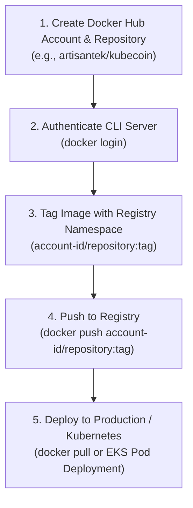

#### Universal Naming Convention:
$$\mathbf{\langle account\text{-}id \rangle / \langle repository \rangle : \langle tag \rangle}$$

**Real-World Enterprise Examples:**
- `artisantek/kubecoin:1.0`
- `artisantek/movie-analyzer:1.1`

#### Summary of Key Commands:
```bash
# 1. Interactive Device-Code Login:
docker login

# 2. Automated Token/Password Login (CI/CD standard):
echo "$DOCKER_PASSWORD" | docker login -u "$DOCKER_USER" --password-stdin

# 3. Tagging local image for Docker Hub:
docker tag local-image:latest artisantek/kubecoin:1.0

# 4. Pushing tagged image to remote repository:
docker push artisantek/kubecoin:1.0
```

---
## 47. Publishing Images to AWS ECR (Elastic Container Registry) — Setup & IAM

### Quick Review: Tagging & Pushing
```bash
# Retag an existing local image:
docker tag <old-image-name>:<tag> <new-image-name>:<tag>

# Push to Docker Hub:
docker push <account-id>/<repository>:<tag>

# Example:
docker push artisantek/movie-analyzer:1.1
```

---

### Enterprise AWS ECR Integration

Amazon Elastic Container Registry (Amazon ECR) is a fully managed, secure, and scalable container registry service provided by AWS.

#### AWS ECR Universal Naming Convention
Every image pushed to AWS ECR must strictly adhere to the Amazon ECR endpoint structure:

$$\mathbf{\langle aws\text{-}account\text{-}id \rangle.dkr.ecr.\langle region \rangle.amazonaws.com/\langle repository\text{-}name \rangle:\langle tag \rangle}$$

**Real Example:**
```text
544917027663.dkr.ecr.ap-south-1.amazonaws.com/movie-analyzer:1.1
```
- Account ID: `544917027663`
- Service: `dkr.ecr`
- Region: `ap-south-1` (Mumbai)
- Repository: `movie-analyzer`
- Tag: `1.1`

---

### ECR Authentication Methods
There are two primary ways to authenticate Docker with Amazon ECR:
1. **Using AWS CLI `get-login-password` (Temporary 12-Hour Session — Recommended / Industry Standard):**
   - Generates an ephemeral authorization token valid for exactly **12 hours**.
   - Highly secure because credentials expire automatically.
2. **Using Amazon ECR Credential Store Plugin (Permanent / Not Recommended):**
   - Maintains a long-lived credential store helper; poses security risks if the host is compromised.

---

### Step-by-Step Implementation: Method 1 (12-Hour Temporary Token)

#### Step 1: Create IAM User with ECR Permissions in AWS Management Console
1. Open the **AWS Console** and search for **IAM** (Identity and Access Management).
2. Click **Users** $\rightarrow$ **Create user**.
3. Set **User name**: `demo` $\rightarrow$ Click **Next**.
4. Under Permissions options, select **Attach policies directly**.
5. Search and select: `AmazonEC2ContainerRegistryFullAccess`.
6. Click **Next** $\rightarrow$ Click **Create user**.
7. Return to the user list, click on the user `demo`, and navigate to the **Security credentials** tab.
8. Scroll to **Access keys** $\rightarrow$ Click **Create access key**.
9. Choose use case **Other** $\rightarrow$ Click **Next** $\rightarrow$ Click **Create access key**.
10. Download or copy both the **Access Key ID** and **Secret Access Key**.

#### Step 2: Configure AWS CLI on the Linux / Build Server
1. Ensure AWS CLI is installed (`aws --version`).
2. Run AWS configuration command:
   ```bash
   aws configure
   ```
3. Enter the prompt values:
   - `AWS Access Key ID [None]: <YOUR_ACCESS_KEY_ID>`
   - `AWS Secret Access Key [None]: <YOUR_SECRET_ACCESS_KEY>`
   - `Default region name [None]: ap-south-1`
   - `Default output format [None]: json`

#### Step 3: Authenticate Docker to AWS ECR 
---

## 48. Authenticating with AWS ECR & Pushing Container Images

### Step 3: Authenticate Docker CLI with AWS ECR (Continued)

Run the modern `aws ecr get-login-password` piped directly into `docker login`:

```bash
# Universal Command:
aws ecr get-login-password --region <region> | docker login --username AWS --password-stdin <aws-account-id>.dkr.ecr.<region>.amazonaws.com
```

#### Real-World Terminal Execution:
```bash
aws ecr get-login-password --region ap-south-1 | docker login -u AWS --password-stdin 544917027663.dkr.ecr.ap-south-1.amazonaws.com
```
**Output:**
```text
Login Succeeded
```

> [!NOTE]
> The username for all AWS ECR authentication requests is always literally `AWS`. The temporary password is generated on the fly by `aws ecr get-login-password` and passed securely via standard input (`--password-stdin`).

---

### Step 4: Create the ECR Repository
1. Navigate to **AWS Console** $\rightarrow$ **Amazon ECR** $\rightarrow$ **Repositories**.
2. Click **Create repository**.
3. Set Repository name: `nag-app`.
4. Choose visibility (Private / Public) and click **Create repository**.

---

### Step 5: Tag or Retag the Local Image for ECR

Ensure the image tag matches your Amazon ECR URI:
```bash
# Syntax:
docker tag <old-image>:<tag> <aws-account-id>.dkr.ecr.<region>.amazonaws.com/<repo-name>:<tag>

# Example:
docker tag nag-app:1a 544917027663.dkr.ecr.ap-south-1.amazonaws.com/nag-app:1a
```

---

### Step 6: Push the Image to AWS ECR

```bash
# Syntax:
docker push <aws-account-id>.dkr.ecr.<region>.amazonaws.com/<repo-name>:<tag>

# Example:
docker push 544917027663.dkr.ecr.ap-south-1.amazonaws.com/nag-app:1a
```

**Verification:**
- Open the AWS Console $\rightarrow$ Amazon ECR $\rightarrow$ Repositories $\rightarrow$ `nag-app`.
- The pushed image tag `1a`, image digest, vulnerability scan findings, and compressed image layers are listed.

---

### Alternative Method 2: AWS ECR Credential Store Plugin
- Uses a permanent background daemon / helper plugin on the host server.
- **Drawback:** Leaves persistent access credentials active; not recommended for shared production build agents due to privilege escalation and security compliance concerns.

---
## 49. AWS ECR Credential Helper & Persistent Authentication

### Alternative Method: AWS ECR Credential Helper Plugin (`amazon-ecr-credential-helper`)

#### Overview
- Instead of manually executing `aws ecr get-login-password` every 12 hours, Docker can be configured with a credential helper plugin.
- The **Amazon ECR Credential Helper** (`docker-credential-ecr-login`) automatically obtains credentials from the AWS CLI credentials profile (`~/.aws/credentials` configured via `aws configure`) whenever Docker attempts to push or pull from an ECR registry.

---

### Step-by-Step Configuration:

#### 1. Pre-requisites (IAM & AWS CLI Setup):
- **IAM User:** Create user `demo` with policy `AmazonEC2ContainerRegistryFullAccess`.
- **Security Credentials:** Generate an Access Key ID & Secret Access Key.
- **AWS CLI:** Install on host machine and configure:
  ```bash
  aws configure
  ```

#### 2. Create Target ECR Repository:
- Navigate to **AWS Console** $\rightarrow$ **Amazon ECR** $\rightarrow$ **Create repository**.
- Name: `nag-app`.

#### 3. Tag Image with ECR URI:
```bash
# Syntax:
docker tag <old-image>:<tag> <aws-account-id>.dkr.ecr.<region>.amazonaws.com/<repo-name>:<tag>

# Example:
docker tag nag-app:1b 544917027663.dkr.ecr.ap-south-1.amazonaws.com/nag-app:1b
```

#### 4. Install the ECR Credential Helper Package:
On Debian/Ubuntu systems, install the official package:
```bash
sudo apt update
sudo apt install -y amazon-ecr-credential-helper
```

#### 5. Configure Docker Daemon Client (`config.json`):
Navigate to the Docker client directory 
:
```bash
cd ~/.docker
```

---

## 50. Configuring Docker Credential Store & Introduction to `docker cp`

### Configuring Docker Client for ECR Helper (Continued)

If a previous `~/.docker/config.json` file exists containing stale tokens or basic auth blocks, clean it up or edit it:
```bash
# Remove stale configuration if resetting auth:
rm -f ~/.docker/config.json

# Create or edit ~/.docker/config.json:
vi ~/.docker/config.json
```

Add the `credStore` directive:
```json
{
    "credStore": "ecr-login"
}
```
Save and exit (`:wq`).

#### 6. Push Directly to Amazon ECR:
With the credential helper enabled, `docker push` seamlessly authenticates in the background using the active AWS CLI credentials without needing `docker login`:
```bash
# Example:
docker push 544917027663.dkr.ecr.ap-south-1.amazonaws.com/nag-app:1b
```
**Verification:**
- Check the AWS ECR Console to confirm tag `1b` has uploaded successfully.

---

### File Transfer Between Host and Containers: `docker cp`

#### Purpose of `docker cp`
- The `docker cp` command copies files and directories between the host operating system and a container (whether the container is running or stopped).
- It is essential for hot-patching config files, retrieving logs, debugging, or copying artifacts without rebuilding the image.

---

### Hands-On Demonstration: Copying from Host $\rightarrow$ Container

#### Step 1: Create a Test File on the Docker Host:
```bash
vi host-test.txt
# File content:
This file is from host
# :wq
```

#### Step 2: Start a Detached Container:
```bash
docker pull ubuntu
docker run -itd ubuntu
# Output container ID: d5ea94fae
```

#### Step 3: Copy the File from Host to Container:
$$\text{Syntax: } \mathbf{docker\ cp\ \langle host\_source\_path \rangle\ \langle container\_id\_or\_name \rangle : \langle container\_target\_path \rangle}$$

```bash
docker cp host-test.txt d5ea94fae:/
```
This copies `host-test.txt` directly into the root directory (`/`) of container `d5ea94fae`.

---

---

## 51. Copying Files Between Host and Container (`docker cp`)

### Verifying Host-to-Container Copy

When executing the copy command from the host:

```bash
docker cp host-test.txt d5ea94fae:/
```

**Terminal Output:**
```text
Successfully copied 24B (transferred 2.05KB) to d5ea94fae:/
```

#### Step-by-Step Verification inside the Container:

1. Connect interactively to the running container's shell:
   ```bash
   docker exec -it d5ea94fae bash
   ```

2. List files in the root directory (`/`) to verify the file was placed:
   ```bash
   ls
   ```
   *Output shows `host-test.txt` present in root directory.*

3. Read the content of the file:
   ```bash
   cat host-test.txt
   ```
   **Output:**
   ```text
   This file is from host
   ```

---

### Copying Files from a Running Container to the Host Machine

The `docker cp` command works bi-directionally. You can extract log files, debug dumps, or configuration files from a running container directly to your host machine filesystem.

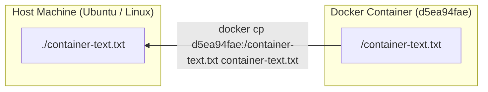

#### Step 1: Create a Test File Inside the Container

1. Open an interactive shell inside the container:
   ```bash
   docker exec -it d5ea94fae bash
   ```

2. (Optional) Install text editors if needed or directly write content using shell redirection:
   ```bash
   apt update -y && apt install vim -y
   vi container-text.txt
   ```
   *Alternatively, create the file directly with echo:*
   ```bash
   echo "This file is from container" >> container-text.txt
   ```

3. Exit from the container shell back to your host terminal:
   ```bash
   exit
   ```

#### Step 2: Copy the File from Container to Host

**Syntax:**
```bash
docker cp <container_name_or_ID>:<container_target_file_path> <host_file_path>
```

**Example:**
```bash
docker cp d5ea94fae:/container-text.txt container-text.txt
```

#### Step 3: Verify the File on the Host Machine

1. List files in the current host working directory:
   ```bash
   ls
   ```
   *`container-text.txt` is now listed.*

2. View the contents of the copied file on the host:
   ```bash
   cat container-text.txt
   ```
   **Output:**
   ```text
   This file is from container
   ```

> [!NOTE]
> **Voting Application Project Reference:**
> For the end-to-end multi-container Voting Application project (Python Voting App, Redis in-memory queue, .NET Worker, PostgreSQL database, and Node.js Result App), check your Google Docs ArtisanTek DevOps Notes 2026 for complete architectural walk-throughs and compose manifests.

---

## 52. Docker Storage Architecture & Persistent Named Volumes

### The Ephemeral Nature of Containers

By default, Docker containers are **ephemeral** (temporary and short-lived). 
- Any file, database record, configuration change, or log written inside a container's writable layer lives only as long as the container exists.
- If the container crashes, is stopped and deleted (`docker rm`), or updated with a new image version, **all modified data inside the container is permanently lost**.

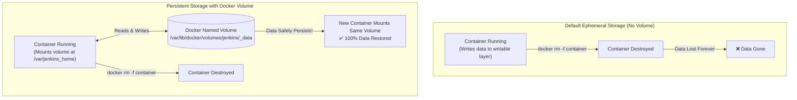

To solve this critical data loss issue and support stateful applications (such as databases like MySQL, PostgreSQL, MongoDB, or CI/CD servers like Jenkins), Docker provides **Volumes** and **Mounts** to decouple storage from the container lifecycle.

---

### The Three Types of Docker Storage Mounts

Docker supports three primary methods for persisting and sharing data:

| Mount Type | Managed By | Host Location | Best Use Case |
| :--- | :--- | :--- | :--- |
| **1. Docker Volumes (Named Volumes)** | Docker Engine | `/var/lib/docker/volumes/` | Production databases, CI/CD tools, shared data between multiple containers. Most safe, portable, and recommended. |
| **2. Bind Mounts** | User / Host OS | Anywhere on host filesystem (e.g., `/home/ubuntu/app`, `C:\data`) | Live development (source code auto-reload), injecting host config files (e.g., `/etc/resolv.conf`). |
| **3. tmpfs Mounts** | Host Memory (RAM) | System RAM (never written to host disk) | Sensitive tokens/passwords, high-throughput temporary caches. |

---

### Deep Dive: 1. Docker Volumes (Named Volumes)

Docker Volumes are the **preferred and officially recommended** mechanism for persisting container-generated data.

#### Key Characteristics:
1. **Fully Managed by Docker:** Created, inspected, and backed up via Docker CLI commands. Stored in Docker's internal host storage directory:
   - **Default Linux Path:** `/var/lib/docker/volumes/<volume_name>/_data`
2. **Container-Independent Lifecycle:** Volumes exist independently of containers. Deleting containers will never delete an attached named volume unless explicitly requested (`docker volume rm` or `docker rm -v`).
3. **High Performance & Safety:** Volumes are isolated from host filesystem modifications by unauthorized processes, preventing accidental corruption.
4. **Cross-Platform Consistency:** Behavior is identical on Linux, Windows, and macOS Docker hosts.

---

### Docker Volume Lifecycle Commands

#### 1. List All Docker Volumes
```bash
docker volume ls
```
Displays all local Docker named volumes, their driver (typically `local`), and their volume names.

#### 2. Create a Docker Volume
```bash
docker volume create <volume_name>
```
*Example:*
```bash
docker volume create jenkins
```

#### 3. Inspect a Volume (Inspect metadata & mountpoint)
```bash
docker volume inspect <volume_name>
```
*Output reveals the exact underlying directory on the host machine (`Mountpoint: /var/lib/docker/volumes/<volume_name>/_data`).*

#### 4. Remove a Volume
```bash
docker volume rm <volume_name>
```
> [!WARNING]
> A volume cannot be removed if it is currently in use by any running or stopped container. You must delete the container first before deleting the volume.

---

### Attaching a Named Volume to a Container

#### Syntax:
```bash
docker run -v <docker_volume_name>:<container_internal_path> <image>:<tag>
```

#### Practical Example: Persistent Jenkins Server
Jenkins stores all its master configurations, plugins, user accounts, and build pipelines inside the internal path `/var/jenkins_home`.

1. Create a dedicated persistent volume for Jenkins:
   ```bash
   docker volume create jenkins
   ```

2. Run the Jenkins container in detached mode with port forwarding and the volume mounted:
   ```bash
   docker run -d -v jenkins:/var/jenkins_home -p 8080:8080 jenkins/jenkins
   ```

**Why this matters:**
- Even if this Jenkins container is deleted, upgraded, or replaced:
  ```bash
  docker rm -f <jenkins_container_id>
  docker run -d -v jenkins:/var/jenkins_home -p 8080:8080 jenkins/jenkins:lts
  ```
- The new container mounts the exact same `jenkins` named volume, and all jobs, pipelines, plugins, and credentials will instantly be preserved without any configuration loss!

---

### Deep Dive: 2. Bind Mounts

Bind mounts allow you to mount a specific directory or file from the host system directly into a container.

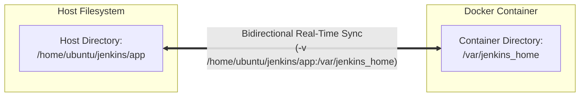

#### Key Characteristics:
- **Host Dependency:** Unlike Docker volumes, bind mounts rely heavily on the host machine's directory structure and filesystem paths.
- **Instant Two-Way Synchronization:** Any changes made inside the container are immediately reflected on the host filesystem, and any edits made on the host are immediately visible inside the container.
- **Portability & Security Considerations:** Bind mounts are less portable across environments (e.g., directory paths differ between Linux, Windows, and macOS). They can also introduce permission or security risks if processes inside the container modify sensitive host directories.

#### Hands-on Example:
1. Create a directory on the host machine:
   ```bash
   mkdir -p jenkins/app
   ```

2. Mount the host directory to the container:
   ```bash
   docker run -d -v /home/ubuntu/jenkins/app:/var/jenkins_home -p 8080:8080 jenkins/jenkins
   ```

3. **Resolving Permission Errors:**
   If the container's internal non-root user (e.g., Jenkins `uid 1000`) cannot write to the host directory, adjust permissions on the host:
   ```bash
   chmod 666 jenkins/app
   # Or grant full ownership to Jenkins user:
   # sudo chown -R 1000:1000 jenkins/app
   ```

#### Universal Syntax:
```bash
docker run -v <host_path>:<container_path> <image>:<tag>
```

---

### Deep Dive: 3. Anonymous Volumes (Unnamed Volumes)

Anonymous volumes are similar to standard Docker volumes, but they **do not have a user-defined name**.

#### Key Characteristics:
- **Automatic Creation:** Docker automatically generates an anonymous volume when a container starts if a volume is defined in the `Dockerfile` using the `VOLUME` instruction and the user does not specify a named volume or bind mount during `docker run`.
- **Purpose / Guarantee:** Acts as a safety mechanism. If an operator forgets to attach a volume during `docker run -v`, Docker ensures data at that path is still written to persistent storage rather than the container's ephemeral writable layer.
- **Storage Location:** Stored in `/var/lib/docker/volumes/` under a generated 64-character hexadecimal hash instead of a friendly name.

#### Hands-on Demonstration:
1. Create a `Dockerfile` defining a volume mount point:
   ```dockerfile
   FROM ubuntu
   VOLUME /home
   ```

2. Build the Docker image:
   ```bash
   docker build -t ubuntu:vol .
   ```

3. Run the container without passing the `-v` flag:
   ```bash
   docker run -itd ubuntu:vol
   ```

4. List all Docker volumes:
   ```bash
   docker volume ls
   ```

**Terminal Output:**
```text
DRIVER    VOLUME NAME
local     8ebe64fbd65c4129b8c34dc096a56e01a4e518598a123456789abcdef0123c16
```

> [!NOTE]
> If a named volume was attached via `docker run -v my-named-vol:/home`, Docker would list the volume under the user-defined name `my-named-vol`. With anonymous volumes, Docker assigns a random 64-character hash name.

---

## 53. Docker Networking Deep Dive: Bridge, Host, and None Networks

### Core Networking Concepts
Each container created by Docker has its own network interface, IP address, and subnet. Docker provides internal networking so containers can communicate with each other, the host system, and external networks.

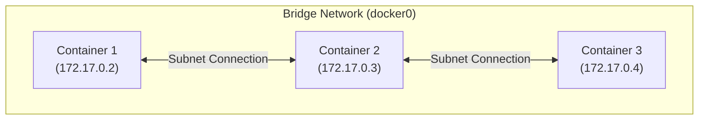

---

### The Three Primary Built-in Docker Network Types

| Network Type | Flag | Isolation Level | Port Mapping Required? | Best For |
| :--- | :--- | :--- | :--- | :--- |
| **Bridge** | `--network bridge` | Standard container network isolation | Yes (`-p host:container`) | Multi-container applications running on a single host. (Default driver). |
| **Host** | `--network host` | No isolation from host network | No (direct host port binding) | High-performance standalone applications; large port range exposure. |
| **Null / None** | `--network none` | 100% complete isolation (loopback only) | N/A (no network stack) | Air-gapped batch jobs, security training, cryptographic computations. |

---

### 1. Bridge Network (`--network bridge`)
- **Default Driver:** `bridge`. The default network interface created on Linux is named `docker0`.
- **Default Attachment:** All containers created without specifying `--network` automatically attach to the default `bridge` network.
- **Port Mapping:** Containers on a bridge network are isolated. To access them from outside the host machine, you must publish ports using `-p` / `--publish`:
  ```bash
  docker run -d -p 8080:8080 --network bridge nginx
  ```
- **Port Binding Verification:**
  When checking open ports on the host with `sudo netstat -tulpn`, port 8080 shows the `docker-proxy` process rather than the container's internal process name:
  ```bash
  sudo netstat -tulpn | grep 8080
  # Shows docker-proxy listening on 0.0.0.0:8080
  ```

---

### 2. Host Network (`--network host`)
- **No Isolation:** Removes all network isolation between the Docker host and the container.
- **Shared Network Stack:** The container does not receive its own private IP address. It binds directly to the host machine's physical network interface and IP address.
- **No Port Mapping Needed:** If an application inside the container runs on port 5000, it is immediately accessible on host port 5000 directly. The `-p` flag is ignored.
- **Performance & Use Cases:**
  - Provides maximum raw networking performance with zero NAT (Network Address Translation) or packet filtering overhead.
  - Ideal for applications handling thousands of simultaneous connections or exposing large ranges of dynamic ports (e.g., VoIP, RTP, video streaming).
  - Checking `sudo netstat -tulpn` shows the port directly associated with the process on the host stack.
- **Command:**
  ```bash
  docker run -d --network host nginx
  ```

---

### 3. Null / None Network (`--network none`)
- **Total Isolation:** Keeps the container in 100% complete network isolation.
- **No External Connectivity:** The container has only the local loopback interface (`lo` / `127.0.0.1`). It cannot reach the internet, the host machine, or any other container.
- **Use Cases:**
  - Air-gapped batch processing jobs.
  - Data encryption/decryption tasks and secret token generation.
  - Machine learning model offline data training.
  - Isolated database backup archives.
- **Command:**
  ```bash
  docker run -d --network none <image>
  ```

---

### Docker Network Management CLI Commands

| Action | Command Syntax |
| :--- | :--- |
| **List Networks** | `docker network ls` |
| **Create Custom Bridge Network** | `docker network create <network_name>` |
| **Create Network with Specific Driver** | `docker network create --driver <type> <network_name>` |
| **Remove Network** | `docker network rm <network_name>` |
| **Run Container in Specific Network** | `docker run --network <network_name> <image>` |
| **Connect Running Container to Network** | `docker network connect <network_name> <container_name_or_ID>` |
| **Disconnect Container from Network** | `docker network disconnect <network_name> <container_name_or_ID>` |

---

### Hands-on Lab: Custom Networks and Multi-Network Communication

#### Architecture Diagram:
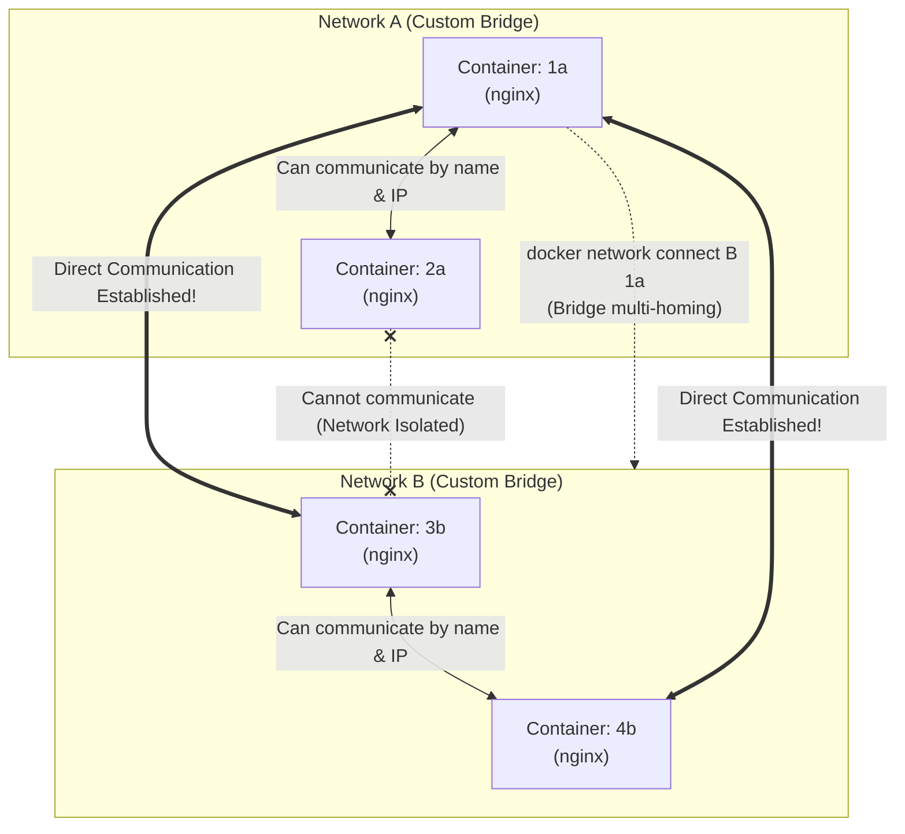

#### Step 1: Create Two Custom Networks
```bash
docker network create A
docker network create B
```

#### Step 2: Deploy Containers into the Respective Networks
```bash
docker pull ubuntu
docker pull nginx

# Deploy containers in Network A
docker run -d --network A --name 1a nginx
docker run -d --network A --name 2a nginx

# Deploy containers in Network B
docker run -d --network B --name 3b nginx
docker run -d --network B --name 4b nginx
```

#### Step 3: Verify Networks and Inspect Container IP
```bash
docker network ls
docker inspect 2a
```
*Note the IP assigned by Network A (e.g., `172.18.0.3`).*

#### Step 4: Test Internal Communication & Automatic DNS Resolution in Network A
Connect to container `1a`:
```bash
docker exec -it 1a bash
```

1. **Curl using Container IP:**
   ```bash
   curl 172.18.0.3
   ```
   *Output: Prints the Nginx default welcome page on the terminal.*

2. **Curl using Container Name (DNS):**
   ```bash
   curl 2a
   ```
   *Output: Prints the Nginx default welcome page on the terminal.*

> [!IMPORTANT]
> **Key Rule of Custom Bridge Networks:**
> Custom bridge networks include an **embedded DNS server**. Containers on the same custom network can resolve each other by **both IP address and container name**. The default `docker0` bridge does **NOT** provide automatic DNS container name resolution!

---

### Cross-Network Routing and Multi-Homing

By default, containers in Network `A` **cannot** communicate with containers in Network `B`.

#### Connecting a Container from Network A to Network B:
To enable container `1a` to communicate with containers in Network `B`:

```bash
docker network connect B 1a
```

Now, container `1a` has two network interfaces (multi-homed into both Network `A` and Network `B`).

#### Verifying Cross-Network Communication:
1. From container `1a` to containers in Network `B`:
   ```bash
   docker exec -it 1a bash
   curl 3b    # Successfully communicates!
   curl 4b    # Successfully communicates!
   ```

2. From container `3b` to container `1a`:
   ```bash
   docker exec -it 3b bash
   curl 1a    # Successfully communicates!
   ```

3. Communication from container `2a` to Network `B`:
   - Container `2a` was **never** connected to Network `B`.
   - `2a` **cannot** reach `3b` or `4b`.

> [!WARNING]
> **Important Rule:**
> You cannot directly connect two networks together (Network `A` $\leftrightarrow$ Network `B`). You connect individual containers from Network `A` into Network `B`.

---

### Custom Subnets and Static IP Assignment

Docker allows administrators to define custom CIDR subnets and assign fixed, static IP addresses to containers.

#### 1. Create a Network with a Custom Subnet:
```bash
docker network create --subnet=192.168.100.0/24 <network_name>
```
*Example with explicit bridge driver:*
```bash
docker network create --driver bridge --subnet 10.10.0.0/16 my-custom-net
```

#### 2. Run a Container with a Static IP:
```bash
docker run -d --name 1a --network A --ip 192.168.100.10 nginx
```
*Container `1a` is now guaranteed to always receive the static IP `192.168.100.10`.*

> [!NOTE]
> **Static IP Support:**
> Assigning static IP addresses using `--ip` works **only with user-defined custom bridge networks**. It is **not supported** on the default `docker0` bridge network, the `host` network, or the `none` network.

---

## 54. Docker System Maintenance & Storage Housekeeping (`docker prune`)

### Managing Host Storage Clutter
As developers and DevOps engineers continuously build, pull, test, and recreate Docker resources, systems rapidly accumulate:
- **Stopped and exited containers**
- **Unused and unreferenced images**
- **Anonymous, dangling storage volumes**
- **Orphaned custom networks**
- **Dangling BuildKit cache layers**

Over time, this accumulation clutters terminal listings and exhausts host disk capacity. Docker provides dedicated `prune` subcommands for fast, safe resource reclamation.

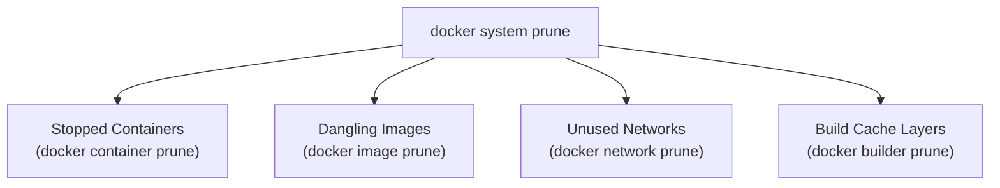

---

### Docker Prune Commands Reference Table

| Target Resource | Command Syntax | Description |
| :--- | :--- | :--- |
| **All System Resources** | `docker system prune` | Removes stopped containers, dangling images, unused networks, and dangling build cache. |
| **All System Resources (Aggressive)** | `docker system prune -a --volumes` | Removes all stopped containers, all unused images (not just dangling), all unused networks, and all unused volumes. |
| **Images (Dangling only)** | `docker image prune` | Removes only untagged / dangling images (`<none>:<none>`). |
| **Images (All Unused)** | `docker image prune -a` | Removes all images not actively associated with at least one running container. |
| **Containers** | `docker container prune` | Removes all stopped and exited containers. |
| **Networks** | `docker network prune` | Removes all custom networks that have no active containers attached. |
| **Volumes (Anonymous)** | `docker volume prune` | Removes all unattached anonymous volumes. |
| **Volumes (All Unused)** | `docker volume prune -a` | Removes all unused volumes (both anonymous and named volumes not mounted by any container). |
| **BuildKit Cache (Dangling)** | `docker builder prune` | Removes all dangling build cache layers. |
| **BuildKit Cache (All Unused)** | `docker builder prune -a` | Clears all unused build cache layers to free disk space. |

---

## 55. Dangling Images (`<none>:<none>`) Deep Dive & Reclamation

### What is a Dangling Image?
A **dangling image** is an image layer that has no repository name and no tag (displayed as `<none>:<none>` in `docker images`).

```text
REPOSITORY   TAG      IMAGE ID       CREATED        SIZE
<none>       <none>   1abcefgh0123   2 hours ago    180MB
```

#### How are Dangling Images Created?
1. **Building Without Name and Tag:**
   Running `docker build .` without passing `-t <name>:<tag>`. Docker builds the image and produces a random hexadecimal ID, leaving repository and tag blank (`<none>:<none>`).
2. **Rebuilding Existing Images with the Same Tag:**
   When you build an updated version of `myapp:1.0`, Docker shifts the tag `myapp:1.0` to the newly built image ID. The previous layer loses its tag and becomes a dangling image.

Because dangling images are unreferenced, they waste disk storage and can be safely deleted.

---

### Managing Dangling Images CLI Commands

#### 1. List All Images (Tagged and Dangling):
```bash
docker image ls -a
```

#### 2. Filter and List Only Dangling Images:
```bash
docker image ls -f dangling=true
```

#### 3. Delete All Dangling Images in One Step:
```bash
docker image prune
```
*Prompted confirmation: `Are you sure you want to continue? [y/N]` (pass `-f` to bypass confirmation).*

---

## 56. Useful Docker Administration One-Liners & CLI Productivity Tricks

DevOps engineers frequently use powerful command-line filters and pipelines to manage large Docker environments.

### 1. List Only Exited / Stopped Containers:
```bash
docker ps -a -f status=exited
```

### 2. Display Only Container IDs (Quiet Mode):
```bash
docker ps -aq
```
*Returns a clean list containing solely container IDs (useful for script automation).*

### 3. Forcefully Delete All Containers (Running and Stopped) in a Single Command:
```bash
docker ps -aq | xargs docker rm --force
```
*Alternative subshell syntax:*
```bash
docker rm -f $(docker ps -aq)
```

---

## 57. Docker Multi-Stage Builds: Optimization & Security Hardening

### The Challenge of Container Image Bloat
When packaging compiled enterprise applications (such as Java, Go, Rust, or C++), traditional single-stage Dockerfiles include:
- Heavy build tools, compilers, and package managers (`maven`, `gradle`, `npm`, `gcc`, `git`).
- Massive SDKs, build libraries, intermediate dependency caches, and source code.

This results in:
1. **Bloated image sizes** (often exceeding 800MB to 1.5GB).
2. **Massive attack surface** (hundreds of unnecessary build tools and libraries introduce security CVEs).
3. **Slow deployment and distribution times** over CI/CD networks.

---

### The Solution: Multi-Stage Builds
In a **Multi-Stage Build**, a single `Dockerfile` contains multiple `FROM` instructions. Each `FROM` instruction starts a **new build stage** with a completely fresh, isolated base image.

We selectively copy **only the final compiled artifact** (e.g., `.jar`, compiled binary) from the heavy build stage into a lightweight, stripped-down runtime stage, discarding all build tools and source code!

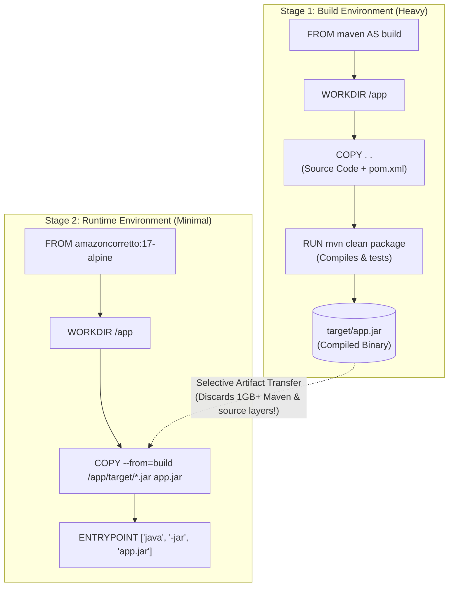

---

### Production Multi-Stage Dockerfile Walkthrough

```dockerfile
# ==========================================
# STAGE 1: Compilation & Packaging (Builder)
# ==========================================
FROM maven AS build
WORKDIR /app

# Copy application source code and dependencies
COPY . .

# Build and package the Java artifact
RUN mvn clean package

# ==========================================
# STAGE 2: Lightweight Runtime Environment
# ==========================================
FROM amazoncorretto
WORKDIR /app

# Selectively copy ONLY the compiled JAR from the 'build' stage
COPY --from=build /app/target/*.jar app.jar

# Define container execution entrypoint
ENTRYPOINT ["java", "-jar", "app.jar"]
```

#### Key Advantages:
1. **Radical Image Size Reduction:** The final runtime image contains only the lightweight Java runtime and the executable `.jar` file (reducing image size from ~1GB to under 150MB).
2. **Minimal Attack Surface:** No compilers, package managers, or raw source code exist in the production runtime container, preventing malicious tampering and drastically reducing CVE scan findings.

---

## 58. Docker Compose: Multi-Container Application Orchestration

### Why Docker Compose?
In modern microservices architectures, an application rarely consists of a single container. A typical production application requires:
- A reverse proxy / frontend (e.g., Nginx)
- One or more application backends (Node.js, Java, Python, Go)
- Caching layers (Redis)
- Relational or document databases (PostgreSQL, MySQL, MongoDB)

Manually running individual `docker run` commands with extensive port bindings, custom network attachments, and environment variables is tedious and error-prone.

**Docker Compose** is a declarative configuration tool used to define, configure, and orchestrate multi-container Docker applications as a unified single service using a YAML file (`docker-compose.yml`).

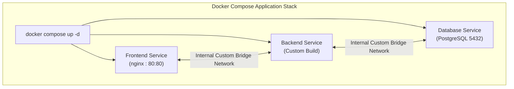

---

### Multi-Tier Architecture: `docker-compose.yml`

Create a compose file in your project directory:
```bash
vi docker-compose.yml
```

```yaml
services:
  # Frontend Web Tier
  frontend:
    image: nginx
    ports:
      - "80:80"
    container_name: frontend

  # Application Backend Tier
  backend:
    build: .
    container_name: backend
    stdin_open: true
    tty: true

  # Database Tier
  db:
    image: postgres
    environment:
      POSTGRES_USER: user
      POSTGRES_PASSWORD: password
      POSTGRES_DB: mydb
    container_name: db
```

#### Breakdown of Compose Directives:
- `services:` Defines all container services that make up the unified application stack.
- `frontend:` First service, pulling the official `nginx` image and publishing host port 80 to container port 80.
- `backend:` Builds the container image from the local directory context (`build: .`) using the project's `Dockerfile`. Enables interactive terminal allocation (`stdin_open: true`, `tty: true`).
- `db:` Deploys a persistent PostgreSQL database service with secure environment configuration credentials (`POSTGRES_USER`, `POSTGRES_PASSWORD`, `POSTGRES_DB`).
- **Automatic Private Network:** Docker Compose automatically creates a shared custom bridge network for all services in the compose file. Services can resolve each other directly using service names (`http://backend`, `db:5432`).

---

### Essential Docker Compose CLI Commands

| Command Syntax | Description |
| :--- | :--- |
| `docker compose up` | Starts and attaches to all containers defined in `docker-compose.yml`. |
| `docker compose up -d` | Starts all services in the background (detached mode). |
| `docker compose -f <filename> up` | Starts services using a custom-named compose manifest (e.g., `docker-compose.prod.yml`). |
| `docker compose ps` | Lists all containers and current running states managed by the Compose project. |
| `docker compose logs -f` | Streams real-time consolidated log output from all services. |
| `docker compose down` | Gracefully stops and removes all containers, networks, and internal resources created by `up`. |
| `docker compose down -v` | Stops and removes all containers, networks, and also permanently destroys associated named volumes. |

---

## 59. Summary & Comprehensive Docker Cheatsheet

### Core CLI Workflow Overview

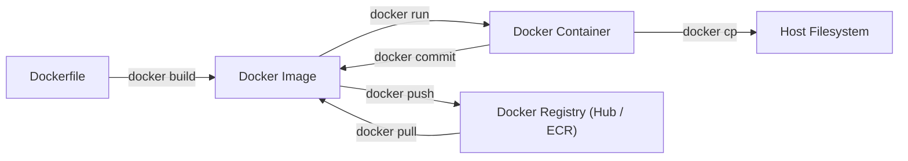

### Quick Command Matrix

| Category | Command | Purpose |
| :--- | :--- | :--- |
| **Container Lifecycle** | `docker run -d --name <name> -p <hp>:<cp> ` | Run detached container with port forwarding |
| | `docker ps -a` | List all containers (running and stopped) |
| | `docker stop <cid>` / `docker start <cid>` | Stop / Start a container |
| | `docker rm -f <cid>` | Force remove a container |
| | `docker exec -it <cid> bash` | Interactive shell execution inside container |
| | `docker logs -f <cid>` | Stream real-time container stdout/stderr logs |
| **Image Management** | `docker build -t <name>:<tag> .` | Build an image from Dockerfile |
| | `docker images` / `docker image ls` | List local Docker images |
| | `docker rmi <image_id>` | Remove a local image |
| | `docker tag <source> <target>` | Create an image alias/tag |
| | `docker push <registry>/<repo>:<tag>` | Push image to remote registry |
| **Storage & Volumes** | `docker volume create <name>` | Create a named volume |
| | `docker volume ls` | List all volumes |
| | `docker run -v <vol>:<path> ` | Mount named volume |
| | `docker run -v <host_path>:<path> ` | Mount host bind mount |
| | `docker cp <cid>:<cpath> <hpath>` | Copy files from container to host |
| **Networking** | `docker network create <name>` | Create a custom bridge network |
| | `docker network connect <net> <cid>` | Connect a running container to another network |
| | `docker run --network <name> ` | Attach container to network |
| **Cleanup & Pruning** | `docker system prune -a` | Clean all stopped containers, unused images & cache |
| | `docker image prune` | Remove dangling images (`<none>:<none>`) |
| | `docker ps -aq \| xargs docker rm -f` | Delete all containers on host |
| **Docker Compose** | `docker compose up -d` | Deploy multi-container stack in detached mode |
| | `docker compose down` | Tear down entire multi-container stack |
| | `docker compose ps` | Check status of Compose stack containers |